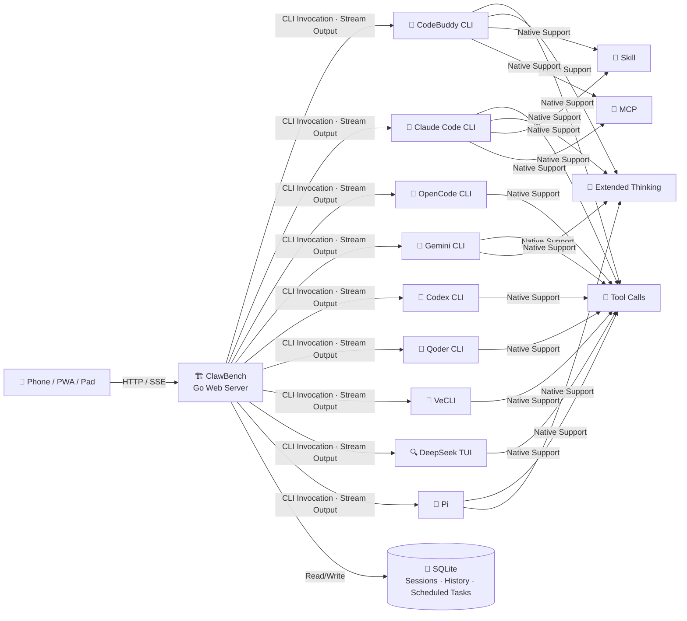

[中文](README.md) | [English](README.en.md)

# ClawBench — AI Workstation Built for Mobile

> 🎬 **Demo Video**: [OpenClaw and Hermes are toys, so I built one that actually works](https://b23.tv/ewACF0h) — Bilibili

<p>
  
</p>

**From Terminal to Palm** — An AI workstation built for mobile.

Brings the full power of AI coding agents to browsers and mobile apps, creating a true mobile development environment. File browsing, code editing, AI conversation, Git operations, scheduled tasks — one app does it all.

Core Advantage: Native passthrough of AI capabilities (tool calls, extended thinking, Skills, MCP) with zero adaptation cost, fully preserving the power of coding agents. Unlike other mobile AI tools that are merely "remote controllers," ClawBench is a full-featured mobile workstation — files, code, Git, AI, scheduled tasks, TTS, get real work done on your phone without needing a PC online. ([Similar Projects Comparison](docs/COMPARISON.en.md))

- **Supported Platforms**: Browser (PC / Tablet / Phone), Android App, PWA
- **AI Backends**: CodeBuddy, Claude Code, OpenCode, Gemini CLI, Codex, Qoder CLI, VeCLI, DeepSeek TUI, Pi

---

## Screenshots

### Login & Navigation

| Login | Home | Select Project |
|-------|------|----------------|
|  |  |  |

### File Browsing & Code Editing

| File Browser | Search & Filter | Code Editor | Quote & Ask |
|-------------|----------------|-------------|-------------|
|  |  |  |  |

### Markdown & Document Preview

| Markdown Render | LaTeX Formulas | Mermaid Diagrams | Table of Contents |
|-----------------|----------------|------------------|-------------------|
|  |  |  |  |

### AI Agents

| Agent Selection | AI Conversation | Structured Question | Session Manager |
|-----------------|-----------------|---------------------|-----------------|
|  |  |  |  |

| Scheduled Tasks | Create Task | Task Card |
|-----------------|-------------|-----------|
|  |  |  |

### Git Integration

| Commit History & Branch Graph | Commit Detail | Comparison Report |
|-------------------------------|---------------|-------------------|
|  |  |  |

### Media Preview

| Image Viewer | Video Player | Audio Player | PDF Preview |
|-------------|-------------|-------------|------------|
|  |  |  |  |

### SSH Tunnel & Web Terminal

| Port Forwarding | Interactive Terminal |
|----------------|---------------------|
|  |  |

---

## Technical Architecture

ClawBench's core philosophy:

- **Zero-Adaptation Passthrough**: Instead of reimplementing AI capabilities, ClawBench uses AI coding agent CLIs as backend engines, wrapping them as HTTP API + SSE streaming interfaces via a web server. This fully preserves tool calls, extended thinking, Skills, MCP, and all other capabilities with zero adaptation cost. The frontend only handles rendering and interaction — all intelligent logic is natively provided by the CLI.
- **AI Handles Changes, I Handle Review**: The project does not provide direct file editing capabilities — all modifications are done through AI. The focus is on building an excellent Markdown and code preview experience, along with interaction with AI during preview — select code or text to ask AI questions or request modifications for rapid iteration.



---

## Quick Start

### Prerequisites

- **A PC (Linux / macOS / Windows)**: To run the ClawBench server, with at least one AI coding agent CLI installed (CodeBuddy, Claude Code, OpenCode, Gemini CLI, Codex, Qoder CLI, VeCLI, DeepSeek TUI, or Pi)
- **A phone**: Install the [ClawBench Android App](https://github.com/xulongzhe/clawbench/releases), or use a mobile browser (Chrome recommended) to access the server address

### Download & Start

Download the latest ZIP package from [GitHub Releases](https://github.com/xulongzhe/clawbench/releases), extract and you're ready:

```bash
wget https://github.com/xulongzhe/clawbench/releases/latest/download/clawbench-linux-amd64.zip
unzip clawbench-linux-amd64.zip
cd clawbench
./server.sh
```

That's it — on every startup, ClawBench automatically scans for installed AI CLI tools, generates minimal agent configs for each detected backend, and auto-discovers available models and thinking effort levels. No manual configuration needed.

> A random password is auto-generated on first startup and printed to the console. Save it securely.

Once deployed, access `http://server-ip:20000` from your phone app or mobile browser:

- **Phone App**: Native integration, auto-connect, full feature support
- **Mobile Browser**: **Chrome** recommended — supports installing as a PWA app (Add to Home Screen) for a near-native experience

### Customize Agents

Auto-generated agent configs use minimal defaults (no model lists or thinking effort levels — these are auto-discovered at runtime). To customize model lists, system prompts, icons, etc., edit the YAML files in `config/agents/` and restart the server:

```bash
# Edit an existing agent
vim config/agents/claude.yaml

# Add a new agent (use example templates as reference)
cp config/agents/claude.yaml.example config/agents/my-claude.yaml
```

Each `.yaml.example` file contains complete configuration fields and descriptions for that backend. They serve as reference templates only and are not auto-loaded.

> For build instructions, advanced configuration, deployment, and architecture details, see **[Build & Development Guide](docs/DEVELOPMENT.en.md)**.

---

## Features

### 📁 File Browser
- Recursive directory browsing with 120+ file extension support
- Search filtering, sorting (name/time/extension/size)
- **List/Grid View Toggle**: Grid view shows image thumbnails for visual file browsing
- **Image Thumbnails**: Backend generates square thumbnails with dominant-color padding for quick preview
- Context menu: rename, delete, copy, cut, paste, new file/folder, download, open as project
- **Multi-Select Operations**: Toggle multi-select mode from toolbar, batch copy/cut/delete; mobile long-press triggers context menu
- File upload (image support, configurable size and count)
- Toggle hidden file visibility
- **Drill-down Browsing + Edge Swipe Back**: Tap folders to drill down, swipe from right edge to go back — intuitive mobile navigation

### 🎨 Code Preview
- Syntax highlighting, sticky line numbers, word wrap toggle
- Double-click to copy code line content (flash animation feedback)
- **File Change Flash Highlight**: When files are modified externally, deleted characters flash red and new characters flash blue for quick change identification
- **Quote & Ask**: Select a code snippet, one-click ask AI, auto-attaches file path and line number
- Swipe gestures: swipe left/right to switch files

### 📝 Markdown
- Toggle between rendered view / source view
- **Quote & Ask**: Select text, one-click ask AI
- Smart table of contents drawer (TOC), LaTeX math, Mermaid diagrams
- **Image Lightbox**: Images support zoom, swipe browsing
- **File Path Navigation**: Clickable file paths in Markdown

### 🤖 AI Agents
- **Streaming Response**: Real-time SSE push, thinking process and tool calls fully visible
- **Multi-Agent Support**: General assistant, coding expert, handyman, etc. — YAML config, plug-and-play
- **AI Backend Switching**: CodeBuddy, Claude Code, OpenCode, Gemini CLI, Codex, Qoder CLI, VeCLI, DeepSeek TUI, Pi — session-level isolation
- **Thinking Effort Levels**: Per-agent thinking depth selection (Auto / Low / Medium / High), supported by 5 backends (Claude/CodeBuddy/OpenCode/Codex/Pi), selection auto-persisted
- **Model Selection Modal**: Unified model switching and thinking effort selection in a dual-tab interface, with search filtering, one-click model list refresh (for agents supporting auto-discovery), and long-press to set default model
- **Model Selection Persistence**: Model choice and thinking effort per agent auto-saved to localStorage, restored on reload/session switch
- **Scheduled Tasks**: AI creates Cron schedules via CLI subcommands, executes automatically; independent tab with 4-level breadcrumb navigation; task cards embedded in chat messages; frequency presets (hourly/daily/weekly/monthly) + custom cron expressions; per-execution read tracking + TTS playback; execution auto-summary + completion notification (sound/haptic/toast)
- **Multi-Session Management**: Create, switch, delete independent sessions, swipe to switch
- **Swipe Session Toggle**: Toggle left/right swipe session switching in Settings → Chat; defaults to off to prevent accidental switches when scrolling wide content
- **Image Upload**: Upload images for AI conversation (multimodal)
- **Disconnect Protection**: Messages persist immediately, no data loss on disconnect, 15s heartbeat keep-alive + 30s timeout auto-reconnect (live content updates during polling fallback)
- **Auto Resume**: Automatically sends "continue" after Claude/CodeBuddy/Qoder/DeepSeek/Pi exits Plan Mode
- **Message Queue**: Messages queue when AI is busy, sent sequentially
- **Auto Summary**: Automatically generates a summary of the last assistant message on session complete; toggle between summary/original via bottom banner; TTS playback also uses the summary

### ⏰ Scheduled Tasks
- **Cron Scheduling**: AI creates Cron schedules via CLI subcommands, executes automatically
- **Independent Tab Management**: 4-level breadcrumb navigation, quickly switch between task lists
- **Frequency Presets**: Hourly / Daily / Weekly / Monthly — one-click selection of common frequencies
- **Custom Cron Expressions**: Full 5-field Cron syntax support, flexibly customize execution timing
- **Task Cards**: Embedded chat message preview, at-a-glance task content and recent execution results
- **Execution Tracking**: Per-execution read status tracking, unread message badge alerts
- **TTS Playback**: Auto-summarize after task completion with voice playback, listen while reviewing
- **Execution Summary**: Auto-generated summary for each completed execution (configurable summarization backend)
- **Completion Notification**: Sound + haptic + toast alert when task execution completes
- **Instant Trigger**: Support immediate manual execution without affecting next scheduled time
- **Lifecycle Management**: Pause / Resume / Delete — flexibly control task state

### 🤖 AI Conversation
- **Tool Call Visualization**: Name, parameters, execution results displayed in real time with success/error status
- **Extended Thinking**: Complex tasks auto-trigger extended thinking, reasoning visible in real time
- **File Path Navigation**: Clickable file paths in AI responses
- **Localhost URL Navigation**: localhost URLs in AI responses (e.g., http://localhost:3000) are auto-detected with an open button; in App mode, port forwarding is auto-registered and the URL opens via WebView with zero manual config
- **Quick Send**: Preset common commands (continue, build, commit, etc.) with drag reorder, one-click send, input placeholder hint showing current quick send
- **Quote & Ask**: Select code or text, ask AI directly, auto-attaches context
- **Current Directory Attachment**: Chat input supports attaching current directory context, AI auto-gets directory structure
- **Unread Badge**: Chat panel icon shows unread message count

### 🖼️ Media Preview
- In-app preview of images, audio, video
- Lightbox zoom, fullscreen view, support for pinch-zoom and drag

### 🔊 TTS Speech Synthesis
- Auto-summarize and read AI replies aloud, listen while reading
- **5 TTS Engines**: Edge TTS (free), MiniMax (best quality), Piper / Kokoro / MOSS-Nano (local offline)
- **12 Summarization Backends**: simple (text-only cleanup), mmx-cli, api (OpenAI/Anthropic compatible), Claude, CodeBuddy, Gemini, OpenCode, Codex, Qoder, VeCLI, DeepSeek, Pi
- See [TTS Deployment Guide](docs/TTS.en.md)

### 📂 Git Integration
- Project-level / file-level commit history browsing
- **Git Branch Graph**: Vertical branch topology, intuitive branch relationships
- **Git Diff View**: View changes relative to HEAD, character-level highlighting
- Commit detail view (author, time, commit message)
- Working tree changes view (staged / unstaged files)
- **3-Tab Management**: Worktree / Branches / Tags tabs for unified management, default tab persisted to localStorage
- **Swipe to Delete**: Branches, worktrees, and tags support swipe-to-delete with safety guards (current branch, default branch, and current worktree cannot be deleted)
- **Tag Management**: Browse project tags, click a tag to checkout, auto-prompt for dirty working tree
- Git init (one-click `git init` from UI)

### 🔀 SSH Tunnel Port Forwarding
- **Remote Development**: Access server local ports directly from Android App
- **Protocol Transparent**: HTTP, HTTPS, WebSocket, SSE, gRPC — no URL rewriting needed
- **Custom Target Host**: Forward to any reachable host (LAN/remote, not limited to 127.0.0.1)
- **Auto Port Assignment**: Automatically allocates local ports when forwarding the same target port to different hosts
- **Port Editing**: Modify existing port forwarding configurations
- **Auto-Open Localhost URLs**: localhost URLs appearing in chat (e.g., web services started by AI) can be opened with one tap — port forwarding is auto-registered and the URL opens via WebView in App mode
- **Tunnel Health Check & Reconnect**: Auto-checks tunnel health before opening localhost URLs; reconnects if unhealthy; one-tap reconnect for disconnected tunnels

### 💻 Web Terminal
- **Interactive Terminal**: PTY + WebSocket + xterm.js, operate server terminal directly in browser
- **Concurrent Sessions**: Each client gets an independent PTY session, no interference
- **Virtual Key Toolbar**: Color-coded key groups (modifiers, shortcuts, navigation, arrows, actions), three-state modifier toggle
- **Symbol Bar**: Expandable symbol input row with 19 high-frequency terminal symbols, smart sorting using exponential decay (balances frequency and recency)
- **Touch Gestures**: Termius-style gestures (swipe→arrow keys, hold-to-repeat, double-tap→Tab, pinch-to-zoom), touch scroll when gestures disabled
- **Quick Commands**: CRUD management of common commands with drag reorder, hidden flag, auto-execute (auto-run on every connect/reconnect)
- **Android Volume Keys**: Volume up/down remapped to arrow keys when terminal is open in the app
- See [Web Terminal User Guide](docs/TERMINAL.en.md)

### 🌐 Internationalization
- Chinese / English bilingual UI, auto-detect system language

### 📱 Android App
- Native bridge integration: auto-login, file download (including POST archive downloads), port forwarding management
- Static HTML login page: shown on first launch or connection failure, matches web UI visual style
- SSH password management, server dialog
- WebView connection protection: WebView hidden during connection attempts to prevent browser error page flash
- Terminal volume key mapping: volume keys act as arrow keys when terminal is open

### 🔔 Notifications
- Notification sound + haptic feedback (alerts when AI completes)
- Browser push notifications
- **Task Completion Push**: Scheduled task completion notifications include response preview summary; tap to navigate to execution details

### 🎨 Themes
- Light / Dark mode, follows system preference

### 📱 PWA Support
- Installable to home screen, runs in standalone window

### 🔒 Security
- Optional password protection (SHA-256 salted hash storage, password change available in settings panel)
- Path traversal protection, all operations restricted to project directory
- Git parameter injection protection (SHA/branch name/tag name validation, `--` separator)
- Configurable file upload size and count (default 10MB / 20 files)
- XSS protection (DOMPurify sanitization)
- TLS support (manual certificate configuration required)

---

## FAQ

See **[FAQ](docs/FAQ.en.md)**.

---

## License

Copyright (c) 2026 xulongzhe

Licensed under the MIT License
