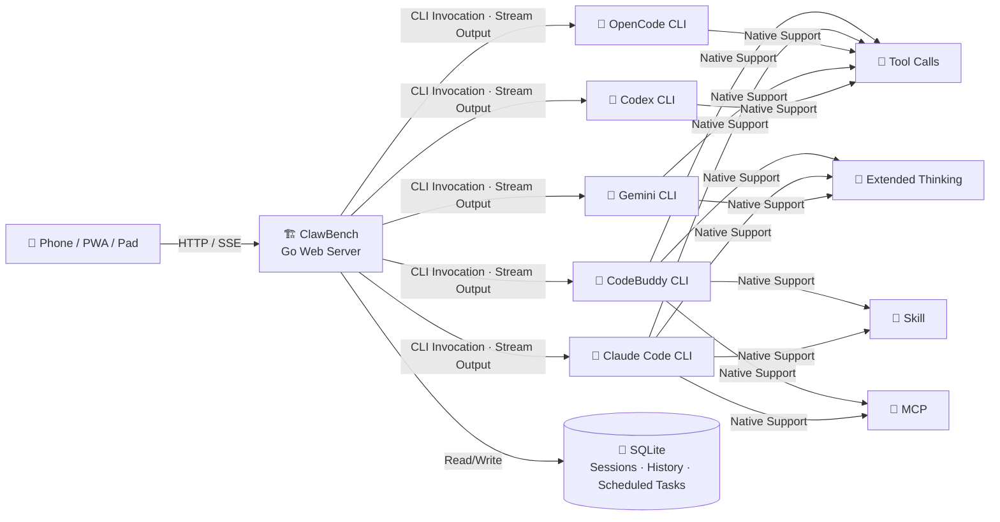

[中文](README.md) | [English](README.en.md)

# ClawBench — AI Workstation Built for Mobile

<p>
  
</p>

**From Terminal to Palm** — An AI workstation built for mobile.

Brings the full power of AI coding agents to browsers and mobile apps, creating a true mobile development environment. File browsing, code editing, AI conversation, Git operations, scheduled tasks — one app does it all.

**Core Advantage**: Native passthrough of AI capabilities (tool calls, extended thinking, Skills, MCP) with zero adaptation cost, fully preserving the power of coding agents. Unlike other mobile AI tools that are merely "remote controllers," ClawBench is the **only full-featured mobile workstation** — files, code, Git, AI, scheduled tasks, TTS, get real work done on your phone without needing a PC online. ([Comparison](docs/COMPARISON.en.md))

**This project was developed entirely using ClawBench on a phone, without ever using a PC.**

- **Supported Platforms**: Browser (PC / Tablet / Phone), Android App, PWA
- **AI Backends**: CodeBuddy, Claude Code, OpenCode, Gemini CLI, Codex

---

## Screenshots

### Login & Navigation

| Login | Home | Select Project |
|-------|------|----------------|
|  |  |  |

### File Browsing & Code Editing

| Code Editor | Search | File Browser |
|-------------|--------|--------------|
|  |  |  |

### Markdown & Document Preview

| LaTeX Formulas | Mermaid Diagrams | Table of Contents |
|----------------|------------------|-------------------|
|  |  |  |

### AI Agents

| Agent Selection | AI Assistant | Session Manager | Scheduled Tasks |
|-----------------|-------------|-----------------|-----------------|
|  |  |  |  |

### AI Conversation

| Tool Calls & Extended Thinking | Quick Send |
|-------------------------------|------------|
|  |  |

### Git Integration

| Git Diff | Commit History | Git Branch Graph |
|----------|---------------|------------------|
|  |  |  |

### Media Preview

| Image Viewer | Lightbox Zoom | Video Player | Audio Player | PDF Preview |
|-------------|---------------|-------------|-------------|------------|
|  |  |  |  |  |

### SSH Tunnel Port Forwarding

| Port Forwarding |
|----------------|
|  |

---

## Technical Architecture

ClawBench's core philosophy:

- **Zero-Adaptation Passthrough**: Instead of reimplementing AI capabilities, ClawBench uses AI coding agent CLIs as backend engines, wrapping them as HTTP API + SSE streaming interfaces via a web server. This fully preserves tool calls, extended thinking, Skills, MCP, and all other capabilities with zero adaptation cost. The frontend only handles rendering and interaction — all intelligent logic is natively provided by the CLI.
- **AI Handles Changes, I Handle Review**: The project does not provide direct file editing capabilities — all modifications are done through AI. The focus is on building an excellent Markdown and code preview experience, along with interaction with AI during preview — select code or text to ask AI questions or request modifications for rapid iteration.



---

## Quick Start

Download the latest ZIP package from [GitHub Releases](https://github.com/xulongzhe/clawbench/releases), extract and deploy. All configuration items have default values — no config file needed to start.

```bash
wget https://github.com/xulongzhe/clawbench/releases/latest/download/clawbench-linux-amd64.zip
unzip clawbench-linux-amd64.zip
cd clawbench
```

### Configure Agents

YAML files in the `config/agents/` directory define available AI agents. Create your agents based on the example template:

```bash
# View the example template (includes detailed field descriptions)
cat config/agents/agent.yaml.example

# Copy and modify to create your own agent
cp config/agents/agent.yaml.example config/agents/my-agent.yaml
# Edit id, name, icon, specialty, backend, model, system_prompt, etc.
```

Each YAML file corresponds to one agent and requires at minimum: `id` (unique identifier), `name` (display name), `icon` (emoji icon), `specialty` (specialty description), `backend` (AI backend type). Optional fields: `model` (specific model), `command` (custom CLI path or arguments), `system_prompt` (role prompt — omitted by default uses `agent_common_prompt.md` content).

### Start the Server

```bash
./server.sh
```

> A random password is auto-generated on first startup and printed to the console. Save it securely. To customize configuration, copy `config/config.example.yaml` to `config.yaml` and modify.

Once deployed, access `http://server-ip:20000` from your phone app or mobile browser:

- **Phone App**: Native integration, auto-connect, full feature support
- **Mobile Browser**: **Chrome** recommended — supports installing as a PWA app (Add to Home Screen) for a near-native experience

> For build instructions, advanced configuration, deployment, and architecture details, see **[Build & Development Guide](docs/DEVELOPMENT.en.md)**.

---

## Features

### 📁 File Browser
- Recursive directory browsing with 120+ file extension support
- Search filtering, sorting (name/time/extension)
- Context menu: rename, delete, copy, cut, paste, new file/folder, download, open as project
- File upload (image support, configurable size and count)
- Toggle hidden file visibility

### 🎨 Code Preview
- Syntax highlighting, sticky line numbers, word wrap toggle
- Double-click to copy code line content (flash animation feedback)
- **Quote & Ask**: Select a code snippet, one-click ask AI, auto-attaches file path and line number
- Swipe gestures: swipe left/right to switch files

### 📝 Markdown
- Toggle between rendered view / source view
- **Quote & Ask**: Select text, one-click ask AI
- Smart table of contents drawer (TOC), LaTeX math, Mermaid diagrams
- **Image Lightbox**: Images support zoom, swipe browsing
- **File Path Navigation**: Clickable file paths in Markdown

### 🤖 AI Agents
- **Streaming Response**: Real-time SSE push, thinking process and tool calls fully visible
- **Multi-Agent Support**: General assistant, coding expert, handyman, etc. — YAML config, plug-and-play
- **AI Backend Switching**: CodeBuddy, Claude Code, OpenCode, Gemini CLI, Codex — session-level isolation
- **Scheduled Tasks**: Auto-create Cron schedule from AI proposals, execute on schedule
- **Multi-Session Management**: Create, switch, delete independent sessions, swipe to switch
- **Image Upload**: Upload images for AI conversation (multimodal)
- **Disconnect Protection**: Messages persist immediately, no data loss on disconnect, 60s timeout auto-reconnect (3 attempts then fallback to polling)
- **Auto Resume**: Automatically sends "continue" after Claude/CodeBuddy exits Plan Mode
- **Message Queue**: Messages queue when AI is busy, sent sequentially

### 🤖 AI Conversation
- **Tool Call Visualization**: Name, parameters, results displayed in real time
- **Extended Thinking**: Complex tasks auto-trigger extended thinking, reasoning visible in real time
- **File Path Navigation**: Clickable file paths in AI responses
- **Quick Send**: Preset common commands (continue, build, commit, etc.), one-click send
- **Quote & Ask**: Select code or text, ask AI directly, auto-attaches context
- **Unread Badge**: Chat panel icon shows unread message count

### 🖼️ Media Preview
- In-app preview of images, audio, video
- Lightbox zoom, fullscreen view, support for pinch-zoom and drag

### 🔊 TTS Speech Synthesis
- Auto-summarize and read AI replies aloud, listen while reading
- **5 TTS Engines**: Edge TTS (free), MiniMax (best quality), Piper / Kokoro / MOSS-Nano (local offline)
- **8 Summarization Backends**: simple (text-only cleanup), mmx-cli, Claude, CodeBuddy, Gemini, OpenCode, Codex, Ollama (local inference)
- See [TTS Deployment Guide](docs/TTS.en.md)

### 📂 Git Integration
- Project-level / file-level commit history browsing
- **Git Branch Graph**: Vertical branch topology, intuitive branch relationships
- **Git Diff View**: View changes relative to HEAD, character-level highlighting
- Commit detail view (author, time, commit message)
- Working tree changes view (staged / unstaged files)
- Git init (one-click `git init` from UI)

### 🔀 SSH Tunnel Port Forwarding
- **Remote Development**: Access server local ports directly from Android App
- **Protocol Transparent**: HTTP, HTTPS, WebSocket, SSE, gRPC — no URL rewriting needed

### 🌐 Internationalization
- Chinese / English bilingual UI, auto-detect system language

### 📱 Android App
- Native bridge integration: auto-login, file download, port forwarding management
- SSH password management, server dialog

### 🔔 Notifications
- Notification sound + haptic feedback (alerts when AI completes)
- Browser push notifications

### 🎨 Themes
- Light / Dark mode, follows system preference

### 📱 PWA Support
- Installable to home screen, runs in standalone window

### 🔒 Security
- Optional password protection (SHA-256 salted)
- Path traversal protection, all operations restricted to project directory
- Configurable file upload size and count (default 10MB / 20 files)
- XSS protection (DOMPurify sanitization)
- TLS support (manual certificate configuration required)

---

## FAQ

See **[FAQ](docs/FAQ.en.md)**.

---

## License

Copyright (c) 2026 xulongzhe

Licensed under the MIT License
