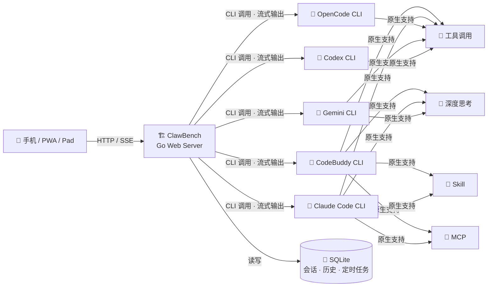

[中文](README.md) | [English](README.en.md)

# ClawBench —— 为移动端打造的AI工作台

<p>
  
</p>

**从终端到掌心** — 为移动端打造的 AI 工作台。

将强大的 AI 编程智能体能力完整移植到浏览器与移动端 App，打造真正的移动端工作环境。文件浏览、代码编辑、AI 对话、Git 操作、定时调度 —— 一个应用，全部搞定。

**核心优势**：原生透传 AI 能力（工具调用、深度思考、Skill、MCP），零适配成本，完整保留编程智能体的强大功能。不同于其他移动端 AI 工具仅做"遥控器"，ClawBench 是**唯一的全功能移动端工作台**——文件、代码、Git、AI、定时任务、TTS，手机上直接干活，不依赖电脑在线。（[竞品对比](docs/COMPARISON.md)）

**本项目本身即完全使用 ClawBench 在手机上开发，全程未使用 PC。**

- **支持平台**：浏览器（PC / 平板 / 手机）、Android App、PWA
- **AI 后端**：CodeBuddy、Claude Code、OpenCode、Gemini CLI、Codex

---

## 截图预览

### 登录与导航

| 登录 | 首页 | 选择项目 |
|------|------|----------|
|  |  |  |

### 文件浏览与代码编辑

| 代码编辑器 | 搜索 | 文件浏览 |
|------------|------|----------|
|  |  |  |

### Markdown 与文档预览

| LaTeX 公式 | Mermaid 图表 | 目录导航 |
|------------|-------------|----------|
|  |  |  |

### AI 智能体

| 智能体选择 | AI 全能助手 | 会话管理 | 定时任务 |
|------------|-------------|----------|----------|
|  |  |  |  |

### AI 对话

| 工具调用与深度思考 | 快捷发送 |
|--------------------|----------|
|  |  |

### Git 集成

| Git Diff | 提交历史 | Git 分支图 |
|----------|----------|------------|
|  |  |  |

### 媒体预览

| 图片查看 | 灯箱放大 | 视频播放 | 音频播放 | PDF 预览 |
|----------|----------|----------|----------|----------|
|  |  |  |  |  |

### SSH 隧道端口转发

| 端口转发管理 |
|-------------|
|  |

---

## 技术架构

ClawBench 的核心哲学：

- **零适配透传**：不重新实现 AI 能力，而是将 AI 编程智能体 CLI 作为后端引擎，通过 Web 服务封装为 HTTP API + SSE 流式接口，完整保留工具调用、深度思考、Skill、MCP 等全部能力，零适配成本。前端只负责渲染和交互，所有智能逻辑由 CLI 原生提供。
- **AI 负责改，我负责看**：项目不提供直接的文件编辑能力，所有修改通过 AI 完成。重点打造 Markdown 和代码的预览体验，以及在预览过程中与 AI 的交互能力——选中代码或文本即可向 AI 提问、要求修改，快速迭代。



---

## 快速开始

从 [GitHub Releases](https://github.com/xulongzhe/clawbench/releases) 下载最新版 ZIP 包，解压即可部署。所有配置项均有默认值，无需配置文件即可启动。

```bash
wget https://github.com/xulongzhe/clawbench/releases/latest/download/clawbench-linux-amd64.zip
unzip clawbench-linux-amd64.zip
cd clawbench
```

### 配置智能体

`config/agents/` 目录下的 YAML 文件定义了可用的 AI 智能体。基于示例创建你需要的智能体：

```bash
# 查看示例模板（包含所有字段的详细说明）
cat config/agents/agent.yaml.example

# 复制示例并修改，创建你自己的智能体
cp config/agents/agent.yaml.example config/agents/my-agent.yaml
# 编辑 id、name、icon、specialty、backend、model、system_prompt 等字段
```

每个 YAML 文件对应一个智能体，至少需要配置：`id`（唯一标识）、`name`（显示名）、`icon`（Emoji 图标）、`specialty`（专长描述）、`backend`（AI 后端类型）。可选字段：`model`（指定模型）、`command`（自定义 CLI 路径或参数）、`system_prompt`（角色设定，省略时使用 `agent_common_prompt.md` 的内容）。

### 启动服务

```bash
./server.sh
```

> 首次启动会自动生成随机密码并打印到控制台，请妥善保存。如需自定义配置，可复制 `config/config.example.yaml` 为 `config.yaml` 并修改。

部署完成后，使用手机 App 或手机浏览器访问 `http://服务器IP:20000` 即可开始使用：

- **手机 App**：原生集成，自动连接，支持完整功能
- **手机浏览器**：推荐使用 **Chrome 浏览器**访问，支持将网页安装为 PWA 应用（添加到主屏幕），获得接近原生 App 的体验

> 编译构建、高级配置、部署说明、架构设计等详细文档请参阅 **[编译与开发指南](docs/DEVELOPMENT.md)**。

---

## 功能详解

### 📁 文件浏览
- 递归目录浏览，支持 120+ 种文件扩展名
- 搜索过滤、排序（名称/时间/扩展名）
- 右键菜单：重命名、删除、复制、剪切、粘贴、新建文件/文件夹、下载、作为项目打开
- 文件上传（支持图片，大小和数量可配置）
- 隐藏文件显示/隐藏切换

### 🎨 代码预览
- 语法高亮，粘性行号，自动换行切换
- 双击复制代码行内容（闪烁动画反馈）
- **引用提问**：选中代码片段后，一键向 AI 提问，自动附上文件路径和行号
- 滑动手势：左右滑动切换文件

### 📝 Markdown
- 渲染视图 / 源码视图一键切换
- **引用提问**：选中文本，一键向 AI 提问
- 智能目录抽屉（TOC），LaTeX 数学公式，Mermaid 图表
- **图片灯箱**：图片支持放大、左右切换浏览
- **文件路径跳转**：Markdown 中的文件路径可点击跳转

### 🤖 AI 智能体
- **流式响应**：SSE 实时推送，思维过程、工具调用全程可见
- **多 Agent 支持**：全能助手、编码专家、勤杂工等，YAML 配置即插即用
- **AI 后端切换**：CodeBuddy、Claude Code、OpenCode、Gemini CLI、Codex，会话级隔离
- **定时任务**：AI 提案后自动创建 Cron 调度，定时执行
- **多会话管理**：创建、切换、删除独立会话，滑动切换
- **图片上传**：支持上传图片与 AI 对话（多模态）
- **断连保护**：消息立即落库，网络断开不丢失，60 秒超时自动重连（3 次后降级轮询）
- **自动恢复**：Claude / CodeBuddy 退出 Plan Mode 后自动发送"继续"
- **消息队列**：AI 忙碌时消息排队，依次发送

### 🤖 AI 对话
- **工具调用可视化**：名称、参数、结果实时展示
- **深度思考**：复杂任务自动触发 extended thinking，推理过程实时可见
- **文件路径跳转**：AI 回复中的文件路径可点击跳转
- **快捷发送**：预设常用指令（继续、编译、提交等），一键发送
- **引用提问**：选中代码或文本，直接向 AI 提问，自动附带上下文
- **未读徽章**：聊天面板图标显示未读消息数

### 🖼️ 媒体预览
- 图片、音频、视频应用内直接预览
- 灯箱放大、全屏查看，支持缩放和拖拽

### 🔊 TTS 语音朗读
- AI 回复自动总结后朗读，边听边看
- **5 种 TTS 引擎**：Edge TTS（免费）、MiniMax（音质最佳）、Piper / Kokoro / MOSS-Nano（本地离线）
- **8 种总结后端**：simple 纯清洗、mmx-cli、Claude、CodeBuddy、Gemini、OpenCode、Codex、Ollama（本地推理）
- 详见 [TTS 语音合成部署指南](docs/TTS.md)

### 📂 Git 集成
- 项目级 / 文件级提交历史浏览
- **Git 分支图**：纵向分支拓扑图，直观展示分支关系
- **Git Diff 视图**：查看文件相对 HEAD 的变更，字符级高亮
- 提交详情查看（作者、时间、提交信息）
- 工作树变更视图（已暂存 / 未暂存文件）
- Git 初始化（从 UI 一键 `git init`）

### 🔀 SSH 隧道端口转发
- **远程开发**：在 Android App 上直接访问服务器本地端口
- **全协议透明**：HTTP、HTTPS、WebSocket、SSE、gRPC，无需 URL 重写

### 🌐 国际化
- 中文 / 英文双语界面，自动检测系统语言

### 📱 Android App
- 原生桥接集成：自动登录、文件下载、端口转发管理
- SSH 密码管理、服务器对话框

### 🔔 通知
- 通知音效 + 触觉反馈（AI 完成时提醒）
- 浏览器推送通知

### 🎨 主题
- 亮色 / 暗色模式，跟随系统偏好

### 📱 PWA 支持
- 可安装到主屏幕，独立窗口运行

### 🔒 安全
- 可选密码保护（SHA-256 加盐）
- 路径穿越防护，所有操作限制在项目目录内
- 文件上传大小和数量可配置（默认 10MB / 20 个）
- XSS 防护（DOMPurify 净化）
- TLS 支持（需手动配置证书）

---

## 常见问题

详见 **[FAQ](docs/FAQ.md)**。

---

## 许可证

Copyright (c) 2026 xulongzhe

Licensed under the MIT License
