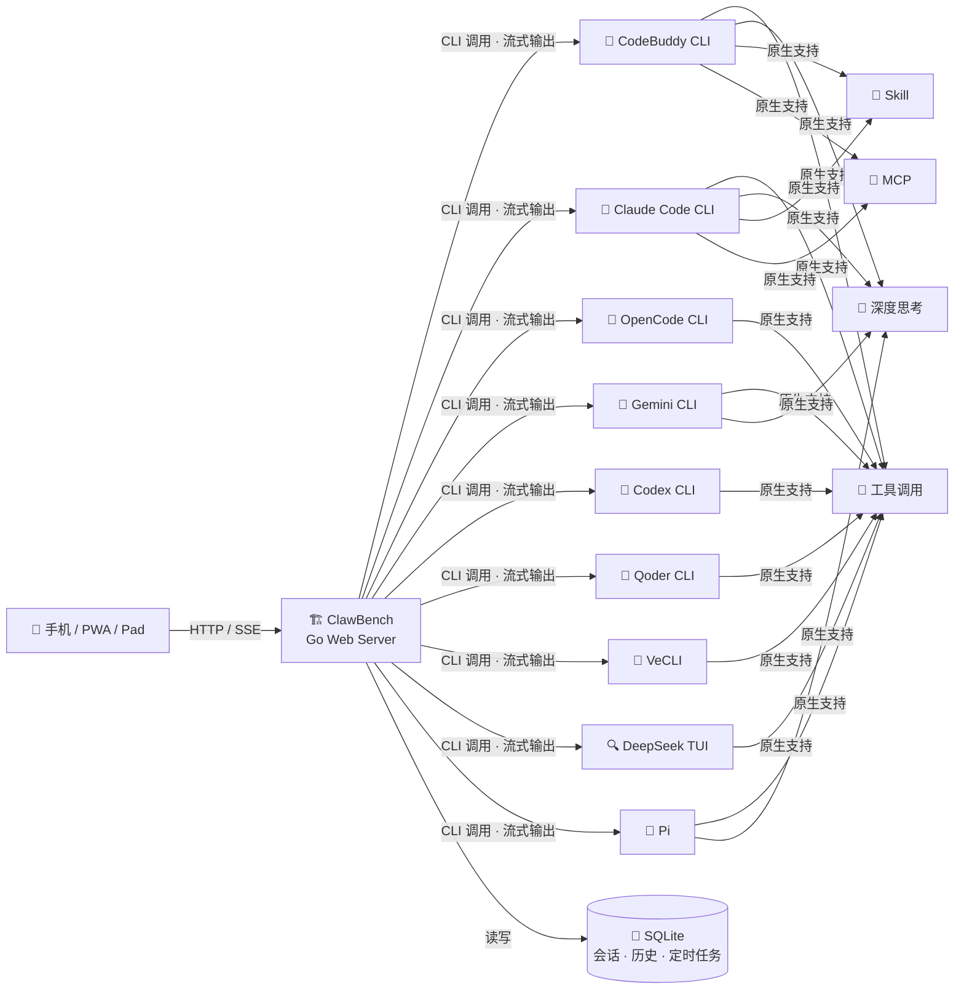

[中文](README.md) | [English](README.en.md)

# ClawBench —— 为移动端打造的AI工作台

> 🎬 **演示视频**：[OpenClaw 和 Hermes 就是玩具，于是我写了一个能干活的](https://b23.tv/ewACF0h) — Bilibili

<p>
  
</p>

**从终端到掌心** — 为移动端打造的 AI 工作台。

将强大的 AI 编程智能体能力完整移植到浏览器与移动端 App，打造真正的移动端工作环境。文件浏览、代码编辑、AI 对话、Git 操作、定时调度 —— 一个应用，全部搞定。

核心优势：原生透传 AI 能力（工具调用、深度思考、Skill、MCP），零适配成本，完整保留编程智能体的强大功能。不同于其他移动端 AI 工具仅做"遥控器"，ClawBench 是全功能移动端工作台——文件、代码、Git、AI、定时任务、TTS，手机上直接干活，不依赖电脑在线。（[同类项目对比](docs/COMPARISON.md)）


- **支持平台**：浏览器（PC / 平板 / 手机）、Android App、PWA
- **AI 后端**：CodeBuddy、Claude Code、OpenCode、Gemini CLI、Codex、Qoder CLI、VeCLI、DeepSeek TUI、Pi

---

## 截图预览

### 登录与导航

| 登录 | 首页 | 选择项目 |
|------|------|----------|
|  |  |  |

### 文件浏览与代码编辑

| 文件浏览 | 搜索过滤 | 代码编辑器 | 引用提问 |
|----------|----------|------------|----------|
|  |  |  |  |

### Markdown 与文档预览

| Markdown 渲染 | LaTeX 公式 | Mermaid 图表 | 目录导航 |
|---------------|------------|-------------|----------|
|  |  |  |  |

### AI 智能体

| 智能体选择 | AI 对话 | 结构化提问 | 会话管理 |
|------------|---------|------------|----------|
|  |  |  |  |

| 定时任务 | 创建任务 | 任务卡片 |
|----------|----------|----------|
|  |  |  |

### Git 集成

| 提交历史与分支图 | 提交详情 | 比较报告 |
|------------------|----------|----------|
|  |  |  |

### 媒体预览

| 图片查看 | 视频播放 | 音频播放 | PDF 预览 |
|----------|----------|----------|----------|
|  |  |  |  |

### SSH 隧道与 Web 终端

| 端口转发 | 交互式终端 |
|---------|-----------|
|  |  |

---

## 技术架构

ClawBench 的核心哲学：

- **零适配透传**：不重新实现 AI 能力，而是将 AI 编程智能体 CLI 作为后端引擎，通过 Web 服务封装为 HTTP API + SSE 流式接口，完整保留工具调用、深度思考、Skill、MCP 等全部能力，零适配成本。前端只负责渲染和交互，所有智能逻辑由 CLI 原生提供。
- **AI 负责改，我负责看**：项目不提供直接的文件编辑能力，所有修改通过 AI 完成。重点打造 Markdown 和代码的预览体验，以及在预览过程中与 AI 的交互能力——选中代码或文本即可向 AI 提问、要求修改，快速迭代。



---

## 快速开始

### 前置准备

- **一台 PC（Linux / macOS / Windows）**：用于运行 ClawBench 服务端，需已安装至少一种 AI 编程智能体 CLI（CodeBuddy、Claude Code、OpenCode、Gemini CLI、Codex、Qoder CLI、VeCLI、DeepSeek TUI、Pi 均可）
- **一台手机**：安装 [ClawBench Android App](https://github.com/xulongzhe/clawbench/releases)，或使用手机浏览器（推荐 Chrome）访问服务端地址

### 下载与启动

从 [GitHub Releases](https://github.com/xulongzhe/clawbench/releases) 下载最新版 ZIP 包，解压即可部署：

```bash
wget https://github.com/xulongzhe/clawbench/releases/latest/download/clawbench-linux-amd64.zip
unzip clawbench-linux-amd64.zip
cd clawbench
./server.sh
```

就这么简单 —— 每次启动时，ClawBench 会自动扫描系统中已安装的 AI CLI 工具，为每个检测到的后端生成最小化智能体配置，并自动发现可用模型和思考档位。无需手动配置即可开始使用。

> 首次启动会自动生成8位随机密码，以字符框突出打印到控制台，请妥善保存。

部署完成后，使用手机 App 或手机浏览器访问 `http://服务器IP:20000` 即可开始使用：

- **手机 App**：原生集成，自动连接，支持完整功能
- **手机浏览器**：推荐使用 **Chrome 浏览器**访问，支持将网页安装为 PWA 应用（添加到主屏幕），获得接近原生 App 的体验

### 自定义智能体

自动生成的智能体配置为最小化默认值（不含模型列表和思考档位，由运行时自动发现填充）。如需自定义模型列表、系统提示词、图标等，编辑 `config/agents/` 目录下的 YAML 文件后重启服务即可：

```bash
# 编辑已有智能体
vim config/agents/claude.yaml

# 添加新的智能体（参考示例模板）
cp config/agents/claude.yaml.example config/agents/my-claude.yaml
```

每个 `.yaml.example` 文件包含该后端的完整配置字段和说明，仅作为参考模板，不会被自动加载。

> 编译构建、高级配置、部署说明、架构设计等详细文档请参阅 **[编译与开发指南](docs/DEVELOPMENT.md)**。

---

## 功能详解

### 📁 文件浏览
- 递归目录浏览，支持 120+ 种文件扩展名
- 搜索过滤、排序（名称/时间/扩展名/大小）
- **列表/网格视图切换**：网格视图以图片缩略图展示文件，直观浏览图片资源
- **图片缩略图**：后端生成方形缩略图（主色调填充），快速预览图片内容
- 右键菜单：重命名、删除、复制、剪切、粘贴、新建文件/文件夹、下载、作为项目打开
- **多选操作**：工具栏切换多选模式，批量复制/剪切/删除，移动端长按触发右键菜单
- 文件上传（支持所有文件类型，大小和数量可配置）
- 隐藏文件显示/隐藏切换
- **下钻浏览 + 边缘滑动回退**：点击文件夹下钻进入，右边缘左滑返回上一级，移动端直觉操作

### 🎨 代码预览
- 语法高亮，粘性行号，自动换行切换
- 双击复制代码行内容（闪烁动画反馈）
- **文件改动闪烁高亮**：文件被外部修改时，删除字符红色脉冲闪烁，新增字符蓝色脉冲闪烁，快速定位改动
- **引用提问**：选中代码片段后，一键向 AI 提问，自动附上文件路径和行号
- 滑动手势：左右滑动切换文件

### 📝 Markdown
- 渲染视图 / 源码视图一键切换
- **引用提问**：选中文本，一键向 AI 提问
- 智能目录抽屉（TOC），LaTeX 数学公式，Mermaid 图表
- **图片灯箱**：图片支持放大、左右切换浏览
- **文件路径跳转**：Markdown 中的文件路径可点击跳转

### 🤖 AI 智能体
- **流式响应**：SSE 实时推送，思维过程、工具调用全程可见
- **多 Agent 支持**：全能助手、编码专家、勤杂工等，YAML 配置即插即用
- **AI 后端切换**：CodeBuddy、Claude Code、OpenCode、Gemini CLI、Codex、Qoder CLI、VeCLI、DeepSeek TUI、Pi，会话级隔离
- **深度思考档位**：支持按智能体选择思考深度（Auto / Low / Medium / High），Claude/CodeBuddy/OpenCode/Codex/Pi 五后端支持，选择自动持久化
- **模型选择模态框**：统一模型切换与思考深度选择，双 Tab 界面，搜索过滤，一键刷新模型列表（支持自动发现的智能体），长按设为默认模型
- **模型选择持久化**：每个智能体的模型选择和思考档位自动保存到 localStorage，刷新/切换会话自动恢复
- **定时任务**：AI 通过 CLI 子命令创建 Cron 调度，定时自动执行；独立标签页管理，4 级面包屑导航；频率预设（每小时/每天/每周/每月）+ 自定义 Cron 表达式；任务卡片内嵌聊天消息；执行级别已读追踪 + TTS 朗读；执行完成后自动摘要 + 完成通知（音效/震动/Toast）
- **继续对话**：定时任务执行详情页可一键继续对话，自动复制历史消息和摘要到新会话，继承后端/智能体/模型/思考档位；会话列表中定时任务来源的会话显示紫色「定时」角标
- **多会话管理**：创建、切换、删除独立会话，滑动切换
- **滑动会话切换开关**：可在设置中开关聊天区域左右滑动切换会话，默认关闭避免滚动宽内容时误触
- **图片上传**：支持上传图片与 AI 对话（多模态）
- **断连保护**：消息立即落库，网络断开不丢失，15 秒心跳保活 + 30 秒超时自动重连（降级轮询时实时更新内容）
- **自动恢复**：Claude / CodeBuddy / Qoder / DeepSeek / Pi 退出 Plan Mode 后自动发送"继续"
- **消息队列**：AI 忙碌时消息排队，依次发送
- **自动摘要**：会话完成后自动生成最后一条助手消息的摘要，底部横幅一键切换摘要/原文；TTS 朗读也使用摘要

### 🤖 AI 对话
- **工具调用可视化**：名称、参数、执行结果实时展示，成功/失败状态一目了然
- **深度思考**：复杂任务自动触发 extended thinking，推理过程实时可见
- **文件路径跳转**：AI 回复中的文件路径可点击跳转
- **Localhost URL 跳转**：AI 回复中的 localhost URL（如 http://localhost:3000）自动识别并添加打开按钮，App 模式下自动注册端口转发并通过 WebView 打开，无需手动配置
- **快捷发送**：预设常用指令（继续、编译、提交等），支持拖拽排序，一键发送，输入框占位提示当前快捷指令
- **引用提问**：选中代码或文本，直接向 AI 提问，自动附带上下文
- **当前目录附加**：聊天输入支持附加当前目录上下文，AI 自动获取目录结构
- **未读徽章**：聊天面板图标显示未读消息数

### 🖼️ 媒体预览
- 图片、音频、视频应用内直接预览
- 灯箱放大、全屏查看，支持缩放和拖拽

### 🔊 TTS 语音朗读
- AI 回复自动总结后朗读，边听边看
- **5 种 TTS 引擎**：Edge TTS（免费）、MiniMax（音质最佳）、Piper / Kokoro / MOSS-Nano（本地离线）
- **12 种总结后端**：simple 纯清洗、mmx-cli、api（OpenAI/Anthropic 兼容）、Claude、CodeBuddy、Gemini、OpenCode、Codex、Qoder、VeCLI、DeepSeek、Pi
- 详见 [TTS 语音合成部署指南](docs/TTS.md)

### 📂 Git 集成
- 项目级 / 文件级提交历史浏览
- **Git 分支图**：纵向分支拓扑图，直观展示分支关系
- **Git Diff 视图**：查看文件相对 HEAD 的变更，字符级高亮
- 提交详情查看（作者、时间、提交信息）
- 工作树变更视图（已暂存 / 未暂存文件）
- **三标签页管理**：工作树 / 分支 / 标签三标签页统一管理，默认标签持久化到 localStorage
- **滑动删除**：分支、工作树、标签支持左滑删除，安全保护（当前分支/默认分支/当前工作树不可删除）
- **标签管理**：浏览项目标签，点击标签可 Checkout，脏工作树自动弹窗处理
- Git 初始化（从 UI 一键 `git init`）

### 🔀 SSH 隧道端口转发
- **远程开发**：在 Android App 上直接访问服务器本地端口
- **全协议透明**：HTTP、HTTPS、WebSocket、SSE、gRPC，无需 URL 重写
- **指定目标地址**：支持转发到任意可达主机（局域网/远程主机，不仅限 127.0.0.1）
- **自动端口分配**：同一目标端口转发到不同主机时自动分配本地端口
- **端口编辑**：支持修改已注册的端口转发配置
- **Localhost URL 自动打开**：聊天中出现的 localhost URL（如 AI 启动的 Web 服务），App 模式下一键自动注册端口转发并通过 WebView 打开
- **隧道健康检测与重连**：打开 localhost URL 前自动检测隧道健康状态，异常时自动重连；断开的隧道支持一键重连

### 💻 Web 终端
- **交互式终端**：基于 PTY + WebSocket + xterm.js，浏览器内直接操作服务器终端
- **多会话并发**：每个客户端拥有独立 PTY 会话，互不干扰
- **虚拟按键栏**：按类型分组的颜色编码按键（修饰键、快捷键、导航键、方向键、操作键），修饰键支持三态切换
- **符号栏**：可展开的符号输入行，19 个终端高频符号，支持智能排序（指数衰减模型，兼顾频率与时效性）
- **触摸手势**：Termius 风格手势（滑动→方向键、长按重复、双击→Tab、捏合缩放），手势关闭时支持触摸滚动
- **快捷命令**：CRUD 管理常用命令，支持拖拽排序、隐藏、自动执行（每次连接自动运行）
- **Android 音量键**：App 内终端打开时，音量键映射为方向键上下
- 详见 [Web 终端使用指南](docs/TERMINAL.md)

### 🌐 国际化
- 中文 / 英文双语界面，自动检测系统语言

### 📱 Android App
- 原生桥接集成：自动登录、文件下载（支持 POST 下载压缩包）、端口转发管理
- 静态 HTML 登录页：首次启动或连接失败时显示，与 Web 端视觉风格统一
- SSH 密码管理、服务器对话框
- WebView 连接保护：连接期间隐藏 WebView，防止浏览器错误页闪现
- 终端音量键映射：打开终端时音量键作为方向键

### 🔔 通知
- 通知音效 + 触觉反馈（AI 完成时提醒）
- 浏览器推送通知
- **任务完成推送**：定时任务执行完成后推送包含响应预览摘要，点击跳转至执行详情

### 🎨 主题
- 亮色 / 暗色模式，跟随系统偏好

### 📱 PWA 支持
- 可安装到主屏幕，独立窗口运行

### 🔒 安全
- 可选密码保护（SHA-256 加盐哈希存储，设置面板支持修改密码）
- 多实例部署安全隔离（Cookie 按端口自动前缀，同域名不同端口互不干扰）
- 路径穿越防护，所有操作限制在项目目录内
- Git 参数注入防护（SHA/分支名/标签名校验，`--` 分隔符）
- 文件上传大小和数量可配置（默认 100MB / 20 个），支持所有文件类型
- XSS 防护（DOMPurify 净化）
- TLS 支持（需手动配置证书）

---

## 常见问题

详见 **[FAQ](docs/FAQ.md)**。

---

## 许可证

Copyright (c) 2026 xulongzhe

Licensed under the MIT License
