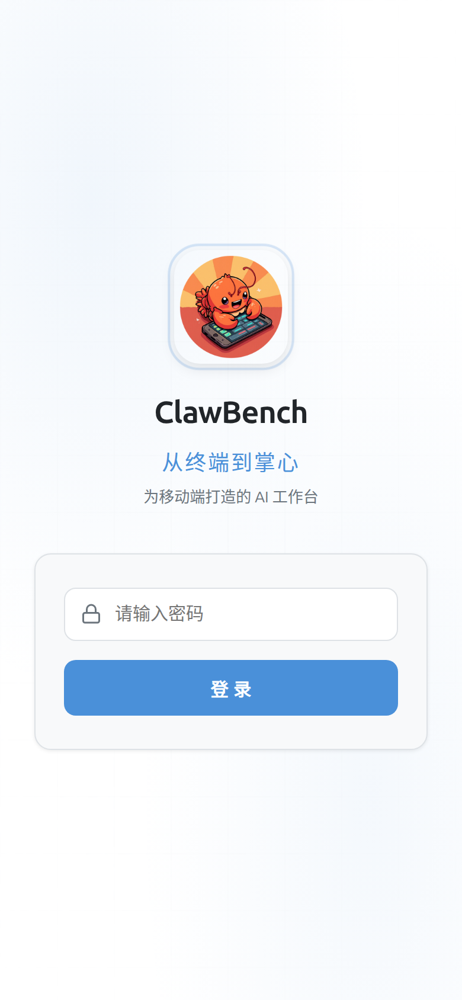
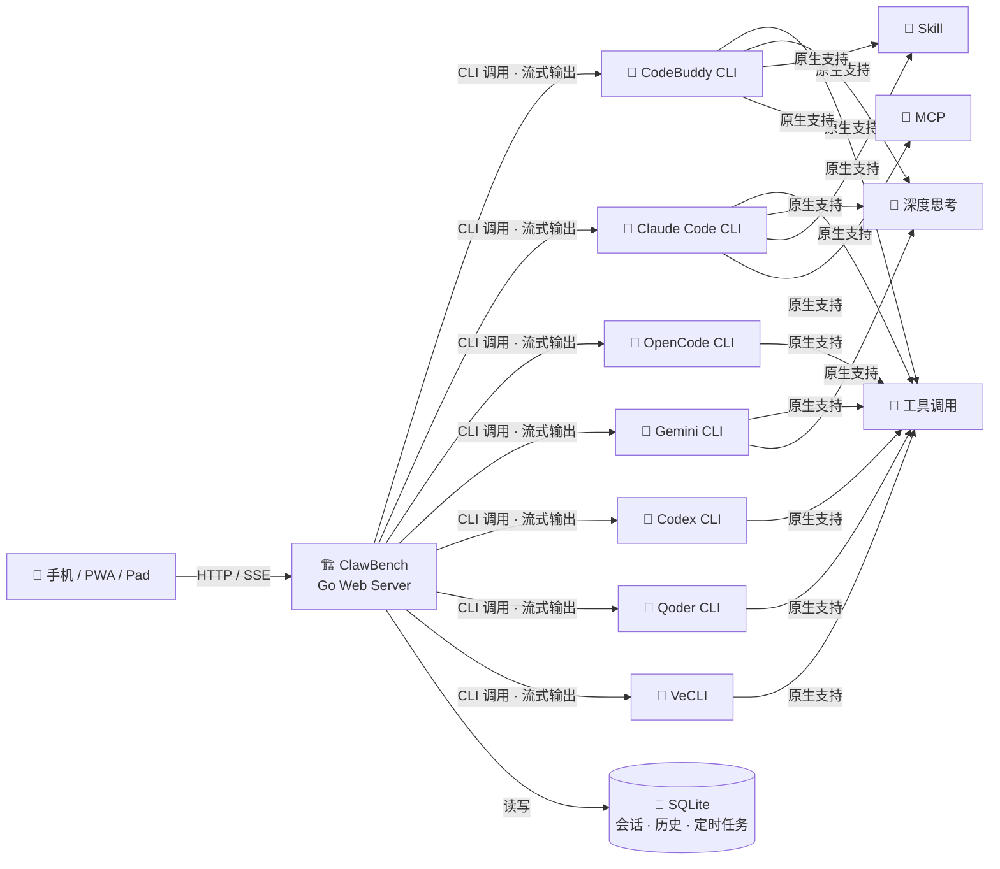

[中文](README.md) | [English](README.en.md)

# ClawBench —— 为移动端打造的AI工作台

<p>
  
</p>

**从终端到掌心** — 为移动端打造的 AI 工作台。

将强大的 AI 编程智能体能力完整移植到浏览器与移动端 App，打造真正的移动端工作环境。文件浏览、代码编辑、AI 对话、Git 操作、定时调度 —— 一个应用，全部搞定。

核心优势：原生透传 AI 能力（工具调用、深度思考、Skill、MCP），零适配成本，完整保留编程智能体的强大功能。不同于其他移动端 AI 工具仅做"遥控器"，ClawBench 是全功能移动端工作台——文件、代码、Git、AI、定时任务、TTS，手机上直接干活，不依赖电脑在线。（[同类项目对比](docs/COMPARISON.md)）


- **支持平台**：浏览器（PC / 平板 / 手机）、Android App、PWA
- **AI 后端**：CodeBuddy、Claude Code、OpenCode、Gemini CLI、Codex、Qoder CLI、VeCLI

---

## 截图预览

### 登录与导航

| 登录 | 首页 | 选择项目 |
|------|------|----------|
|  |  |  |

### 文件浏览与代码编辑

| 文件浏览 | 搜索过滤 | 代码编辑器 | 引用提问 |
|----------|----------|------------|----------|
|  |  |  |  |

### Markdown 与文档预览

| Markdown 渲染 | LaTeX 公式 | Mermaid 图表 | 目录导航 |
|---------------|------------|-------------|----------|
|  |  |  |  |

### AI 智能体

| 智能体选择 | AI 对话 | 结构化提问 | 会话管理 |
|------------|---------|------------|----------|
|  |  |  |  |

| 定时任务 | 创建任务 | 任务卡片 |
|----------|----------|----------|
|  |  |  |

### Git 集成

| 提交历史与分支图 | 提交详情 | 比较报告 |
|------------------|----------|----------|
|  |  |  |

### 媒体预览

| 图片查看 | 视频播放 | 音频播放 | PDF 预览 |
|----------|----------|----------|----------|
|  |  |  |  |

### SSH 隧道与 Web 终端

| 端口转发 | 交互式终端 |
|---------|-----------|
|  |  |

---

## 技术架构

ClawBench 的核心哲学：

- **零适配透传**：不重新实现 AI 能力，而是将 AI 编程智能体 CLI 作为后端引擎，通过 Web 服务封装为 HTTP API + SSE 流式接口，完整保留工具调用、深度思考、Skill、MCP 等全部能力，零适配成本。前端只负责渲染和交互，所有智能逻辑由 CLI 原生提供。
- **AI 负责改，我负责看**：项目不提供直接的文件编辑能力，所有修改通过 AI 完成。重点打造 Markdown 和代码的预览体验，以及在预览过程中与 AI 的交互能力——选中代码或文本即可向 AI 提问、要求修改，快速迭代。



---

## 快速开始

### 前置准备

- **一台 PC（Linux / macOS / Windows）**：用于运行 ClawBench 服务端，需已安装至少一种 AI 编程智能体 CLI（CodeBuddy、Claude Code、OpenCode、Gemini CLI、Codex、Qoder CLI、VeCLI 均可）
- **一台手机**：安装 [ClawBench Android App](https://github.com/xulongzhe/clawbench/releases)，或使用手机浏览器（推荐 Chrome）访问服务端地址

### 下载与解压

从 [GitHub Releases](https://github.com/xulongzhe/clawbench/releases) 下载最新版 ZIP 包，解压即可部署。所有配置项均有默认值，无需配置文件即可启动。

```bash
wget https://github.com/xulongzhe/clawbench/releases/latest/download/clawbench-linux-amd64.zip
unzip clawbench-linux-amd64.zip
cd clawbench
```

### 配置智能体

`config/agents/` 目录下的 YAML 文件定义了可用的 AI 智能体。每个后端提供独立的示例文件，复制后修改即可：

| 示例文件 | 后端 | 说明 |
|----------|------|------|
| `claude.yaml.example` | claude | Claude Code CLI |
| `codebuddy.yaml.example` | codebuddy | CodeBuddy CLI，支持多模型 |
| `opencode.yaml.example` | opencode | OpenCode CLI |
| `gemini.yaml.example` | gemini | Gemini CLI |
| `codex.yaml.example` | codex | Codex CLI，支持 profile |
| `qoder.yaml.example` | qoder | Qoder CLI，自动模型路由 |
| `vecli.yaml.example` | vecli | VeCLI（火山引擎） |

```bash
# 示例：创建一个 Claude 智能体
cp config/agents/claude.yaml.example config/agents/my-claude.yaml
# 编辑 id、name、model 等字段后重启服务即可
```

每个示例文件包含该后端的完整配置字段和说明，`.yaml.example` 文件不会被加载，仅作为参考模板。

### 启动服务

```bash
./server.sh
```

> 首次启动会自动生成随机密码并打印到控制台，请妥善保存。如需自定义配置，可复制 `config/config.example.yaml` 为 `config/config.yaml` 并修改。

部署完成后，使用手机 App 或手机浏览器访问 `http://服务器IP:20000` 即可开始使用：

- **手机 App**：原生集成，自动连接，支持完整功能
- **手机浏览器**：推荐使用 **Chrome 浏览器**访问，支持将网页安装为 PWA 应用（添加到主屏幕），获得接近原生 App 的体验

> 编译构建、高级配置、部署说明、架构设计等详细文档请参阅 **[编译与开发指南](docs/DEVELOPMENT.md)**。

---

## 功能详解

### 📁 文件浏览
- 递归目录浏览，支持 120+ 种文件扩展名
- 搜索过滤、排序（名称/时间/扩展名）
- 右键菜单：重命名、删除、复制、剪切、粘贴、新建文件/文件夹、下载、作为项目打开
- 文件上传（支持图片，大小和数量可配置）
- 隐藏文件显示/隐藏切换

### 🎨 代码预览
- 语法高亮，粘性行号，自动换行切换
- 双击复制代码行内容（闪烁动画反馈）
- **引用提问**：选中代码片段后，一键向 AI 提问，自动附上文件路径和行号
- 滑动手势：左右滑动切换文件

### 📝 Markdown
- 渲染视图 / 源码视图一键切换
- **引用提问**：选中文本，一键向 AI 提问
- 智能目录抽屉（TOC），LaTeX 数学公式，Mermaid 图表
- **图片灯箱**：图片支持放大、左右切换浏览
- **文件路径跳转**：Markdown 中的文件路径可点击跳转

### 🤖 AI 智能体
- **流式响应**：SSE 实时推送，思维过程、工具调用全程可见
- **多 Agent 支持**：全能助手、编码专家、勤杂工等，YAML 配置即插即用
- **AI 后端切换**：CodeBuddy、Claude Code、OpenCode、Gemini CLI、Codex、Qoder CLI、VeCLI，会话级隔离
- **定时任务**：AI 通过 CLI 子命令创建 Cron 调度，定时自动执行；聊天消息中可内嵌任务卡片；频率预设（每小时/每天/每周/每月）+ 自定义 Cron 表达式
- **多会话管理**：创建、切换、删除独立会话，滑动切换
- **图片上传**：支持上传图片与 AI 对话（多模态）
- **断连保护**：消息立即落库，网络断开不丢失，60 秒超时自动重连（3 次后降级轮询）
- **自动恢复**：Claude / CodeBuddy / Qoder 退出 Plan Mode 后自动发送"继续"
- **消息队列**：AI 忙碌时消息排队，依次发送

### 🤖 AI 对话
- **工具调用可视化**：名称、参数、执行结果实时展示，成功/失败状态一目了然
- **深度思考**：复杂任务自动触发 extended thinking，推理过程实时可见
- **文件路径跳转**：AI 回复中的文件路径可点击跳转
- **快捷发送**：预设常用指令（继续、编译、提交等），支持拖拽排序，一键发送
- **引用提问**：选中代码或文本，直接向 AI 提问，自动附带上下文
- **未读徽章**：聊天面板图标显示未读消息数

### 🖼️ 媒体预览
- 图片、音频、视频应用内直接预览
- 灯箱放大、全屏查看，支持缩放和拖拽

### 🔊 TTS 语音朗读
- AI 回复自动总结后朗读，边听边看
- **5 种 TTS 引擎**：Edge TTS（免费）、MiniMax（音质最佳）、Piper / Kokoro / MOSS-Nano（本地离线）
- **10 种总结后端**：simple 纯清洗、mmx-cli、Claude、CodeBuddy、Gemini、OpenCode、Codex、Qoder、VeCLI、Ollama（本地推理）
- 详见 [TTS 语音合成部署指南](docs/TTS.md)

### 📂 Git 集成
- 项目级 / 文件级提交历史浏览
- **Git 分支图**：纵向分支拓扑图，直观展示分支关系
- **Git Diff 视图**：查看文件相对 HEAD 的变更，字符级高亮
- 提交详情查看（作者、时间、提交信息）
- 工作树变更视图（已暂存 / 未暂存文件）
- Git 初始化（从 UI 一键 `git init`）

### 🔀 SSH 隧道端口转发
- **远程开发**：在 Android App 上直接访问服务器本地端口
- **全协议透明**：HTTP、HTTPS、WebSocket、SSE、gRPC，无需 URL 重写

### 💻 Web 终端
- **交互式终端**：基于 PTY + WebSocket + xterm.js，浏览器内直接操作服务器终端
- **多会话并发**：每个客户端拥有独立 PTY 会话，互不干扰
- **虚拟按键栏**：按类型分组的颜色编码按键（修饰键、快捷键、导航键、方向键、符号键、操作键），修饰键支持三态切换
- **触摸手势**：Termius 风格手势（滑动→方向键、长按重复、双击→Tab、捏合缩放），手势关闭时支持触摸滚动
- **快捷命令**：CRUD 管理常用命令，支持拖拽排序、隐藏、自动执行（每次连接自动运行）
- **Android 音量键**：App 内终端打开时，音量键映射为方向键上下
- 详见 [Web 终端使用指南](docs/TERMINAL.md)

### 🌐 国际化
- 中文 / 英文双语界面，自动检测系统语言

### 📱 Android App
- 原生桥接集成：自动登录、文件下载、端口转发管理
- SSH 密码管理、服务器对话框
- 终端音量键映射：打开终端时音量键作为方向键

### 🔔 通知
- 通知音效 + 触觉反馈（AI 完成时提醒）
- 浏览器推送通知

### 🎨 主题
- 亮色 / 暗色模式，跟随系统偏好

### 📱 PWA 支持
- 可安装到主屏幕，独立窗口运行

### 🔒 安全
- 可选密码保护（SHA-256 加盐）
- 路径穿越防护，所有操作限制在项目目录内
- 文件上传大小和数量可配置（默认 10MB / 20 个）
- XSS 防护（DOMPurify 净化）
- TLS 支持（需手动配置证书）

---

## 常见问题

详见 **[FAQ](docs/FAQ.md)**。

---

## 许可证

Copyright (c) 2026 xulongzhe

Licensed under the MIT License
