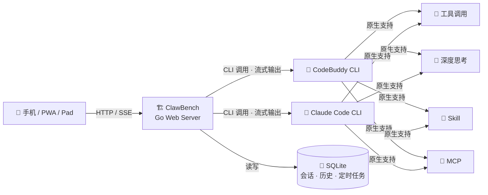

# ClawBench

<p>
  
</p>

**编程工具版的 OpenClaw** — 基于 AI 编程工具 CLI 构建的智能体平台。

将 Claude Code / CodeBuddy 等 AI 编程工具的强大能力，从终端搬到手机浏览器，让 AI 智能体触手可及。

**不是套壳聊天，是复用编程智能体的全部能力**：工具调用、深度思考、Skill、MCP —— 原生透传，零适配成本。

---

## 截图预览

| 登录 | 首页 | 文件浏览 | 代码编辑 |
|------|------|----------|----------|
|  |  |  |  |

| 图片预览 | 视频预览 | 音频预览 | PDF 预览 |
|----------|----------|----------|----------|
|  |  |  |  |

| AI 对话 | AI 智能体 | Git Diff | 提交历史 |
|---------|-----------|----------|----------|
|  |  |  |  |

| 搜索 | 目录 | 数学公式 | 时序图 |
|------|------|----------|--------|
|  |  |  |  |

---

## 为什么需要 ClawBench？

AI 编程工具（如 CodeBuddy、Claude Code）能力强大，但使用门槛高：

- **不暴露 API Key**：CodeBuddy 等工具通过 CLI 本地运行，API Key 不直接暴露给用户，无法像 OpenAI API 那样随意调用
- **依赖终端**：只能在安装了 CLI 的机器上通过终端交互，手机和平板上无法使用
- **单用户限制**：一个 CLI 进程一次只能服务一个请求，无法并发、无法远程共享

**ClawBench 的解法**：把 AI 编程工具的 CLI 作为后端引擎，通过 Web 服务封装为 HTTP API + SSE 流式接口，将智能体能力安全地暴露给移动端。

因为直接调用 CLI，编程智能体原生具备的一切能力自动可用：

| 能力 | 说明 | 示例 |
|------|------|------|
| 🔧 **工具调用** | 读写文件、执行命令、代码编辑……CLI 暴露的工具全部透传 | `Read` / `Bash` / `Edit` / `Write` / `Glob` / `Grep` |
| 🧠 **深度思考** | 复杂任务自动触发 extended thinking，推理过程实时可见 | 架构设计、Bug 定位、多步重构 |
| 🎯 **Skill** | 编程工具内置的技能系统，一键触发专业工作流 | `brainstorming` → `writing-plans` → `executing-plans` |
| 🔌 **MCP** | Model Context Protocol 工具即插即用，无需改代码 | Tavily 搜索、MiniMax 图片/语音、数据库操作 |



**核心价值**：

| 痛点 | ClawBench 解法 |
|------|---------------------|
| API Key 无法暴露 | CLI 本地运行，Key 不离开服务器，用户无需关心 Key |
| 只能在终端用 | Web UI + PWA，手机/平板/任意浏览器直接访问 |
| 无法并发 | Go 后端异步调度，多会话并行，SSE 流式推送 |
| 无法远程共享 | 部署一次，团队/个人多设备访问，密码保护 |
| 无定时能力 | 内置 Cron 调度，AI 智能体定时自动执行 |
| 无法调用工具/Skill/MCP | CLI 原生透传，零适配成本，能力随工具升级自动获得 |

---

## 核心理念

打开文件 → 与 AI 对话 → AI 直接修改文件

AI 始终在当前文件的上下文中，不需要复制粘贴，不需要在应用间切换。

---

## 快速开始

### 构建

```bash
./build.sh
```

编译 Go 后端二进制文件 `./clawbench`，并构建 Vue 前端到 `public/` 目录。

### 启动与停止

发布版和开发版使用独立端口和数据库，可以同时运行。

| 命令 | 说明 |
|------|------|
| `./server.sh` | 后台启动发布版（端口 20000） |
| `./server.sh --fg` | 前台启动发布版 |
| `./server.sh --dev` | 启动开发版（Go 后端 :20002 + Vite HMR :20001） |
| `./server.sh --stop` | 停止发布版 |
| `./server.sh --stop --all` | 停止所有进程 |
| `./server.sh --restart` | 重启发布版 |
| `./server.sh --port 8080` | 指定端口（仅发布版） |

---

## 环境部署与配置

### 系统要求

> **仅支持 Linux 系统**。后端使用 CGO 编译 SQLite，生成 Linux 原生二进制，不支持 macOS / Windows。

| 依赖 | 最低版本 | 用途 |
|------|---------|------|
| **Linux** | — | 运行环境（x86_64 / ARM64） |
| **Go** | 1.21+ | 编译后端 |
| **Node.js** | 18+ | 构建前端 |
| **npm** | 9+ | 前端依赖管理 |
| **Git** | 2.0+ | Git 集成功能 |

AI 后端（二选一，需提前安装并完成认证）：

| CLI 工具 | 说明 |
|----------|------|
| **CodeBuddy CLI** | CodeBuddy 编程智能体命令行工具 |
| **Claude Code CLI** | Claude Code 编程智能体命令行工具 |

### 安装步骤

#### 1. 克隆项目

```bash
git clone <repository-url> clawbench
cd clawbench
```

#### 2. 安装依赖

```bash
# 前端依赖
npm install
```

Go 依赖会在构建时自动下载（`go build` 自动处理 `go.mod`）。

#### 3. 构建项目

```bash
./build.sh
```

该脚本依次执行：
1. `go build -o clawbench ./cmd/server` — 编译 Go 后端
2. `npm run build` — 构建 Vue 前端到 `public/` 目录

也可单独构建：

```bash
# 仅后端
go build -o clawbench ./cmd/server

# 仅前端
npm run build
```

#### 4. 配置

编辑 `config.yaml`，**至少配置以下项**：

```yaml
port: 20000                     # 服务端口
watch_dir: "/home/user"         # 项目监控目录（AI 可访问的文件根路径）
password: "your_password"       # 访问密码（可选，留空则无需登录）
```

完整配置参考见下方 [配置详解](#配置详解)。

#### 5. 启动服务

```bash
./server.sh              # 后台启动
./server.sh --fg         # 前台启动（可看实时日志）
```

启动后访问 `http://localhost:20000`（或你配置的端口）。

### 配置详解

编辑 `config.yaml` 文件：

```yaml
port: 20000                     # 发布版服务端口
watch_dir: "/home/user"         # 项目监控目录
password: "your_password"       # 访问密码（可选，SHA-256 加盐存储）

# 上传限制（可选）
upload:
  max_size_mb: 10               # 单文件上传大小上限（MB），默认 10
  max_files: 20                 # 单次上传文件数量上限，默认 20

# 日志配置（可选）
log_dir: "~/.ClawBench/logs"    # 日志目录，默认 .ClawBench/logs/
log_max_days: 7                 # 日志保留天数，默认 7

# TLS (HTTPS) 配置（可选，推荐公网部署时启用）
tls:
  enabled: false                # 启用 TLS
  cert_file: "/path/to/fullchain.pem"   # 证书文件
  key_file: "/path/to/privkey.pem"      # 私钥文件

# 开发版端口配置（独立于发布版，避免冲突）
dev:
  port: 20002                   # 开发版后端端口
  frontend_port: 20001          # Vite 前端端口（HMR 热更新）
```

#### 配置项说明

| 配置项 | 必填 | 默认值 | 说明 |
|--------|------|--------|------|
| `port` | 否 | 20000 | 发布版 HTTP 服务端口 |
| `watch_dir` | 是 | — | AI 可操作的根目录，所有文件读写限制在此路径内 |
| `password` | 否 | 空 | 设置后访问需登录，密码经 SHA-256 加盐存储 |
| `log_dir` | 否 | `.ClawBench/logs/` | 日志文件存储路径 |
| `log_max_days` | 否 | 7 | 日志文件保留天数，超期自动清理 |
| `tls.enabled` | 否 | false | 启用 HTTPS |
| `tls.cert_file` | 否 | — | TLS 证书路径（如 Let's Encrypt） |
| `tls.key_file` | 否 | — | TLS 私钥路径 |
| `dev.port` | 否 | 20002 | 开发模式后端端口 |
| `dev.frontend_port` | 否 | 20001 | 开发模式 Vite HMR 端口 |
| `upload.max_size_mb` | 否 | 10 | 单文件上传大小上限（MB） |
| `upload.max_files` | 否 | 20 | 单次上传文件数量上限 |

### AI 后端配置

ClawBench 通过调用本地 CLI 实现与 AI 编程工具的交互，无需额外 API Key 配置。

#### CodeBuddy 后端

1. 安装 CodeBuddy CLI 并完成登录认证
2. 确保 `codebuddy` 命令在 PATH 中可用：
   ```bash
   which codebuddy   # 验证可执行
   ```
3. 无需额外配置，ClawBench 自动调用

#### Claude Code 后端

1. 安装 Claude Code CLI 并完成认证
2. 确保 `claude` 命令在 PATH 中可用：
   ```bash
   which claude     # 验证可执行
   ```
3. 无需额外配置，ClawBench 自动调用

> **提示**：两种后端可在 ClawBench Web UI 中实时切换，会话数据隔离。

### HTTPS 配置（公网部署推荐）

公网部署时强烈建议启用 HTTPS，步骤如下：

1. **获取证书**：使用 Let's Encrypt 或其他 CA 签发证书
   ```bash
   # 示例：使用 certbot 获取 Let's Encrypt 证书
   sudo certbot certonly --standalone -d your-domain.com
   ```

2. **配置 TLS**：在 `config.yaml` 中启用 TLS
   ```yaml
   tls:
     enabled: true
     cert_file: "/etc/letsencrypt/live/your-domain.com/fullchain.pem"
     key_file: "/etc/letsencrypt/live/your-domain.com/privkey.pem"
   ```

3. **重启服务**：
   ```bash
   ./server.sh --restart
   ```

### 开发模式

开发模式使用独立端口和数据库，可与发布版同时运行：

```bash
./server.sh --dev
```

- 后端：`http://localhost:20002`
- 前端（Vite HMR）：`http://localhost:20001`
- 数据库：`ClawBench-dev.db`（与发布版隔离）

### Docker 部署

```bash
docker run -d \
  --name clawbench \
  -p 20000:20000 \
  -v /your/data:/data \
  ghcr.io/xulongzhe/clawbench:latest
```

| 参数 | 说明 |
|------|------|
| `-p 20000:20000` | 映射服务端口 |
| `-v /your/data:/data` | 数据持久化目录（AI 可操作的文件根路径） |

可选环境变量：

| 变量 | 说明 |
|------|------|
| `PORT` | 覆盖默认端口 |

如需自定义配置，挂载自己的 `config.yaml`：

```bash
docker run -d \
  -p 20000:20000 \
  -v /your/data:/data \
  -v /path/to/config.yaml:/app/config.yaml \
  ghcr.io/xulongzhe/clawbench:latest
```

### 数据存储

| 数据 | 路径 | 说明 |
|------|------|------|
| 数据库 | `.ClawBench/ClawBench.db` | SQLite，会话/历史/项目/定时任务 |
| 日志 | `.ClawBench/logs/` | 按天轮转，`log_max_days` 自动清理 |
| 开发版数据库 | `.ClawBench/ClawBench-dev.db` | 开发模式独立数据库 |
| Docker 数据 | `/data` | 容器内数据持久化目录 |

---

## 智能体架构

ClawBench 不只是一个"聊天壳"——它是一个完整的智能体运行平台：

```
agents/
├── assistant.yaml    # 全能助手 — 通用问答、代码、文档、运维
└── handyman.yaml     # 勤杂工 — 定时任务、简单编码、日常操作
```

- **Agent 配置化**：每个智能体通过 YAML 定义专属 system prompt、模型、后端，无需改代码
- **多 Agent 调度**：不同任务匹配不同智能体，全能助手负责对话，专业 Agent 执行定时任务
- **工具调用透传**：AI 的工具调用（文件读写、Bash 命令、代码编辑）实时可视化展示
- **Cron 定时执行**：AI 生成 `<schedule-proposal>` 提案，确认后由 Cron 调度自动执行
- **多后端可切换**：同一平台同时支持 CodeBuddy 和 Claude Code 后端，会话数据隔离

---

## 功能特性

### 📁 文件浏览
- 递归目录浏览，支持 80+ 种文件类型
- 客户端搜索过滤、排序（名称/时间/扩展名）
- 隐藏文件切换
- 右键菜单：重命名、删除、复制、移动
- 文件上传（支持图片，大小和数量可在配置文件中调整）
- **Git Diff 视图**：查看文件相对 HEAD 的变更，字符级高亮

### 🎨 代码预览
- highlight.js 逐行语法高亮
- **粘性行号**（sticky 定位，滚动时始终可见）
- 长按/右键菜单：编辑、删除、复制、插入行
- 底部抽屉式编辑框
- **双击屏幕左右两侧**：在当前目录内循环切换文件

### 📝 Markdown
- 渲染视图 / 源码视图一键切换
- 目录抽屉（TOC）
- LaTeX 数学公式（KaTeX）
- Mermaid 图表自动渲染，跟随主题切换
- 本地图片路径自动代理

### 🤖 AI 智能体
- **流式响应**：SSE 实时推送 AI 回复，思维过程、工具调用全程可见
- **多 Agent 支持**：全能助手、勤杂工等专业 Agent，YAML 配置即插即用
- **AI 后端切换**：支持 CodeBuddy 和 Claude Code 两种 CLI 后端，会话级隔离
- **工具调用透传**：文件读写、Bash 执行、代码编辑等 CLI 工具全部可用，实时可视化
- **深度思考**：复杂任务自动触发 extended thinking，推理链路实时展示
- **Skill 技能链**：brainstorming → planning → executing，编程工具内置工作流原生触发
- **MCP 工具**：Tavily 搜索、MiniMax 图片/语音等 MCP 插件即插即用
- **定时任务**：AI 提案 → 确认 → Cron 自动调度，Agent 定时执行
- **多会话管理**：创建、切换、删除独立会话，每个会话绑定 Agent 和后端
- **图片上传**：支持上传图片与 AI 对话（多模态）
- **断连保护**：消息立即落库，异步执行，网络断开不丢消息，重连后自动恢复

### 🖼️ 媒体预览
- 图片内嵌预览（PNG、JPG、GIF、SVG、WebP 等）
- PDF 内嵌预览
- 音频 / 视频播放器
- 灯箱放大、全屏查看，滚轮缩放、拖拽平移

### 📂 Git 集成
- 项目级 / 文件级提交历史浏览
- 提交涉及的文件列表查看
- Diff 视图查看变更详情（字符级高亮）
- 工作区状态和未提交变更查看

### 🎨 主题
- 亮色 / 暗色模式，跟随系统偏好
- 代码高亮、Mermaid 图表随主题自动切换
- 地址栏自动隐藏

### 📱 PWA 支持
- 可安装到主屏幕，独立窗口运行

### 🔒 安全
- 可选密码保护（SHA-256 加盐）
- 路径穿越防护，所有操作限制在项目目录内
- 文件上传大小和数量可配置（默认 10MB / 20 个）
- XSS 防护（DOMPurify 净化）
- TLS 支持（自动检测 Let's Encrypt 证书）

---

## 项目结构

```
clawbench/
├── cmd/server/main.go           # 应用入口
├── internal/
│   ├── handler/                 # HTTP 处理器
│   │   ├── handler.go           # 路由注册
│   │   ├── auth.go              # 认证
│   │   ├── chat.go              # AI 聊天（SSE 流式推送）
│   │   ├── agent.go             # Agent 管理
│   │   ├── scheduler.go         # 定时任务
│   │   ├── file.go              # 文件读取
│   │   ├── file_ops.go          # 文件操作
│   │   ├── upload.go            # 文件上传
│   │   ├── git.go               # Git 操作
│   │   ├── project.go           # 项目管理
│   │   └── static.go            # 静态文件
│   ├── middleware/              # 中间件（认证/日志/恢复/请求ID）
│   ├── service/                 # 业务逻辑
│   │   ├── database.go          # SQLite 初始化
│   │   ├── chat.go              # 聊天历史管理
│   │   ├── scheduler.go         # 定时任务调度
│   │   └── logger.go            # 文件日志（按天轮转）
│   ├── model/                   # 数据模型
│   │   ├── config.go / chat.go / file.go / agent.go / scheduler.go
│   │   └── errors.go
│   └── ai/                      # AI 后端抽象
│       ├── interface.go         # AIBackend 接口
│       ├── factory.go           # 后端工厂
│       ├── claude.go / claude_stream.go
│       └── codebuddy.go / codebuddy_stream.go
├── agents/                      # Agent 配置
│   ├── assistant.yaml           # 全能助手
│   └── handyman.yaml           # 勤杂工
├── web/                         # Vue 3 前端源码
│   └── src/
│       ├── components/          # 26 个 Vue 组件
│       ├── composables/         # 组合式函数
│       ├── stores/              # 状态管理
│       └── utils/               # 工具函数
├── config.yaml                  # 配置文件
├── config.docker.yaml           # Docker 默认配置
├── Dockerfile                   # 多阶段构建（Node + Go → Alpine）
├── .dockerignore                # Docker 构建排除
├── build.sh                     # 编译脚本
├── server.sh                    # 启动/停止脚本
└── vite.config.ts               # Vite 配置
```

---

## CI/CD

### 持续集成（CI）

推送到 `main` 分支或创建 PR 时自动运行：

- Go vet + Go test
- 前端构建验证

### 发布流程

推送 `v*` 格式的 tag 触发自动发布：

```bash
git tag v1.0.0
git push origin v1.0.0
```

自动执行：
1. 多平台 Docker 镜像构建（`linux/amd64` + `linux/arm64`）
2. 推送到 GitHub Container Registry (`ghcr.io`)
3. 创建 GitHub Release（自动生成 Release Notes）

Docker 镜像标签：

| 标签 | 说明 |
|------|------|
| `ghcr.io/xulongzhe/clawbench:1.0.0` | 精确版本 |
| `ghcr.io/xulongzhe/clawbench:1.0` | 主版本.次版本 |
| `ghcr.io/xulongzhe/clawbench:sha-xxxxxxx` | Git SHA |

---

## 技术栈

| 层级 | 技术 |
|------|------|
| 后端 | Go 1.21+ (net/http + SQLite) |
| 前端 | Vue 3 + Vite + TypeScript |
| 语法高亮 | highlight.js |
| Markdown | marked.js |
| 图表渲染 | Mermaid.js |
| 数学公式 | KaTeX |
| HTML 净化 | DOMPurify |
| AI 后端 | CodeBuddy CLI / Claude Code CLI（流式 JSON 输出 → SSE 推送） |
| 定时调度 | robfig/cron |
| 容器化 | Docker (Alpine 多阶段构建) |
| CI/CD | GitHub Actions (测试 + 多平台镜像发布) |
