# ClawBench —— 为移动端打造的AI工作台

<p>
  
</p>

**从终端到掌心** — 为移动端打造的 AI 工作台。

将强大的 AI 编程工具能力完整移植到手机浏览器，打造真正的移动端工作环境。文件浏览、代码编辑、AI 对话、Git 操作、定时调度 —— 一个应用，全部搞定。

**核心优势**：原生透传 AI 能力（工具调用、深度思考、Skill、MCP），零适配成本，完整保留编程智能体的强大功能。

---

## 截图预览

### 登录与导航

| 登录 | 首页 | 选择项目 |
|------|------|----------|
| 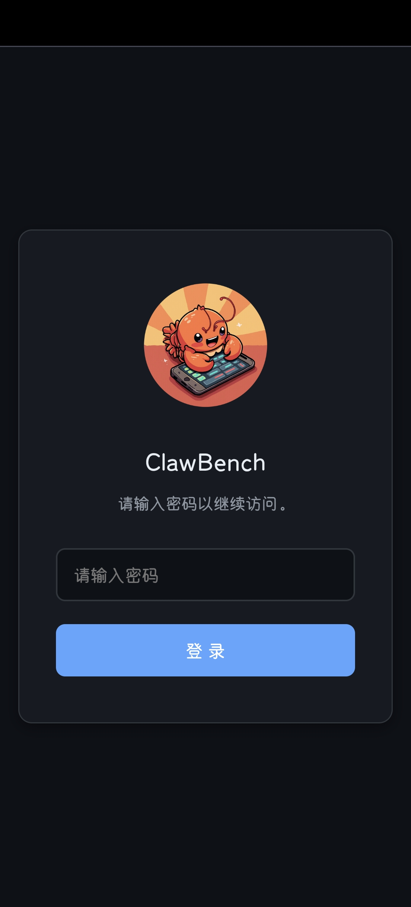 | 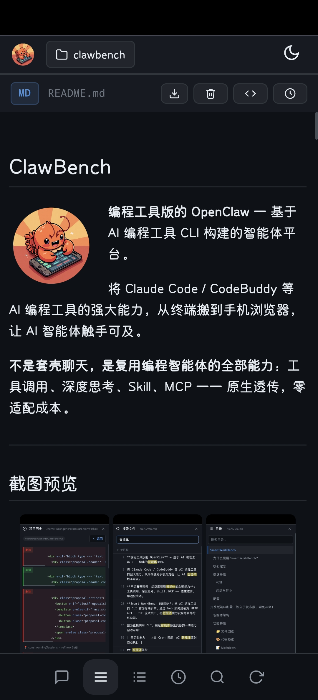 | 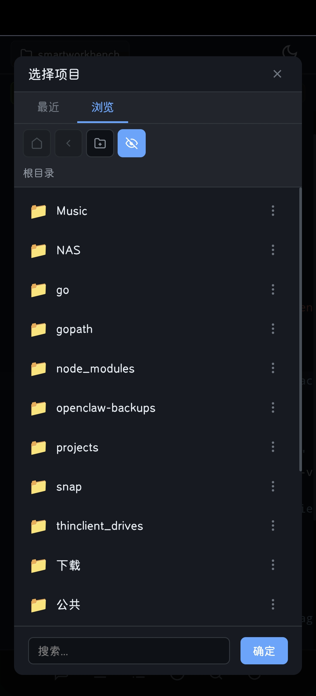 |

### 文件浏览与代码编辑

| 代码编辑器 | 搜索 | 文件浏览 |
|------------|------|----------|
| 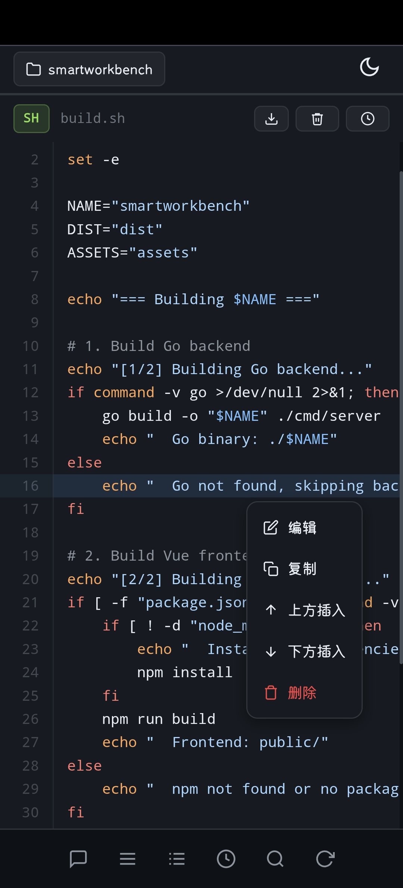 | 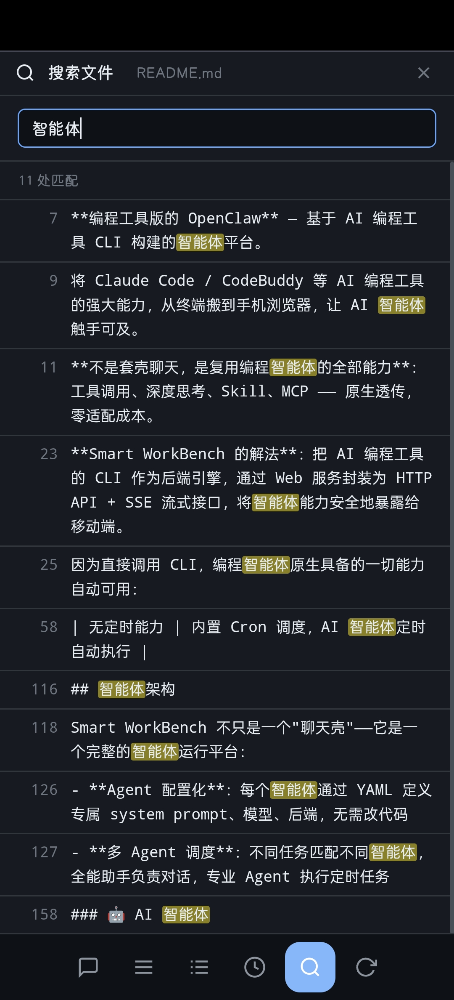 | 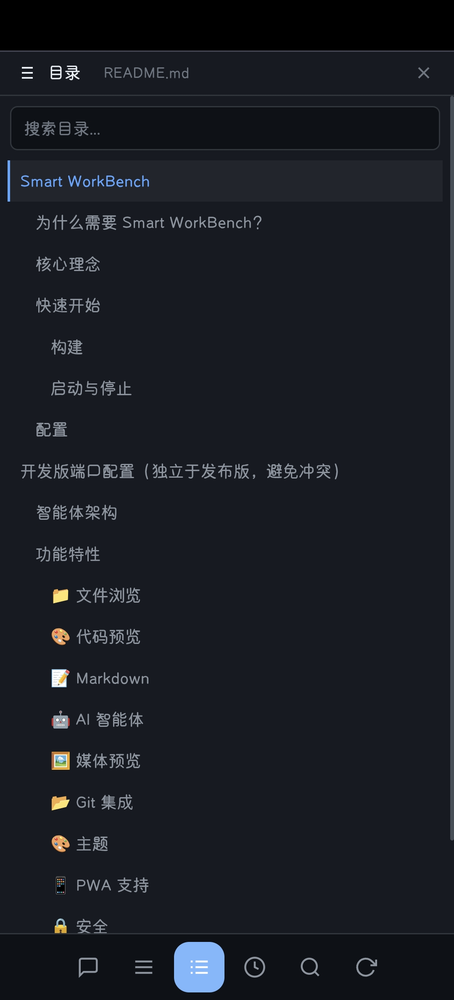 |

### Markdown 与文档预览

| LaTeX 公式 | Mermaid 图表 | README 目录 |
|------------|-------------|-------------|
| 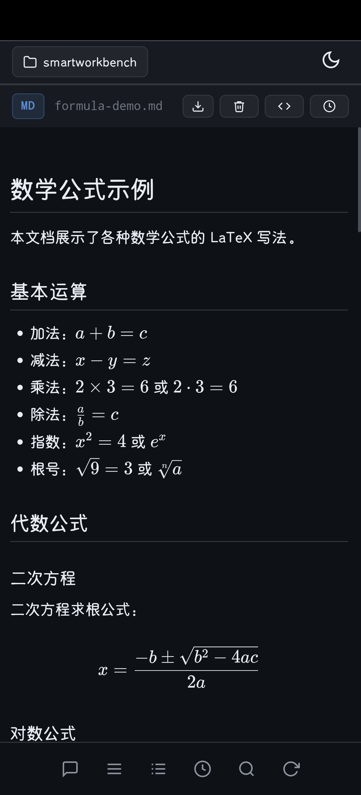 | 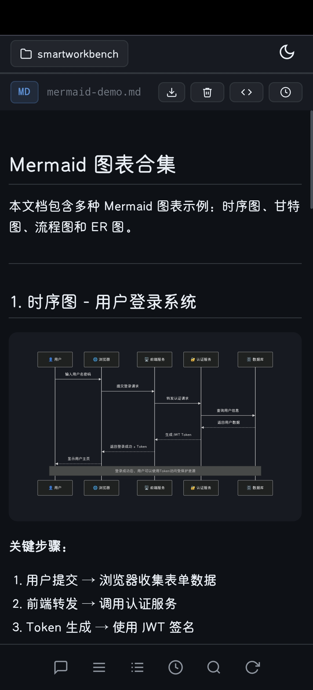 | 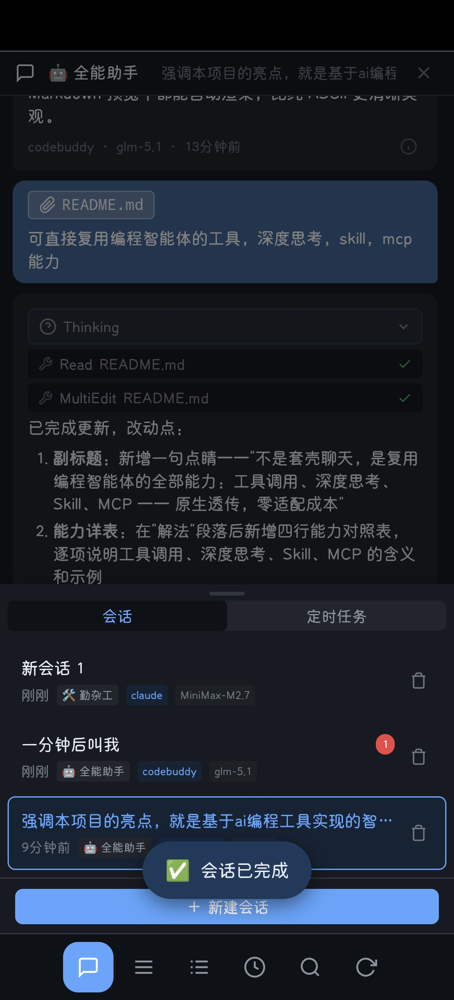 |

### AI 智能体

| AI 全能助手 | AI 对话 | 会话管理 |
|-------------|---------|----------|
| 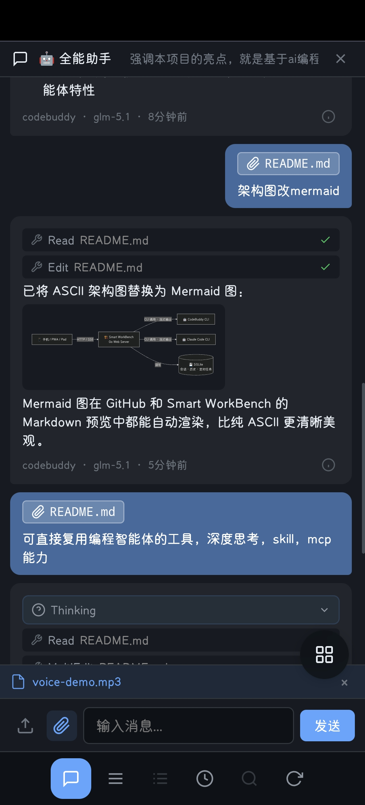 |  |  |

### Git 集成

| Git Diff | 提交历史 |
|----------|----------|
| 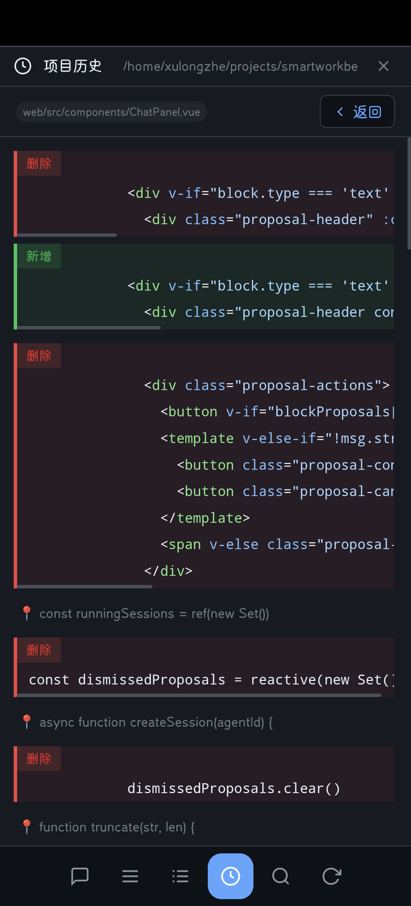 | 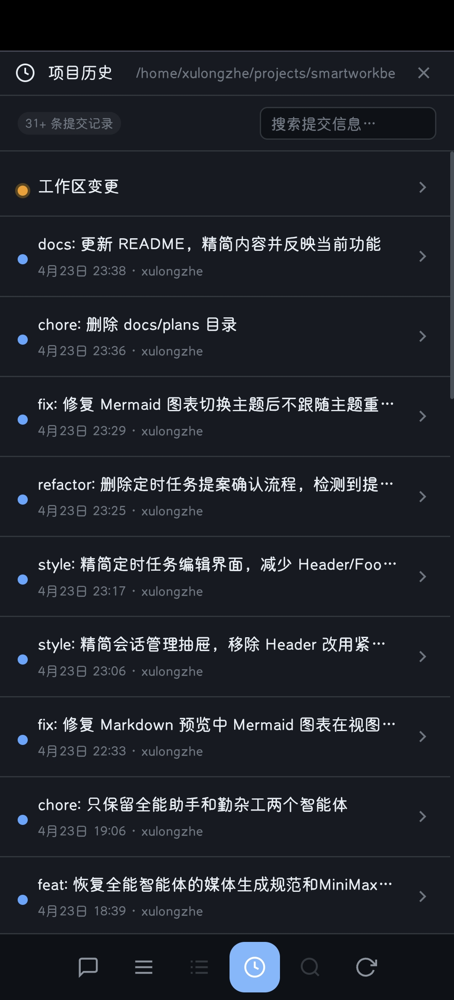 |

### 媒体预览

| 图片查看 | 视频播放 | 音频播放 | PDF 预览 |
|----------|----------|----------|----------|
|  | 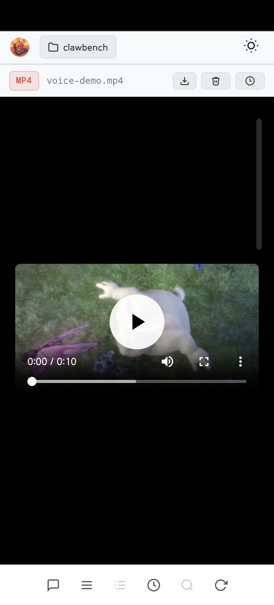 | 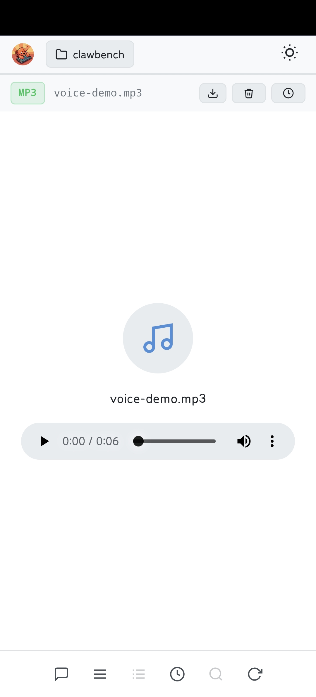 | 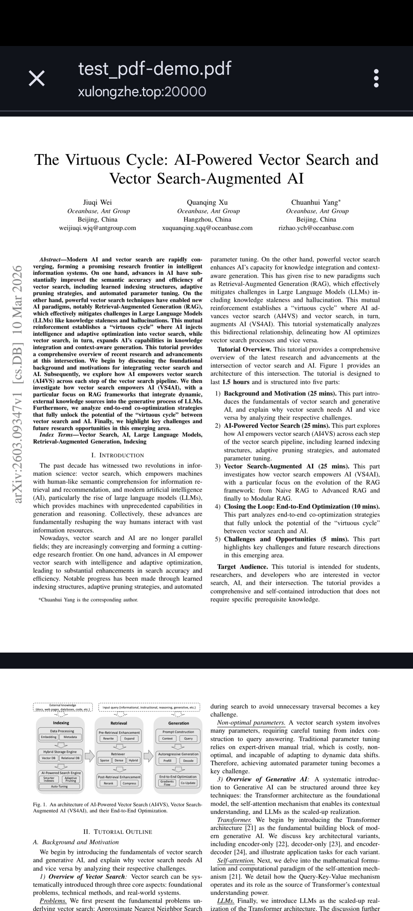 |

---

## 核心特性

### 为什么需要 ClawBench？

AI 编程工具（如 CodeBuddy、Claude Code）能力强大，但存在移动端使用障碍：

- **依赖终端环境**：只能在安装了 CLI 的机器上使用，手机和平板无法直接访问
- **移动端适配成本高**：为移动端重写 AI 交互逻辑需要大量开发工作

**ClawBench 的解法**：将 AI 编程工具 CLI 作为后端引擎，通过 Web 服务封装为 HTTP API + SSE 流式接口，打造为移动端打造的AI工作台。

### 核心能力

| 能力 | 说明 |
|------|------|
| 🔧 **工具调用透传** | 文件读写、Bash 命令、代码编辑等 CLI 工具全部可用 |
| 🧠 **深度思考** | 复杂任务自动触发 extended thinking，推理过程实时可见 |
| 🎯 **Skill 技能链** | 编程工具内置工作流原生触发（brainstorming → planning → executing） |
| 🔌 **MCP 工具** | Tavily 搜索、MiniMax 图片/语音等 MCP 插件即插即用 |

### 核心理念

**把开发、研究、维护，搬到手机上**

打破空间限制，随时随地处理技术工作。无论是在通勤路上、咖啡厅、还是旅行途中，你的手机就是完整的工作环境。

**三大核心场景**：

| 场景 | 传统方式 | ClawBench 方式 |
|------|---------|----------------|
| **💻 开发** | 需要笔记本 + IDE + 终端，环境配置复杂 | 手机即可：文件浏览 → 代码编辑 → AI 协助 → Git 提交 |
| **🔬 研究** | 多设备间同步不便，信息割裂 | 集成环境：资料查询 → 文档整理 → 概念验证 → AI 辅助分析 |
| **🔧 维护** | 紧急问题响应慢，无法快速定位 | 即时响应：查看日志 → AI 诊断 → 执行修复 → 监控状态 |


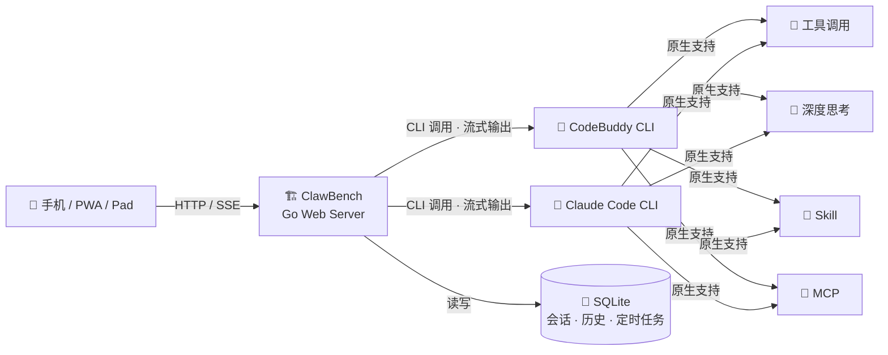

---

## 快速开始

### 方式一：使用发布包（推荐）

从 [GitHub Releases](https://github.com/xulongzhe/clawbench/releases) 下载最新版 ZIP 包，解压即可部署。

```bash
# 1. 下载并解压
wget https://github.com/xulongzhe/clawbench/releases/latest/download/clawbench-linux-amd64.zip
unzip clawbench-linux-amd64.zip

# 2. 配置文件
cd clawbench
cp config.example.yaml config.yaml
# 编辑 config.yaml，至少配置 watch_dir 和 password

# 3. 启动服务
./clawbench-linux-amd64
```

发布包内容：

| 文件 | 说明 |
|------|------|
| `clawbench-linux-amd64` | 后端二进制 |
| `public/` | 前端静态资源（已构建） |
| `config.example.yaml` | 配置模板 |
| `agents/` | 智能体配置 |
| `server.sh` | 启动/停止脚本 |

### 方式二：从源码构建

```bash
# 1. 克隆项目
git clone https://github.com/xulongzhe/clawbench.git
cd clawbench

# 2. 配置文件
cp config.example.yaml config.yaml
# 编辑 config.yaml 配置必要参数

# 3. 一键构建并启动
./build.sh && ./server.sh
```

### 系统要求

> **仅支持 Linux 系统**（x86_64 / ARM64）

| 依赖 | 说明 |
|------|------|
| **CodeBuddy CLI** 或 **Claude Code CLI** | AI 后端（需提前安装并完成认证） |

### 配置文件

**最少配置**：

```yaml
port: 20000                     # 服务端口
watch_dir: "/home/user"         # 项目监控目录（AI 可访问的文件根路径）
password: "your_password"       # 访问密码（可选，留空则无需登录）
```

> **安全提示**：`config.yaml` 已添加到 `.gitignore`，不会被提交到 Git 仓库。生产环境建议设置强密码。

### 启动命令

| 命令 | 说明 |
|------|------|
| `./clawbench-linux-amd64` | 直接运行（前台） |
| `./server.sh` | 后台启动（端口 20000） |
| `./server.sh --fg` | 前台启动（查看实时日志） |
| `./server.sh --stop` | 停止服务 |
| `./server.sh --restart` | 重启服务 |
| `./server.sh --port 8080` | 指定端口 |

---

## 高级配置

完整配置参考 `config.example.yaml`。主要配置项：

```yaml
port: 20000                     # 发布版服务端口
watch_dir: "/home/user"         # 项目监控目录（AI 可访问的文件根路径）
password: "your_password"       # 访问密码（可选，SHA-256 加盐存储）

# 上传限制（可选）
upload:
  max_size_mb: 10               # 单文件上传大小上限（MB），默认 10
  max_files: 20                 # 单次上传文件数量上限，默认 20

# 日志配置（可选）
log_dir: "~/.ClawBench/logs"    # 日志目录，默认 .ClawBench/logs/
log_max_days: 7                 # 日志保留天数，默认 7

# TLS (HTTPS) 配置（可选）
tls:
  enabled: false                # 启用 HTTPS
  cert_file: "/path/to/fullchain.pem"   # 证书文件
  key_file: "/path/to/privkey.pem"      # 私钥文件
```

### AI 后端配置

ClawBench 通过调用本地 CLI 实现与 AI 编程工具的交互，无需额外 API Key 配置。

**CodeBuddy 后端**：安装 CodeBuddy CLI 并完成登录认证，确保 `codebuddy` 命令在 PATH 中可用。

**Claude Code 后端**：安装 Claude Code CLI 并完成认证，确保 `claude` 命令在 PATH 中可用。

两种后端可在 ClawBench Web UI 中实时切换，会话数据隔离。

---

## 部署说明

### HTTPS 配置（公网部署）

生产环境建议启用 HTTPS：

1. **获取证书**：使用 Let's Encrypt 或其他 CA 签发证书
2. **配置 TLS**：在 `config.yaml` 中启用
   ```yaml
   tls:
     enabled: true
     cert_file: "/etc/letsencrypt/live/your-domain.com/fullchain.pem"
     key_file: "/etc/letsencrypt/live/your-domain.com/privkey.pem"
   ```
3. **重启服务**：`./server.sh --restart`

### 数据存储

| 数据 | 路径 | 说明 |
|------|------|------|
| 数据库 | `.ClawBench/ClawBench.db` | SQLite，会话/历史/项目/定时任务 |
| 日志 | `.ClawBench/logs/` | 按天轮转，自动清理 |

### 开发模式

```bash
./server.sh --dev
```

- 后端：`http://localhost:20002`
- 前端（Vite HMR）：`http://localhost:20001`

---

## 功能详解

### 📁 文件浏览
- 递归目录浏览，支持 80+ 种文件类型
- 客户端搜索过滤、排序（名称/时间/扩展名）
- 隐藏文件切换
- 右键菜单：重命名、删除、复制、移动
- 文件上传（支持图片，大小和数量可在配置文件中调整）
- **Git Diff 视图**：查看文件相对 HEAD 的变更，字符级高亮

### 🎨 代码预览
- highlight.js 逐行语法高亮
- **粘性行号**（sticky 定位，滚动时始终可见）
- 长按/右键菜单：编辑、删除、复制、插入行
- 底部抽屉式编辑框
- **双击屏幕左右两侧**：在当前目录内循环切换文件

### 📝 Markdown
- 渲染视图 / 源码视图一键切换
- 智能目录抽屉（TOC），滑动跳转章节
- LaTeX 数学公式（KaTeX）
- Mermaid 图表自动渲染，跟随主题切换
- 本地图片路径自动代理
- **移动端优化**：触控手势、双击缩放、阅读流畅自然

### 🤖 AI 智能体
- **流式响应**：SSE 实时推送 AI 回复，思维过程、工具调用全程可见
- **多 Agent 支持**：全能助手、勤杂工等专业 Agent，YAML 配置即插即用
- **AI 后端切换**：支持 CodeBuddy 和 Claude Code 两种 CLI 后端，会话级隔离
- **定时任务**：AI 提案 → 确认 → Cron 自动调度，Agent 定时执行
- **多会话管理**：创建、切换、删除独立会话，每个会话绑定 Agent 和后端
- **图片上传**：支持上传图片与 AI 对话（多模态）
- **断连保护**：消息立即落库，异步执行，网络断开不丢消息，重连后自动恢复

### 🖼️ 媒体预览
- 图片内嵌预览（PNG、JPG、GIF、SVG、WebP 等）
- PDF 内嵌预览，技术文档直接查看
- 音频 / 视频播放器，教程演示内置播放
- 灯箱放大、全屏查看，滚轮缩放、拖拽平移
- **移动端优化**：无需跳转外部应用，所有媒体文件应用内直接预览，触控缩放、缓存机制

### 📂 Git 集成
- 项目级 / 文件级提交历史浏览
- 提交涉及的文件列表查看
- Diff 视图查看变更详情（字符级高亮）
- 工作区状态和未提交变更查看

### 🎨 主题
- 亮色 / 暗色模式，跟随系统偏好
- 代码高亮、Mermaid 图表随主题自动切换
- 地址栏自动隐藏

### 📱 PWA 支持
- 可安装到主屏幕，独立窗口运行

### 🔒 安全
- 可选密码保护（SHA-256 加盐）
- 路径穿越防护，所有操作限制在项目目录内
- 文件上传大小和数量可配置（默认 10MB / 20 个）
- XSS 防护（DOMPurify 净化）
- TLS 支持（自动检测 Let's Encrypt 证书）

---

## 架构设计

### 智能体架构

ClawBench 不只是一个"聊天壳"——它是一个完整的智能体运行平台：

```
agents/
├── assistant.yaml    # 全能助手 — 通用问答、代码、文档、运维
└── handyman.yaml     # 勤杂工 — 定时任务、简单编码、日常操作
```

- **Agent 配置化**：每个智能体通过 YAML 定义专属 system prompt、模型、后端，无需改代码
- **多 Agent 调度**：不同任务匹配不同智能体，全能助手负责对话，专业 Agent 执行定时任务
- **工具调用透传**：AI 的工具调用（文件读写、Bash 命令、代码编辑）实时可视化展示
- **Cron 定时执行**：AI 生成 `<schedule-proposal>` 提案，确认后由 Cron 调度自动执行
- **多后端可切换**：同一平台同时支持 CodeBuddy 和 Claude Code 后端，会话数据隔离

### 项目结构

```
clawbench/
├── cmd/server/main.go           # 应用入口
├── internal/
│   ├── handler/                 # HTTP 处理器
│   │   ├── handler.go           # 路由注册
│   │   ├── auth.go              # 认证
│   │   ├── chat.go              # AI 聊天（SSE 流式推送）
│   │   ├── agent.go             # Agent 管理
│   │   ├── scheduler.go         # 定时任务
│   │   ├── file.go              # 文件读取
│   │   ├── file_ops.go          # 文件操作
│   │   ├── upload.go            # 文件上传
│   │   ├── git.go               # Git 操作
│   │   ├── project.go           # 项目管理
│   │   └── static.go            # 静态文件
│   ├── middleware/              # 中间件（认证/日志/恢复/请求ID）
│   ├── service/                 # 业务逻辑
│   │   ├── database.go          # SQLite 初始化
│   │   ├── chat.go              # 聊天历史管理
│   │   ├── scheduler.go         # 定时任务调度
│   │   └── logger.go            # 文件日志（按天轮转）
│   ├── model/                   # 数据模型
│   │   ├── config.go / chat.go / file.go / agent.go / scheduler.go
│   │   └── errors.go
│   └── ai/                      # AI 后端抽象
│       ├── interface.go         # AIBackend 接口
│       ├── factory.go           # 后端工厂
│       ├── claude.go / claude_stream.go
│       └── codebuddy.go / codebuddy_stream.go
├── agents/                      # Agent 配置
│   ├── assistant.yaml           # 全能助手
│   └── handyman.yaml           # 勤杂工
├── web/                         # Vue 3 前端源码
│   └── src/
│       ├── components/          # 26 个 Vue 组件
│       ├── composables/         # 组合式函数
│       ├── stores/              # 状态管理
│       └── utils/               # 工具函数
├── config.example.yaml          # 配置模板
├── build.sh                     # 编译脚本
├── server.sh                    # 启动/停止脚本
└── vite.config.ts               # Vite 配置
```

---

## 技术栈

| 层级 | 技术 |
|------|------|
| 后端 | Go 1.21+ (net/http + SQLite) |
| 前端 | Vue 3 + Vite + TypeScript |
| 语法高亮 | highlight.js |
| Markdown | marked.js |
| 图表渲染 | Mermaid.js |
| 数学公式 | KaTeX |
| HTML 净化 | DOMPurify |
| AI 后端 | CodeBuddy CLI / Claude Code CLI（流式 JSON 输出 → SSE 推送） |
| 定时调度 | robfig/cron |

---

## 常见问题

**Q: ClawBench 支持哪些操作系统？**

A: 仅支持 Linux 系统（x86_64）。后端二进制为 Linux amd64 静态编译，不支持 macOS / Windows。

**Q: 是否需要配置 API Key？**

A: 不需要。ClawBench 通过调用本地 CLI（CodeBuddy 或 Claude Code）实现 AI 功能，这些 CLI 工具已经完成了 API Key 的配置和管理。

**Q: 可以同时运行多个 ClawBench 实例吗？**

A: 可以。发布版和开发版使用独立端口和数据库，可以同时运行。也可以通过 `--port` 参数指定不同端口运行多个实例。

**Q: 数据存储在哪里？**

A: 默认存储在 `.ClawBench/` 目录下，包括数据库文件（`ClawBench.db`）和日志文件（`logs/`）。

**Q: 如何备份数据？**

A: 备份 `.ClawBench/ClawBench.db` 数据库文件即可。

---

## 许可证

Copyright (c) 2026 xulongzhe

Licensed under the MIT License
