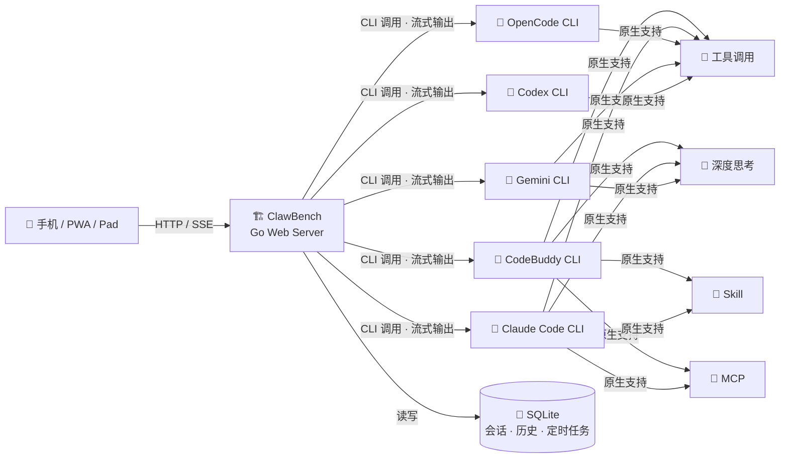

# ClawBench —— 为移动端打造的AI工作台

<p>
  
</p>

**从终端到掌心** — 为移动端打造的 AI 工作台。

将强大的 AI 编程工具能力完整移植到手机浏览器，打造真正的移动端工作环境。文件浏览、代码编辑、AI 对话、Git 操作、定时调度 —— 一个应用，全部搞定。

**核心优势**：原生透传 AI 能力（工具调用、深度思考、Skill、MCP），零适配成本，完整保留编程智能体的强大功能。支持 CodeBuddy、Claude Code、OpenCode、Gemini CLI、Codex 五种 AI 后端。

---

## 截图预览

### 登录与导航

| 登录 | 首页 | 选择项目 |
|------|------|----------|
|  |  |  |

### 文件浏览与代码编辑

| 代码编辑器 | 搜索 | 文件浏览 |
|------------|------|----------|
|  |  |  |

### Markdown 与文档预览

| LaTeX 公式 | Mermaid 图表 | 目录导航 |
|------------|-------------|----------|
|  |  |  |

### AI 智能体

| 智能体选择 | AI 全能助手 | 会话管理 | 定时任务 |
|------------|-------------|----------|----------|
|  |  |  |  |

### AI 对话

| 工具调用与深度思考 | 快捷发送 |
|--------------------|----------|
|  |  |

### Git 集成

| Git Diff | 提交历史 | Git 分支图 |
|----------|----------|------------|
|  |  |  |

### 媒体预览

| 图片查看 | 灯箱放大 | 视频播放 | 音频播放 | PDF 预览 |
|----------|----------|----------|----------|----------|
|  |  |  |  |  |

### SSH 隧道端口转发

| 端口转发管理 |
|-------------|
|  |

---

## 核心特性

### 为什么需要 ClawBench？

AI 编程工具（如 CodeBuddy、Claude Code）能力强大，但存在移动端使用障碍：

- **依赖终端环境**：只能在安装了 CLI 的机器上使用，手机和平板无法直接访问
- **移动端适配成本高**：为移动端重写 AI 交互逻辑需要大量开发工作

**ClawBench 的解法**：将 AI 编程工具 CLI 作为后端引擎，通过 Web 服务封装为 HTTP API + SSE 流式接口，打造为移动端打造的AI工作台。

### 核心能力

| 能力 | 说明 |
|------|------|
| 🔧 **工具调用透传** | 文件读写、Bash 命令、代码编辑等 CLI 工具全部可用 |
| 🧠 **深度思考** | 复杂任务自动触发 extended thinking，推理过程实时可见 |
| 🎯 **Skill 技能链** | 编程工具内置工作流原生触发（brainstorming → planning → executing） |
| 🔌 **MCP 工具** | Tavily 搜索、MiniMax 图片/语音等 MCP 插件即插即用 |

### 核心理念

**把开发、研究、维护，搬到手机上**

打破空间限制，随时随地处理技术工作。无论是在通勤路上、咖啡厅、还是旅行途中，你的手机就是完整的工作环境。

**三大核心场景**：

| 场景 | 传统方式 | ClawBench 方式 |
|------|---------|----------------|
| **💻 开发** | 需要笔记本 + IDE + 终端，环境配置复杂 | 手机即可：文件浏览 → 代码编辑 → AI 协助 → Git 提交 |
| **🔬 研究** | 多设备间同步不便，信息割裂 | 集成环境：资料查询 → 文档整理 → 概念验证 → AI 辅助分析 |
| **🔧 维护** | 紧急问题响应慢，无法快速定位 | 即时响应：查看日志 → AI 诊断 → 执行修复 → 监控状态 |




---

## 快速开始

### 方式一：使用发布包（推荐）

从 [GitHub Releases](https://github.com/xulongzhe/clawbench/releases) 下载最新版 ZIP 包，解压即可部署。

```bash
# 1. 下载并解压
wget https://github.com/xulongzhe/clawbench/releases/latest/download/clawbench-linux-amd64.zip
unzip clawbench-linux-amd64.zip

# 2. 配置文件
cd clawbench
cp config.example.yaml config.yaml
# 编辑 config.yaml，至少配置 watch_dir 和 password

# 3. 启动服务
./clawbench-linux-amd64
```

发布包内容（Linux）：

| 文件 | 说明 |
|------|------|
| `clawbench-linux-amd64` | 后端二进制 |
| `public/` | 前端静态资源（已构建） |
| `config.example.yaml` | 配置模板 |
| `agents/` | 智能体配置 |
| `dev-server.sh` | 开发调试启动脚本 |
| `server.sh` | 正式版启动脚本 |

发布包内容（Windows）：

| 文件 | 说明 |
|------|------|
| `clawbench-windows-amd64.exe` | 后端二进制 |
| `public/` | 前端静态资源（已构建） |
| `config.example.yaml` | 配置模板 |
| `agents/` | 智能体配置 |
| `server.ps1` | 启动/停止脚本 |

### 方式二：从源码构建

**Linux/macOS：**

```bash
# 1. 克隆项目
git clone https://github.com/xulongzhe/clawbench.git
cd clawbench

# 2. 配置文件
cp config.example.yaml config.yaml
# 编辑 config.yaml 配置必要参数

# 3. 一键构建并启动
./build.sh && ./server.sh
```

**开发调试模式**：

```bash
# 后台启动（Go dev 后端 + Vite 热更新）
./dev-server.sh

# 前台启动，查看实时日志
./dev-server.sh --fg

# 停止后台进程
./dev-server.sh --stop

# 重启
./dev-server.sh --restart
```

**Windows (PowerShell)：**

```powershell
# 1. 克隆项目
git clone https://github.com/xulongzhe/clawbench.git
cd clawbench

# 2. 配置文件
copy config.example.yaml config.yaml
# 编辑 config.yaml 配置必要参数

# 3. 一键构建并启动
.\build.ps1; .\server.ps1
```

**交叉编译**（在 Linux 上构建 Windows 二进制）：

```bash
./build.sh --windows
```

### 系统要求

| 平台 | 支持 |
|------|------|
| Linux x86_64 / ARM64 | ✅ |
| Windows x86_64 | ✅ |

| 依赖 | 说明 |
|------|------|
| **CodeBuddy CLI** 或 **Claude Code CLI** | AI 后端（需提前安装并完成认证，可选 OpenCode / Gemini / Codex） |

### 配置文件

**最少配置**：

```yaml
port: 20000                     # 服务端口
watch_dir: "/home/user"         # Linux/macOS 项目监控目录
# watch_dir: "C:\\Users\\user"  # Windows 项目监控目录
password: "your_password"       # 访问密码（可选，留空则无需登录）
default_agent: "assistant"     # 默认智能体（可选），留空则使用第一个智能体
```


### 启动命令

#### 正式版

| 命令 | 说明 |
|------|------|
| `./clawbench-linux-amd64` | 直接运行（前台） |
| `./server.sh` | 后台启动（端口 20000） |
| `./server.sh --fg` | 前台启动（查看实时日志） |
| `./server.sh --stop` | 停止服务 |
| `./server.sh --restart` | 重启服务 |
| `./server.sh --port 8080` | 指定端口 |

#### 开发调试模式

| 命令 | 说明 |
|------|------|
| `./dev-server.sh` | 后台启动（dev 后端 + Vite，端口 20002/20001） |
| `./dev-server.sh --fg` | 前台启动 |
| `./dev-server.sh --stop` | 停止进程 |
| `./dev-server.sh --restart` | 重启 |

> **注意**：开发调试与正式版使用独立端口和数据库，可同时运行，互不干扰。

**Windows**：

| 命令 | 说明 |
|------|------|
| `.\clawbench-windows-amd64.exe` | 直接运行（前台） |
| `.\server.ps1` | 后台启动 |
| `.\server.ps1 -Foreground` | 前台启动 |
| `.\server.ps1 -Stop` | 停止服务 |
| `.\server.ps1 -Restart` | 重启服务 |
| `.\server.ps1 -Port 8080` | 指定端口 |

---

## 高级配置

完整配置参考 `config.example.yaml`。主要配置项：

```yaml
port: 20000                     # 发布版服务端口
watch_dir: "/home/user"         # Linux/macOS 项目监控目录
# watch_dir: "C:\\Users\\user"  # Windows 项目监控目录
password: "your_password"       # 访问密码（可选，SHA-256 加盐存储）

# 默认智能体（可选）
default_agent: "assistant"      # 默认使用的智能体 ID，留空则使用第一个智能体
                                 # 可用智能体：assistant（全能助手）、coder（编码专家）、
                                 # gemini（Gemini CLI）、handyman（勤杂工）、codebuddy2（Gemini）、gpt54（GPT）

# 上传限制（可选）
upload:
  max_size_mb: 10               # 单文件上传大小上限（MB），默认 10
  max_files: 20                 # 单次上传文件数量上限，默认 20

# 日志配置（可选）
log_dir: ".clawbench/logs"     # 日志目录，默认二进制同级 .clawbench/logs/
log_max_days: 7                 # 日志保留天数，默认 7

# TLS (HTTPS) 配置（可选）
tls:
  enabled: false                # 启用 HTTPS
  cert_file: "/path/to/fullchain.pem"   # 证书文件
  key_file: "/path/to/privkey.pem"      # 私钥文件

# 端口转发配置（Android App 访问服务器本地端口）
proxy:
  enabled: true                 # 启用端口转发
  allowed_ports: "1024-65535"   # 允许转发的端口范围

# SSH 隧道配置（远程开发端口转发）
ssh:
  enabled: true                 # 启用 SSH 隧道服务
  port: 0                       # SSH 端口（0 = 自动 = 主端口+1；也可指定如 20020）
  host_key: ""                  # Host key 文件路径（空 = 自动生成，重启后变更）

# Chat UI 配置（可选）
chat:
  initial_messages: 20          # 初始加载消息条数，默认 20
  page_size: 20                 # 懒加载每页消息条数，默认 20
  collapsed_height: 150         # 历史消息折叠高度（像素），默认 150
  quick_send:                   # 快捷发送预设（输入框为空时，点击发送按钮弹出菜单选择）
    "▶️ 继续": "继续"             # Key: 菜单显示标签（可带 emoji），Value: 实际发送的文本
    "👌 OK": "OK"
    "🔨 编译": "帮我编译当前项目，优先使用项目中已有的脚本。"
    "🔄 重启调试": "帮我重启当前项目的调试版本服务，优先使用项目中已经有的脚本。"
    "🚀 重启服务": "帮我重启当前项目的发布版本服务，优先使用项目中已经有的脚本。"
    "📦 提交": "提交"
    "👀 浏览变更": "工作区改了什么"
    "🗑️ 丢弃变更": "放弃工作区修改"
```

### AI 后端配置

ClawBench 通过调用本地 CLI 实现与 AI 编程工具的交互，无需额外 API Key 配置。

**CodeBuddy 后端**：安装 CodeBuddy CLI 并完成登录认证，确保 `codebuddy` 命令在 PATH 中可用。

**Claude Code 后端**：安装 Claude Code CLI 并完成认证，确保 `claude` 命令在 PATH 中可用。

**OpenCode 后端**：安装 OpenCode CLI 并完成认证，确保 `opencode` 命令在 PATH 中可用。

**Gemini CLI 后端**：安装 Gemini CLI 并完成认证，确保 `gemini` 命令在 PATH 中可用。

**Codex 后端**：安装 OpenAI Codex CLI 并完成认证，确保 `codex` 命令在 PATH 中可用。

五种后端可在 ClawBench Web UI 中实时切换，会话数据隔离。

### TTS 语音合成配置

ClawBench 支持 TTS 语音合成，自动将 AI 回复总结后朗读。需要配置 **TTS 引擎** 和 **总结后端**。

#### TTS 引擎

| 引擎 | 说明 | 网络要求 |
|------|------|---------|
| `minimax` | 云端合成，音质最佳（默认） | 需要 mmx CLI + API 配额 |
| `edge` | 微软 Edge TTS，免费无限制 | 需要网络 |
| `piper` | 本地离线，速度极快 | 无需网络 |
| `kokoro` | 本地离线，高质量中文 | 无需网络 |

#### Kokoro 引擎配置

Kokoro 使用 kokoro-onnx 进行本地离线语音合成，无需 GPU。需要提前下载模型文件：

```bash
# 创建模型目录
mkdir -p .clawbench/kokoro-models

# 下载 v1.1-zh 中文优化模型（~328MB）
curl -L -o .clawbench/kokoro-models/kokoro-v1.1-zh.onnx \
  https://github.com/thewh1teagle/kokoro-onnx/releases/download/model-files-v1.1/kokoro-v1.1-zh.onnx

# 下载声纹文件（~51MB）
curl -L -o .clawbench/kokoro-models/voices-v1.1-zh.bin \
  https://github.com/thewh1teagle/kokoro-onnx/releases/download/model-files-v1.1/voices-v1.1-zh.bin

# 下载词表配置（~3KB，misaki G2P 必需）
curl -L -o .clawbench/kokoro-models/config.json \
  https://huggingface.co/hexgrad/Kokoro-82M-v1.1-zh/resolve/main/config.json
```

配置示例：

```yaml
tts:
  engine: "kokoro"
  voice: "zf_001"     # 女声：zf_001 ~ zf_085；男声：zm_009 ~ zm_100
  speed: 1.0
  kokoro:
    model_path: ""     # 空 = 自动使用 .clawbench/kokoro-models/kokoro-v1.1-zh.onnx
    voices_path: ""    # 空 = 自动使用 .clawbench/kokoro-models/voices-v1.1-zh.bin
    lang: "cmn"        # espeak-ng 语言代码，默认 cmn（普通话）
```

> **中文音素化说明**：Kokoro v1.1-zh 模型支持两种音素化路径：
>
> - **misaki[zh] G2P**（推荐）：基于 Jieba 分词 + PaddleSpeech，能正确处理多音字（如"银行行长"），中文发音自然。当 `.clawbench/kokoro-models/config.json` 存在时自动启用。
> - **espeak-ng**（回退）：基于规则的音素化，多音字容易读错，口音较重。当 config.json 不存在或 misaki 未安装时自动回退。
>
> 如需最佳中文效果，请确保：
> 1. 已下载 `config.json` 到模型目录
> 2. Python 虚拟环境中已安装 `misaki[zh]`（`pip install misaki[zh]`）

#### 总结后端

长文本朗读前会自动总结，由 `summarize_backend` 控制使用哪个 AI：

| 后端 | 说明 | 网络要求 |
|------|------|---------|
| `mmx` | mmx text chat（默认） | 需要 mmx CLI |
| `claude` | Claude CLI | 需要 claude CLI |
| `codebuddy` | CodeBuddy CLI | 需要 codebuddy CLI |
| `gemini` | Gemini CLI | 需要 gemini CLI |
| `opencode` | OpenCode CLI | 需要 opencode CLI |
| `codex` | Codex CLI | 需要 codex CLI |
| `ollama` | Ollama HTTP API（本地推理） | 仅需本地 Ollama 服务 |

#### Ollama 总结后端（本地推理，无需云服务）

使用 Ollama 在本地运行小型模型进行文本总结，无需任何云 API，适合离线或隐私敏感场景。

```bash
# 1. 安装 Ollama：https://ollama.com/download
# 2. 拉取模型（推荐国内镜像）
OLLAMA_REGISTRY=https://ollama.ai-mirror.cn ollama pull gemma3:270m
# 3. 启动 Ollama 服务
ollama serve
```

配置示例：

```yaml
tts:
  engine: "edge"                    # 任意 TTS 引擎
  summarize_backend: "ollama"       # 使用 Ollama 总结
  summarize_model: "gemma3:270m"    # 模型名（ollama pull 的名字）
  ollama:
    base_url: "http://localhost:11434"  # Ollama API 地址
  voice: "zh-CN-XiaoxiaoNeural"
  speed: 1
```

> 💡 `gemma3:270m` 模型仅 291MB，适合快速总结。如需更好质量，可换 `qwen3:0.6b` 或更大模型，只需修改 `summarize_model` 即可。

---

## 部署说明

### HTTPS 配置（公网部署）

生产环境建议启用 HTTPS：

1. **获取证书**：使用 Let's Encrypt 或其他 CA 签发证书
2. **配置 TLS**：在 `config.yaml` 中启用
   ```yaml
   tls:
     enabled: true
     cert_file: "/etc/letsencrypt/live/your-domain.com/fullchain.pem"
     key_file: "/etc/letsencrypt/live/your-domain.com/privkey.pem"
   ```
3. **重启服务**：`./server.sh --restart`

### 数据存储

| 数据 | 路径 | 说明 |
|------|------|------|
| 数据库 | `二进制同级/.clawbench/ClawBench.db` | SQLite，会话/历史/项目/定时任务 |
| 日志 | `二进制同级/.clawbench/logs/` | 按天轮转，自动清理 |
| 上传文件 | `项目目录/.clawbench/uploads/` | 用户上传的文件，属于具体项目 |

> 所有运行时数据存放在二进制同级目录下的 `.clawbench/`，实现绿色便携部署，删除程序目录即可彻底卸载。当项目目录与二进制目录相同时，上传文件也在同一个 `.clawbench/` 下。

### 开发调试模式

使用 `./dev-server.sh` 启动独立开发环境：

- 后端：`http://localhost:20002`
- 前端（Vite HMR）：`http://localhost:20001`
- 数据库：使用 `ClawBench-dev.db`，与正式版数据隔离

```bash
./dev-server.sh              # 后台启动
./dev-server.sh --fg         # 前台启动
./dev-server.sh --stop       # 停止
./dev-server.sh --restart    # 重启
```

---

## 功能详解

### 📁 文件浏览
- 递归目录浏览，支持 80+ 种文件类型
- 客户端搜索过滤、排序（名称/时间/扩展名）
- 隐藏文件切换
- 右键菜单：重命名、删除、复制、移动
- 文件上传（支持图片，大小和数量可在配置文件中调整）
- **Git Diff 视图**：查看文件相对 HEAD 的变更，字符级高亮

### 🎨 代码预览
- highlight.js 逐行语法高亮
- **粘性行号**（sticky 定位，滚动时始终可见）
- 长按/右键菜单：编辑、删除、复制、插入行
- 底部抽屉式编辑框
- **双击屏幕左右两侧**：在当前目录内循环切换文件
- **引用提问**：选中代码片段后，顶部弹出浮动栏，一键向 AI 提问，选中内容自动附上文件路径和行号

### 📝 Markdown
- 渲染视图 / 源码视图一键切换
- **引用提问**：Markdown 渲染视图中选中文本，同样可向 AI 提问
- 智能目录抽屉（TOC），滑动跳转章节
- LaTeX 数学公式（KaTeX）
- Mermaid 图表自动渲染，跟随主题切换
- 本地图片路径自动代理
- **图片灯箱**：Markdown 内图片支持左右切换浏览，显示文件名
- **文件路径跳转**：Markdown 中的文件路径自动识别，点击即可跳转打开对应文件
- **移动端优化**：触控手势、双击缩放、阅读流畅自然

### 🤖 AI 智能体
- **流式响应**：SSE 实时推送 AI 回复，思维过程、工具调用全程可见
- **多 Agent 支持**：全能助手、编码专家、勤杂工等专业 Agent，YAML 配置即插即用
- **AI 后端切换**：支持 CodeBuddy、Claude Code、OpenCode、Gemini CLI、Codex 五种 CLI 后端，会话级隔离
- **智能体详情**：选择智能体时展示专长、后端、模型标签，一目了然
- **默认智能体**：可在配置文件中设置 `default_agent`，留空则使用 `agents/` 目录下的第一个智能体
- **共享提示词**：所有智能体共享 `common_prompt.md`，支持 `{{AVAILABLE_AGENTS}}` 占位符自动注入
- **定时任务**：AI 提案 → 确认 → Cron 自动调度，Agent 定时执行
- **Cron 管控**：Claude 后端内置禁用 CronCreate/CronDelete/CronList，强制走 ClawBench 的 schedule-proposal 机制
- **多会话管理**：创建、切换、删除独立会话，每个会话绑定 Agent 和后端
- **未读提示**：会话标签显示未读消息角标
- **图片上传**：支持上传图片与 AI 对话（多模态）
- **回复提示音**：AI 回复完成时播放提示音
- **空会话欢迎**：空聊天会话展示智能体信息卡片
- **断连保护**：消息立即落库，异步执行，网络断开不丢消息，重连后自动恢复

### 🤖 AI 对话
- **工具调用可视化**：工具名称、参数、结果实时展示
- **JSON 语法高亮**：工具调用详情中的 JSON 内容自动高亮，横向滚动查看
- **深度思考**：复杂任务自动触发 extended thinking，推理过程实时可见
- **停止按钮脉冲动效**：生成中停止按钮带心跳动画，视觉反馈清晰
- **文件路径跳转**：AI 回复中的文件路径自动识别为可点击链接，点击即可跳转打开对应文件
- **快捷发送**：输入框为空时点击发送按钮，弹出预设消息菜单，一键发送常用指令（如"继续"、"编译"、"提交"等），在 `config.yaml` 中自定义
- **引用提问**：在文件查看器中选中代码或文本，顶部弹出浮动栏，直接输入问题向 AI 提问。选中内容自动以代码块形式引用（含文件路径和行号），并附带当前文件作为上下文，无需手动复制粘贴

### 🖼️ 媒体预览
- 图片内嵌预览（PNG、JPG、GIF、SVG、WebP 等）
- PDF 内嵌预览，技术文档直接查看
- 音频 / 视频播放器，教程演示内置播放
- 灯箱放大、全屏查看，滚轮缩放、拖拽平移
- **移动端优化**：无需跳转外部应用，所有媒体文件应用内直接预览，触控缩放、缓存机制

### 📂 Git 集成
- 项目级 / 文件级提交历史浏览
- **Git 分支图**：纵向分支拓扑图，直观展示分支关系
- 提交涉及的文件列表查看
- Diff 视图查看变更详情（字符级高亮）
- 工作区状态和未提交变更查看

### 🔀 SSH 隧道端口转发
- **远程开发利器**：在 Android App 上直接访问服务器本地端口，如同本地开发
- **SSH 隧道**：Go 后端内嵌 SSH 服务器，Android 客户端通过 JSch 建立 `-L` 本地端口转发
- **全协议透明**：HTTP、HTTPS、WebSocket、SSE、gRPC — SSH 隧道工作在传输层，无需 URL 重写
- **端口注册**：在 UI 中添加需要转发的端口，支持自动检测服务器上的活跃端口
- **内嵌浏览器**：转发端口在 App 内以 iframe 浏览器打开，工具栏显示完整 URL，可编辑路径导航到子路径，支持 http/https 协议切换

### 🎨 主题
- 亮色 / 暗色模式，跟随系统偏好
- 代码高亮、Mermaid 图表随主题自动切换
- 地址栏自动隐藏

### 📱 PWA 支持
- 可安装到主屏幕，独立窗口运行

### 🔒 安全
- 可选密码保护（SHA-256 加盐）
- 路径穿越防护，所有操作限制在项目目录内
- 文件上传大小和数量可配置（默认 10MB / 20 个）
- XSS 防护（DOMPurify 净化）
- TLS 支持（自动检测 Let's Encrypt 证书）

---

## 架构设计

### 智能体架构

ClawBench 不只是一个"聊天壳"——它是一个完整的智能体运行平台：

```
agents/
├── common_prompt.md   # 共享提示词（网络搜索、多模态工具、媒体处理规则）
├── assistant.yaml     # 全能助手 — 通用问答、代码、文档、运维
├── codebuddy2.yaml    # Gemini（通过 CodeBuddy 调用）
├── coder.yaml         # 编码专家 — 复杂编码、架构设计、代码重构
├── codex.yaml         # Codex — OpenAI Codex CLI 编码助手
├── gemini.yaml        # Gemini CLI — Google Gemini 驱动的通用助手
├── gpt54.yaml         # GPT — 通过 CodeBuddy 调用 GPT 模型
└── handyman.yaml      # 勤杂工 — 定时任务、简单编码、日常操作
```

- **Agent 配置化**：每个智能体通过 YAML 定义专属 system prompt、模型、后端，无需改代码
- **共享提示词**：`common_prompt.md` 定义所有智能体的公共行为（网络搜索、多模态、媒体处理），避免重复配置
- **模板占位符**：`{{AVAILABLE_AGENTS}}` 自动替换为可用智能体列表，方便智能体间互相调度
- **多 Agent 调度**：不同任务匹配不同智能体，全能助手负责对话，专业 Agent 执行定时任务
- **工具调用透传**：AI 的工具调用（文件读写、Bash 命令、代码编辑）实时可视化展示
- **Cron 定时执行**：AI 生成 `<schedule-proposal>` 提案，确认后由 Cron 调度自动执行
- **Cron 管控**：Claude 后端通过 `--disallowedTools` 禁用内置定时工具，统一走 ClawBench 调度
- **多后端可切换**：同一平台同时支持 CodeBuddy、Claude Code、OpenCode、Gemini CLI、Codex 后端，会话数据隔离

### 项目结构

```
clawbench/
├── cmd/server/main.go           # 应用入口
├── internal/
│   ├── handler/                 # HTTP 处理器
│   │   ├── handler.go           # 路由注册
│   │   ├── auth.go              # 认证
│   │   ├── chat.go              # AI 聊天（SSE 流式推送）
│   │   ├── agent.go             # Agent 管理
│   │   ├── scheduler.go         # 定时任务
│   │   ├── file.go              # 文件读取
│   │   ├── file_ops.go          # 文件操作
│   │   ├── upload.go            # 文件上传
│   │   ├── git.go               # Git 操作
│   │   ├── project.go           # 项目管理
│   │   ├── ssh_info.go          # SSH 隧道信息接口
│   │   └── static.go            # 静态文件
│   ├── middleware/              # 中间件（认证/日志/恢复/请求ID）
│   ├── platform/                # 平台适配（Windows 路径等）
│   ├── service/                 # 业务逻辑
│   │   ├── database.go          # SQLite 初始化
│   │   ├── chat.go              # 聊天历史管理
│   │   ├── scheduler.go         # 定时任务调度
│   │   ├── uuid.go              # UUID 工具
│   │   └── logger.go            # 文件日志（按天轮转）
│   ├── model/                   # 数据模型
│   │   ├── config.go / chat.go / file.go / agent.go / scheduler.go / path.go / ssh.go
│   │   └── errors.go
│   ├── ssh/                     # SSH 隧道服务器
│   │   ├── server.go            # SSH 服务器（direct-tcpip 端口转发）
│   │   └── server_test.go       # 测试
│   ├── ai/                      # AI 后端抽象
│       ├── interface.go         # AIBackend 接口
│       ├── factory.go           # 后端工厂
│       ├── cli_backend.go       # 共享 CLI 后端抽象
│       ├── stream_parser.go     # 共享流解析工具
│       ├── claude.go / claude_stream.go
│       ├── codebuddy.go / codebuddy_stream.go
│       ├── opencode.go / opencode_stream.go
│       ├── gemini.go / gemini_stream.go
│       └── codex.go / codex_stream.go
│   └── speech/                  # TTS 语音合成 & 总结
│       ├── summarizer.go        # Summarizer 接口 + genericSummarizer 共享管线
│       ├── mmx_summarizer.go    # MMXSummarizer（mmx text chat）
│       ├── ollama_summarizer.go # OllamaSummarizer（HTTP /api/chat）
│       ├── ai_backend_summarizer.go # AIBackendSummarizer（CLI 后端总结）
│       ├── minimax.go / edge.go / piper.go / kokoro.go  # TTS 引擎实现
├── agents/                      # Agent 配置
│   ├── common_prompt.md         # 共享提示词
│   ├── assistant.yaml           # 全能助手
│   ├── codebuddy2.yaml          # Gemini（CodeBuddy 调用）
│   ├── coder.yaml               # 编码专家
│   ├── codex.yaml               # Codex CLI
│   ├── gemini.yaml              # Gemini CLI
│   ├── gpt54.yaml               # GPT（CodeBuddy 调用）
│   └── handyman.yaml            # 勤杂工
├── web/                         # Vue 3 前端源码
│   └── src/
│       ├── components/          # 41 个 Vue 组件
│       ├── composables/         # 13 个组合式函数
│       ├── stores/              # 状态管理
│       └── utils/               # 工具函数
├── config.example.yaml          # 配置模板
├── build.sh                     # 编译脚本 (Linux/macOS)
├── build.ps1                    # 编译脚本 (Windows)
├── dev-server.sh                # 开发调试启动脚本 (Linux/macOS)
├── server.sh                    # 正式版启动脚本 (Linux/macOS)
├── server.ps1                   # 正式版启动脚本 (Windows)
└── vite.config.ts               # Vite 配置
```

---

## 技术栈

| 层级 | 技术 |
|------|------|
| 后端 | Go 1.21+ (net/http + SQLite) |
| 前端 | Vue 3 + Vite + TypeScript |
| 语法高亮 | highlight.js |
| Markdown | marked.js |
| 图表渲染 | Mermaid.js |
| 数学公式 | KaTeX |
| HTML 净化 | DOMPurify |
| AI 后端 | CodeBuddy CLI / Claude Code CLI / OpenCode CLI / Gemini CLI / Codex CLI（流式 JSON 输出 → SSE 推送） |
| TTS 总结 | Ollama HTTP API（本地推理，gemma3:270m 等小型模型，零外部 Go 依赖） |
| SSH 隧道 | golang.org/x/crypto/ssh（内嵌 SSH 服务器，direct-tcpip 端口转发） |
| 定时调度 | robfig/cron |

---

## 常见问题

**Q: ClawBench 支持哪些操作系统？**

A: 支持 Linux（x86_64 / ARM64）和 Windows（x86_64）。后端使用 Go 编写，前端为标准 Web 应用，可跨平台运行。

**Q: 支持哪些 AI 后端？**

A: 支持 CodeBuddy、Claude Code、OpenCode、Gemini CLI、Codex 五种 CLI 后端。可在 Web UI 中实时切换，会话数据隔离。只需确保对应 CLI 已安装并在 PATH 中可用。

**Q: 如何添加新的智能体？**

A: 在 `agents/` 目录下创建 YAML 文件，定义 id、name、icon、specialty、backend、model 和 system_prompt 即可。公共提示词放在 `common_prompt.md`，会自动注入到所有智能体。`{{AVAILABLE_AGENTS}}` 占位符会自动替换为可用智能体列表。

**Q: 是否需要配置 API Key？**

A: 不需要。ClawBench 通过调用本地 CLI（CodeBuddy、Claude Code、OpenCode、Gemini CLI 或 Codex）实现 AI 功能，这些 CLI 工具已经完成了 API Key 的配置和管理。

**Q: TTS 语音合成可以使用本地模型吗？**

A: 可以。将 `summarize_backend` 设为 `"ollama"` 即可使用本地 Ollama 服务进行文本总结，无需任何云 API。只需安装 Ollama 并拉取模型（如 `ollama pull gemma3:270m`），然后在配置文件中设置 `summarize_backend: "ollama"`。TTS 引擎本身也支持本地离线方案（piper / kokoro），两者搭配可实现完全离线的语音朗读。

**Q: 可以同时运行多个 ClawBench 实例吗？**

A: 可以。发布版和开发版使用独立端口和数据库，可以同时运行。也可以通过 `--port` 参数指定不同端口运行多个实例。

**Q: 数据存储在哪里？**

A: 数据存储在二进制文件同级目录下的 `.clawbench/` 中，包括数据库文件（`ClawBench.db`）和日志文件（`logs/`）。上传的文件存放在项目目录的 `.clawbench/uploads/` 中。绿色便携，删除程序目录即可彻底卸载。

**Q: 如何备份数据？**

A: 备份二进制同级目录下 `.clawbench/ClawBench.db` 数据库文件即可。

---

## 许可证

Copyright (c) 2026 xulongzhe

Licensed under the MIT License
