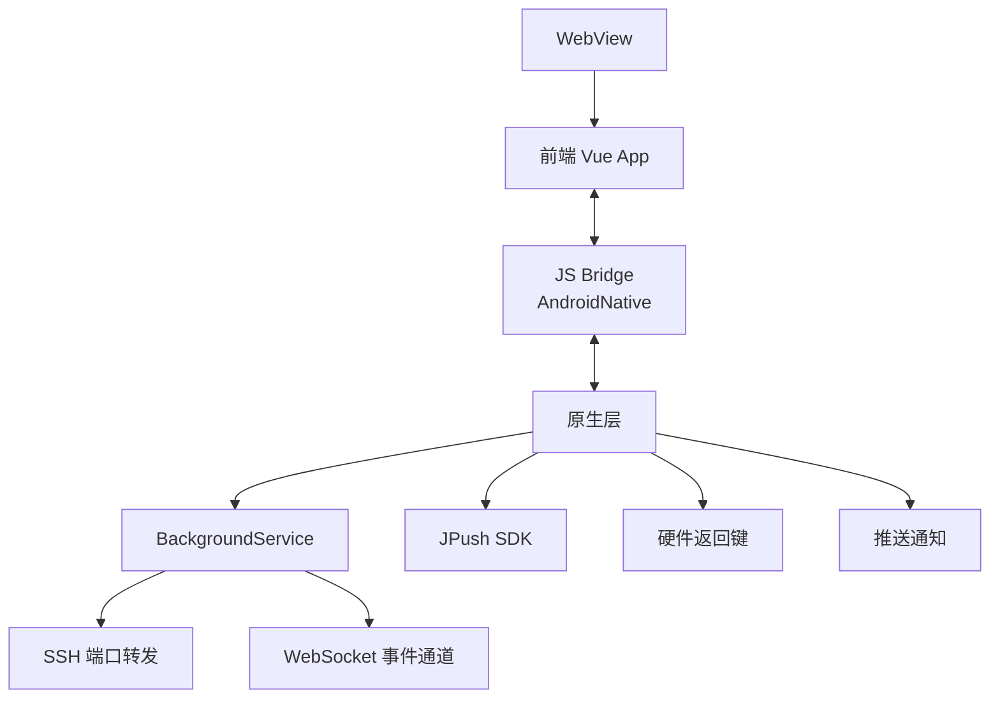
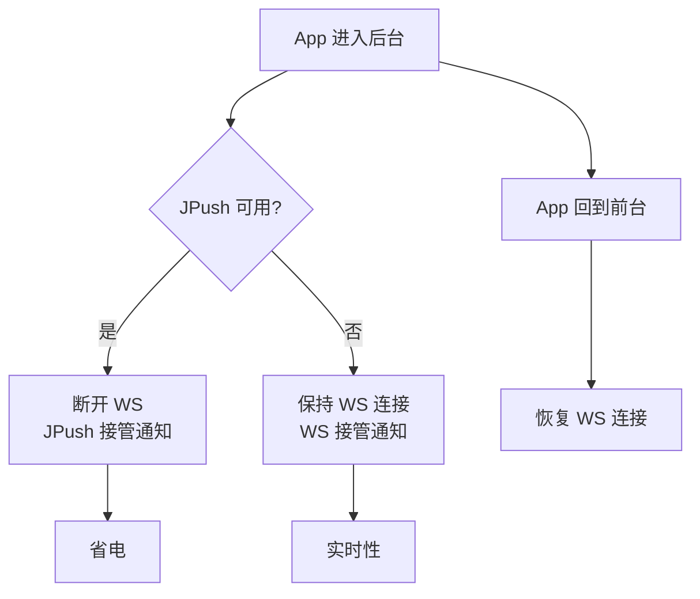

# Android 集成

Android 集成让 ClawBench 在手机上像一个原生 App 一样运行——WebView 承载前端界面，原生层提供后台服务、推送通知、SSH 端口转发和硬件按键代理。关键设计是"推送感知"：App 进入后台时根据推送可用性决定是否断开 WebSocket，在省电和实时性之间自动权衡。

## 流程图

### Android App 架构

### 推送感知后台策略

## 功能与设计要点

### 功能清单

- **WebView 容器**：Android WebView 承载前端 Vue App，通过 `AndroidNative` JS Bridge 暴露原生能力（获取密码、推送注册、端口转发、文件操作等）。Web 和原生之间通过 Bridge 双向通信
- **后台服务（BackgroundService）**：管理 SSH 端口转发和原生 WebSocket 事件通道，App 在后台时仍能接收通知。没有后台服务，Android 杀进程后端口转发和通知都会中断
- **SSH 端口转发**：原生层建立 SSH 连接并维持端口转发，前端通过 `usePortForward` composable 控制。端口转发状态通过 `syncToNative()` 同步到原生层
- **JPush 推送集成**：AppKey 从服务端 `/api/push/config` 运行时获取（不打包在 APK 中），Registration ID 通过 WS `register` 消息上报。推送配置可以动态切换
- **推送感知后台策略**：App 进入后台时，JPush 可用则断开 WS（省电），JPush 不可用则保持 WS（保实时）。回到前台时恢复 WS 连接。自动权衡省电和实时性
- **硬件返回键代理**：Android `onBackPressed` 委托给 JS 层 `clawbench-back-press` 事件，JS 注册了处理器则拦截（不退出 App），未注册则传递给原生。Web 页面也能处理返回键
- **自动登录**：Android 通过 `AndroidNative.getPassword()` Bridge 获取密码自动登录，用户不需要在 App 内手动输入密码

### 设计要点

- **AppKey 运行时获取而非编译时打包**：不同部署环境使用不同的 JPush 配置，同一 APK 可连接不同推送服务。这是多租户场景的必要设计
- **推送感知策略是自动的**：App 不需要用户选择"省电模式"或"实时模式"，系统根据 JPush 可用性自动切换。JPush 不可用（如未配置）时退化为 WS 长连接——降级是无缝的
- **Registration ID 绑定登录级别**：通过 WS `register` 消息上报，不是 HTTP API。这样 WS 重连后 Registration ID 不需要重新上报——WS 消息的生命周期与登录绑定，不受连接状态影响
- **后台服务是端口转发的前提**：没有 BackgroundService，Android 杀进程后 SSH 端口转发断开，已转发的端口全部不可达。后台服务保持 SSH 心跳，维持隧道活跃
