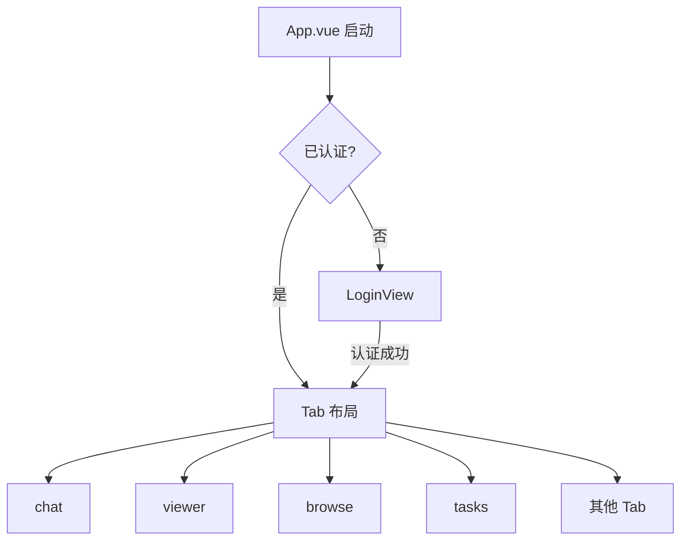
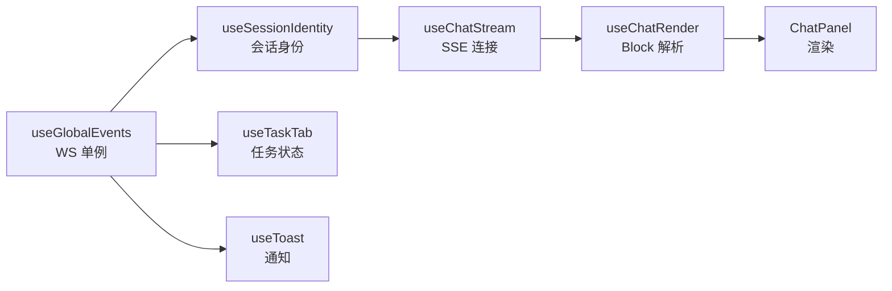

# 前端架构

ClawBench 前端是一个无路由的 Vue 3 单页应用——没有 Vue Router，通过底部 Tab 栏和抽屉式布局组织界面。全局状态集中在单个 `reactive()` store 中，业务逻辑封装为 38 个 composable，模块级单例模式贯穿整个架构。这种"少抽象、多组合"的风格让代码路径扁平，但要求开发者理解模块级状态的生命周期。

## 流程图

### 应用启动与布局结构

### 数据流与 Composable 组合

## 功能与设计要点

### 功能清单

- **Tab 式单页布局**：底部 Tab 栏切换主功能区（chat、viewer、browse、tasks），溢出 Tab 放入弹出菜单。`TabPanel` 使用 `v-show` 保持状态持久——切换 Tab 不销毁组件，回到之前的 Tab 状态还在
- **抽屉式导航**：Session 抽屉（会话列表）、TOC 抽屉（文件目录）、搜索抽屉等。从侧面滑入，不占常驻空间——移动端屏幕有限，抽屉比常驻面板更节省空间
- **模块级 Composable 单例**：18 个 composable 使用模块级 `ref`，所有消费者共享同一份状态（如 `useToast`、`useSessionIdentity`、`useGlobalEvents`）。跨组件状态协调无需 provide/inject
- **SSE/WebSocket 双通道**：聊天内容走 SSE（单向流式），系统事件走 WebSocket（双向、ack、register）。两种通道各有重连策略和 HTTP 轮询降级
- **标注管道**：聊天消息依次经过 Worktree 标注 → 文件路径标注 → localhost URL 标注 → commit hash 标注，全部基于 DOM 遍历而非正则替换。让聊天中的技术信息可直接交互
- **SPA 热切换项目**：切换项目不需要 `window.location.reload()`，而是原地重置 store + Vue `:key` 重建组件树（0.15s 渐隐过渡）。无页面闪烁
- **Android 硬件返回键**：全局 `useBackHandler` 注册表管理返回导航，Android `onBackPressed` 委托给 JS 层——注册了返回处理器则拦截（不退出 App），未注册则传递给原生处理

### 设计要点

- **模块级单例是双刃剑**：所有消费者共享状态，跨组件协调零成本；但需要理解模块级状态的生命周期（应用级而非组件级），项目切换时需要显式重置——这是有意为之的架构选择，不是反模式
- **无 Vue Router 是移动优先的决策**：Tab 式布局不需要 URL 路由，返回导航由 `useBackHandler` 管理。省去了路由配置的复杂度，但也意味着无法通过 URL 深链接到特定页面
- **标注管道顺序有讲究**：Worktree 标注先于文件路径标注，已标注的元素不再被后续标注匹配——避免 Worktree 路径被文件路径标注二次匹配
- **reactive store 而非 Pinia**：单个 reactive store + action 函数，不用 Pinia/Vuex。状态形状扁平，action 直接修改——对于这种规模的应用，Pinia 的模块化开销不值得
- **单调序列号防竞态**：并发目录加载时使用单调计数器，保证旧结果不会覆盖新状态。这是异步 UI 的经典问题，单调计数器是最简单的解决方案
