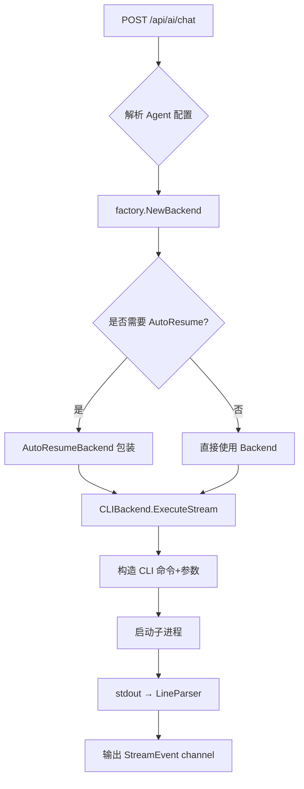
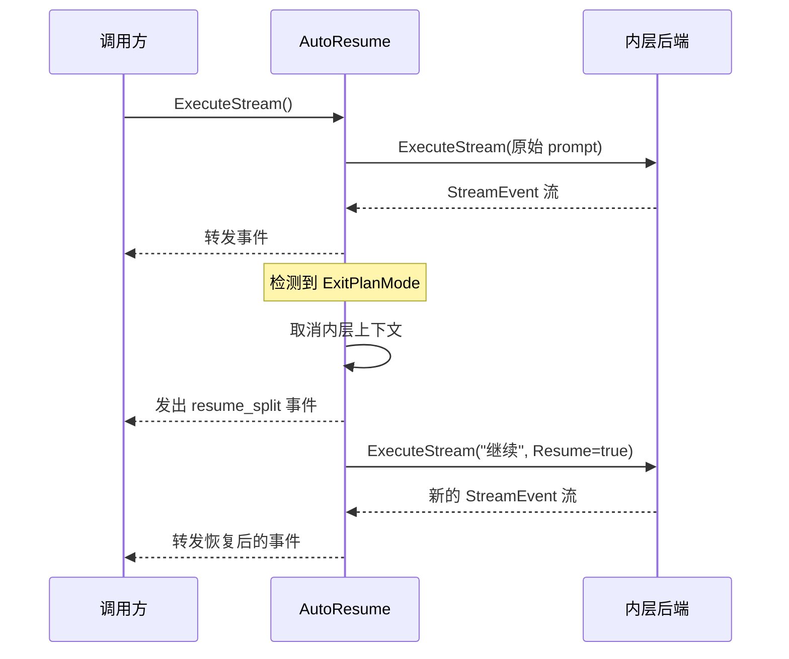

# AI 后端抽象

ClawBench 支持多种 AI CLI 工具，每种工具的命令行参数、输出格式各不相同。AI 后端抽象层将这种差异封装为统一的 `AIBackend` 接口——handler 只需调用 `ExecuteStream()`，不关心背后是 Claude 还是 Gemini。这种设计让新增一个 AI 后端只需实现一个 LineParser 和一组 CLI 参数构造函数。

## 流程图

### 后端选择与执行流程

### AutoResume 流程

某些 AI 后端（Claude、Codebuddy、Qoder 等）在执行计划审批时会触发 ExitPlanMode——后端暂停等待用户确认。AutoResumeBackend 自动处理这一场景：检测到 ExitPlanMode 后取消当前执行，自动恢复并继续，对调用方透明。

## 功能与设计要点

### 功能清单

- **统一流式接口**：所有 AI 后端实现 `AIBackend` 接口，对外暴露统一的 `ExecuteStream()` 方法，返回 `<-chan StreamEvent`。调用方无需关心底层差异
- **多后端支持**：支持 9 种 AI 后端（Claude、Codebuddy、OpenCode、Gemini、Codex、Qoder、VeCLI、DeepSeek、Pi），每种后端有独立的 CLI 参数构造和输出解析逻辑
- **自动恢复（AutoResume）**：对 ExitPlanMode 场景自动执行"取消→恢复继续"流程，避免用户手动干预。这是 AI 编码助手的常见交互模式，自动化后用户体验显著提升
- **流式事件标准化**：各后端不同的 JSON 输出格式经 LineParser 统一为标准 StreamEvent 类型（content、thinking、tool_use、tool_result、done、error 等），前端只需处理一种格式
- **工具名称归一化**：不同后端对同一操作使用不同的工具名称（如 `read_file` vs `Read`），归一化层统一映射，保证前端显示和 RAG 索引的一致性

### 设计要点

- **CLIBackend 是通用骨架**：所有 shell-out 后端共享 `CLIBackend` 的进程管理、stdout 管道、上下文取消逻辑，差异仅在于参数构造函数和 LineParser 回调——新增后端只需提供这两个函数
- **AutoResumeBackend 是透明包装器**：实现了 `AIBackend` 接口，内含一个被包装的后端。对外表现为连续的流，对内处理 ExitPlanMode 的拆分与恢复——遵循装饰器模式，不侵入已有逻辑
- **LineParser 按后端定制**：每种 CLI 工具的 JSON 输出格式不同（Claude 的 stream-json、Gemini 的自定义格式、DeepSeek 的 TUI 格式等），每个后端有自己的 LineParser 实现——这是唯一需要为新后端编写的解析逻辑
- **Block 合并在后端层完成**：`AccumulateBlock()` 将增量 content/thinking 事件合并为完整 Block，tool_use 作为边界——这是纯数据处理逻辑，与具体后端无关，因此放在公共层
