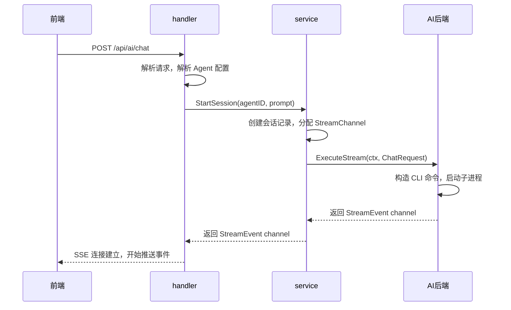
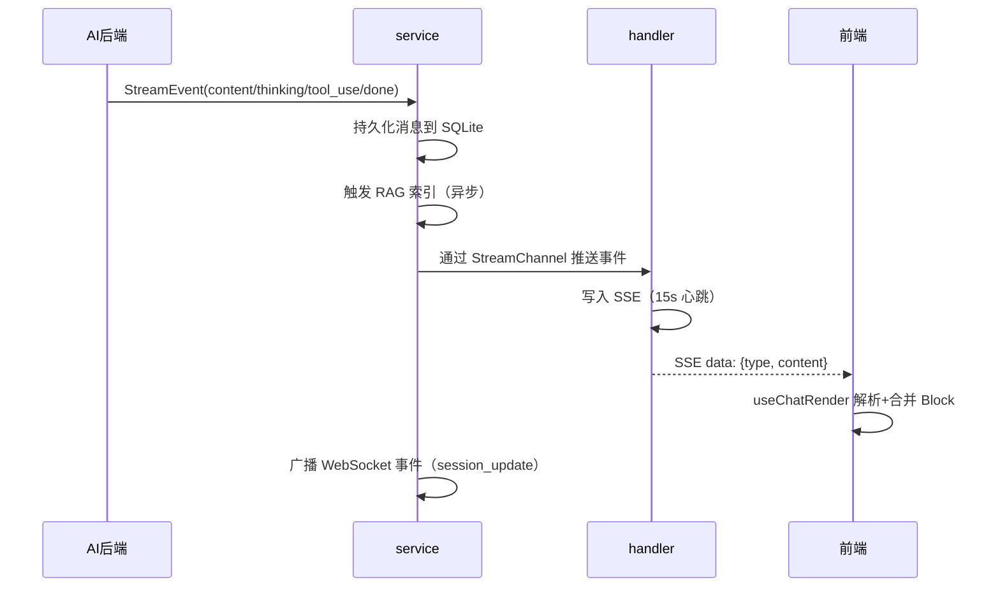

# 聊天流程

聊天是 ClawBench 的核心业务——用户发送一条消息，系统启动对应的 AI 后端执行，流式输出结果到前端，同时持久化到 SQLite 并建立 RAG 索引。这条链路贯穿了 handler、service、AI 后端、SSE/WebSocket 和前端五个层，是理解整个系统的入口。

## 流程图

### 请求链路：从用户发消息到 AI 开始执行

用户点击发送后，请求进入 handler，由 handler 解析出目标 Agent 和后端；service 层负责创建会话、管理运行时状态，然后将执行委托给 AI 后端。AI 后端 shell-out 启动 CLI 子进程，将 stdout 解析为 StreamEvent 流。

### SSE 推送链路：流式事件到前端渲染

AI 后端产出的事件同时流向两个方向：一路经 SSE 推送给当前连接的客户端用于实时渲染，另一路触发 service 层的持久化和 WebSocket 广播（通知其他客户端会话状态变化）。

## 功能与设计要点

### 功能清单

- **消息发送与流式回复**：用户输入 prompt 后，系统选择对应的 AI Agent 执行并实时流式返回结果。这是系统的核心价值——让用户在移动端也能获得与桌面 CLI 等同的 AI 交互体验
- **多 Agent 选择**：用户可以切换不同的 AI 后端（Claude、Codebuddy、Gemini 等），每个 Agent 有独立的系统提示词、模型和思考深度配置。不同后端各有擅长，用户按需选择
- **消息持久化与历史回看**：所有聊天消息存入 SQLite，支持分页加载、搜索、软删除。用户可以随时回看历史对话，删除的对话仍可被 RAG 检索
- **排队机制**：同一会话的消息排队执行，前一条未完成时后续消息入队等待。防止并发冲突，保证消息顺序
- **文件上传与引用**：用户可以上传文件作为消息附件，AI 可以读取这些文件。降低了在移动端传递上下文的成本
- **引用提问**：选中聊天或文件中的文本片段，以引用形式发送新问题。减少上下文描述的开销，尤其适合代码审查场景
- **快捷发送**：预设常用 prompt 一键发送，避免重复输入。移动端打字成本高，这个功能显著降低了常用操作的交互开销

### 设计要点

- **消息排队在内存中**：排队消息存储在内存中，重启丢失——这是有意为之的权衡，排队消息本质是待执行的瞬时指令，不需要跨重启持久化
- **软删除保留 RAG 可搜索性**：删除的会话和消息标记 `deleted=1` 而非物理删除，RAG 索引仍可检索到——历史知识不应因用户整理而丢失
- **双通道推送**：SSE 负责聊天内容的实时流式推送（长连接、单向），WebSocket 负责系统事件广播（会话状态、任务更新）。两种推送模式互补，SSE 适合大体积流式数据，WebSocket 适合轻量级状态变更
- **前端 Block 合并**：连续的 text/thinking 事件合并为同一个 Block 渲染，tool_use 作为 Block 边界——减少 DOM 更新频率，提升渲染性能
