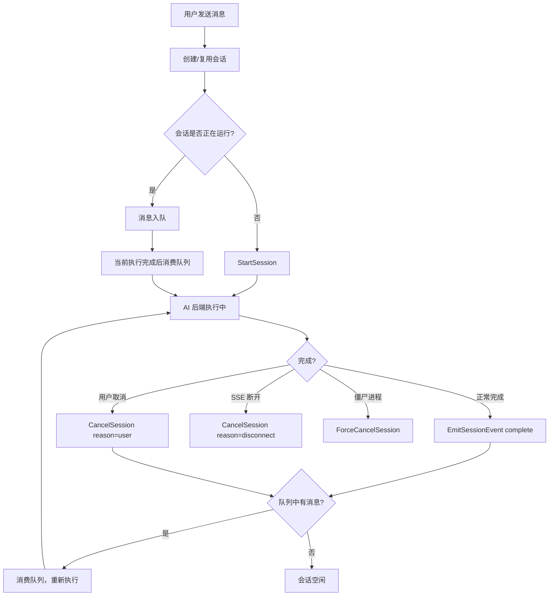
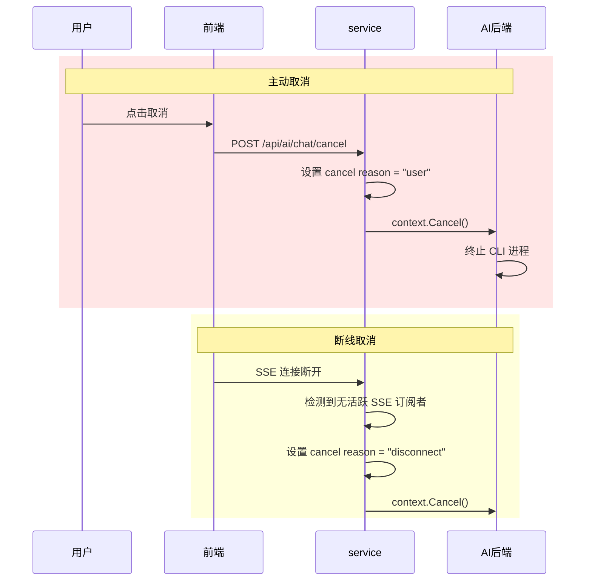

# 会话生命周期

聊天会话从用户发送第一条消息开始创建，经历执行、排队、取消、完成等状态，最终被软删除或保留。定时任务的执行结果可以续接为新的交互式会话，继承原始对话上下文。理解会话的生命周期是理解系统运行时行为的关键——大多数用户交互都围绕"当前会话"展开，而 service 层的会话管理是整个系统的运行时核心。

## 流程图

### 会话主生命周期

### 会话取消场景

## 功能与设计要点

### 功能清单

- **会话创建与复用**：用户发消息时，系统自动创建新会话或复用已有会话（同一 Agent）。每个会话绑定一个 Agent，保证对话上下文的一致性
- **消息排队**：同一会话内，前一条消息未执行完时后续消息自动入队，执行完成后依次消费。避免并发冲突，保证 AI 能看到完整的对话历史
- **主动取消**：用户可以随时取消正在执行的会话，系统区分"主动取消"和"连接断开"两种原因——主动取消不触发重连，断线取消可能触发重连尝试
- **僵尸进程清理**：`ForceCancelSession` 直接 kill CLI 子进程，用于处理卡死的执行。这是最后的兜底手段，保证系统不会因异常进程而资源泄漏
- **会话软删除**：删除会话仅标记 `deleted=1`，消息仍然保留在数据库中供 RAG 检索。用户整理对话列表时不会丢失历史知识
- **会话身份持久化**：用户在会话中选择的模型和思考深度会被记住，下次打开同一会话时自动恢复——避免每次都需要重新配置
- **续接对话**：定时任务的执行结果可以续接为新的聊天会话，继承源会话的消息、摘要和 `external_session_id`。用户看到定时任务结果后想继续追问，无需重新描述上下文。已续接的会话显示"定时"标识，已软删除的续接会话会自动恢复

### 设计要点

- **取消原因区分"用户"与"断线"**：系统为每个 Session 记录取消原因。用户主动取消意味着"我不想再继续了"，断线意味着"网络问题，可能需要恢复"——两种场景的处理策略完全不同
- **运行时 Session 是内存态**：活跃 Session 和 Stream 通道存储在内存中，重启后清空。运行时状态（是否在执行、Stream 通道）是瞬时的，不需要持久化
- **强制终止是最后手段**：在常规取消失败或进程卡死时，直接终止 CLI 进程（跳过优雅退出），避免产生孤儿进程
- **会话恢复依赖 AutoResume**：取消后的自动恢复由 [AI 后端抽象层](ai-backend.md) 的 AutoResumeBackend 处理，service 层只负责取消和状态管理——职责分离，避免会话管理逻辑和 AI 交互逻辑耦合
- **续接对话是去重的**：同一个执行记录只能续接一次，已有续接会话时直接返回（已软删除的自动恢复）——防止重复创建导致数据冗余
