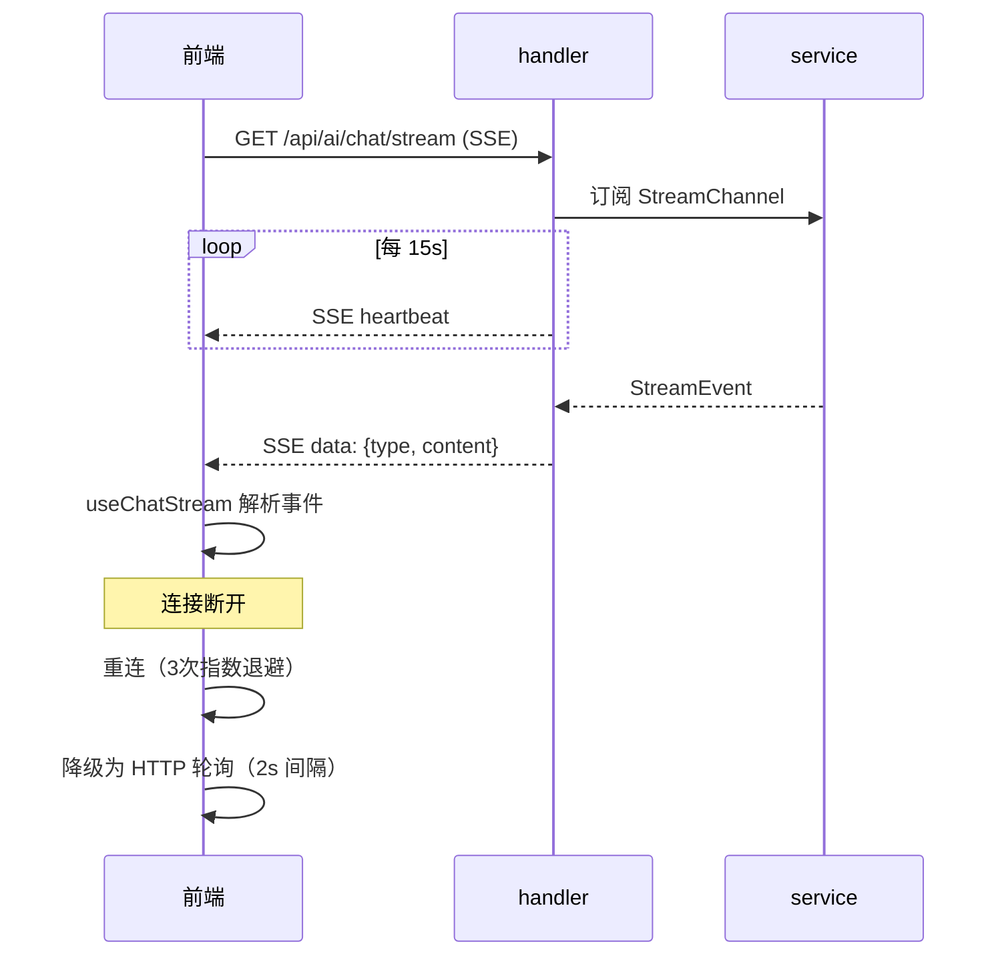
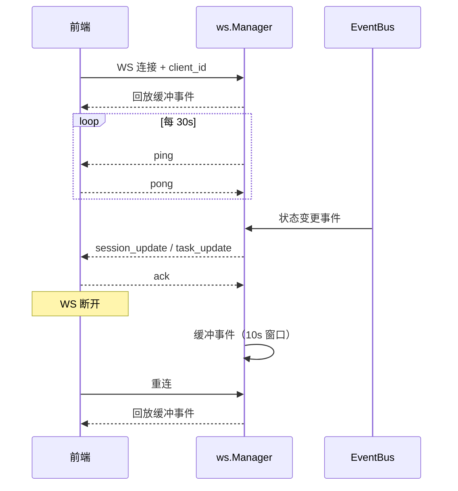

# 流式传输体系

ClawBench 使用 SSE 和 WebSocket 两种机制实现实时数据推送。SSE 用于聊天内容的流式传输（单向、大体积、长连接），WebSocket 用于系统事件的广播（双向、轻量、状态变更）。两者都有独立的重连策略和 HTTP 轮询降级方案，保证在弱网和移动端场景下的可用性。

## 流程图

### SSE 聊天流式传输

### WebSocket 系统事件通道

## 功能与设计要点

### 功能清单

- **SSE 聊天流**：GET `/api/ai/chat/stream` 建立 SSE 连接，实时推送 AI 回复内容。SSE 天然支持单向流式数据，适合聊天场景的"一发多收"模式
- **WebSocket 系统事件**：`/api/ai/events/ws` 提供 7 种事件类型（session_start、session_complete、message_new、task_update、task_exec_update、tunnel_status、summary_update），客户端可实时感知系统状态变化
- **SSE 重连与降级**：聊天 SSE 断开后尝试 3 次重连（指数退避），失败后降级为 HTTP 轮询（2s 间隔），保证在弱网环境下仍能获取数据
- **WebSocket 重连与缓冲**：WebSocket 断开后客户端重连时自动回放断线期间的缓冲事件（10s 窗口，最多 50 条），防止状态丢失
- **SSE 心跳与超时**：SSE 15s 心跳保活，30s 超时检测连接有效性；WebSocket 30s ping，5min 空闲超时
- **排队状态推送**：排队消息的状态变更（消费、更新、完成）通过 WebSocket `queue_update` 事件推送，保持与系统事件统一的推送通道
- **摘要实时推送**：会话完成后 `summary_update` 事件推送生成的摘要，前端 `SummaryToggle` 组件可立即切换显示摘要，无需轮询

### 设计要点

- **SSE 和 WebSocket 各司其职**：SSE 用于大体积的聊天内容流（单向推送），WebSocket 用于轻量的系统状态广播（双向通信）。不把所有实时通信塞进一个通道，避免聊天数据影响状态事件的及时性
- **HTTP 轮询是最终保底**：两种实时通道都有 HTTP 轮询降级方案——这是移动端场景的必要设计，移动网络不稳定时轮询虽然低效但可靠
- **WebSocket 替代了 SSE 系统事件**：系统事件最初使用 SSE（`/api/events`，5 次重连后降级轮询），后来迁移到 WebSocket——WebSocket 的双向通信能力更适合推送确认（ack）和注册（register）场景
- **断线缓冲窗口有限**：WebSocket 断线后只缓冲 10s 内的事件，超过 10s 的事件丢失。重连后客户端通过 REST API 做 fullStateSync 恢复完整状态——缓冲只是减少重连瞬间的数据丢失，不是持久化方案
