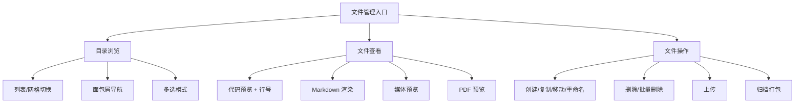
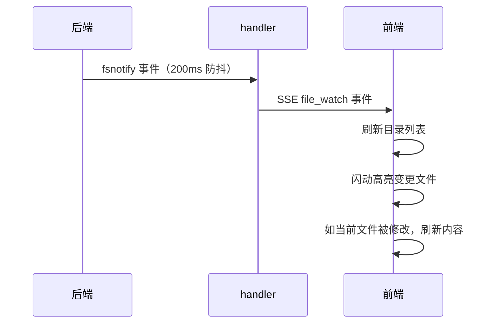

# 文件管理

文件管理让用户在 Web 界面中浏览、查看、编辑、上传项目文件——这是代码工作站的基座能力。从目录浏览到代码预览，从文件上传到缩略图生成，覆盖了日常开发中"看代码、传文件、下归档"的核心场景。

## 流程图

### 文件操作链路

### 文件变更监听

## 功能与设计要点

### 功能清单

- **目录浏览**：列表和网格两种视图，面包屑导航，支持多选操作。移动端文件浏览最基本的能力
- **文件查看**：代码文件（语法高亮 + 行号）、Markdown（渲染预览）、图片/PDF/音频/视频预览。覆盖了项目中常见的文件类型
- **文件操作**：创建、复制、移动、重命名、删除、批量删除。所有路径操作都经过 symlink 感知的穿越防护，确保不会访问项目根目录之外的文件——安全是文件操作的底线
- **文件上传**：支持多文件上传，带进度跟踪。大小和数量由配置限制（`upload.max_size_mb`、`upload.max_files`）
- **缩略图生成**：图片文件自动生成缩略图，用于列表和网格视图的预览。避免加载全尺寸图片消耗带宽
- **归档打包**：选择文件/目录打包为 zip/tar 下载。移动端不方便 `tar czf`，一键打包是刚需
- **文件变更监听**：后端通过 fsnotify 监听文件变更，SSE 推送给前端，前端自动刷新目录和文件内容。用户不用手动刷新就能看到 AI 编辑的代码变化
- **文件路径标注**：聊天中出现的文件路径自动标注为可点击链接，点击打开文件查看器。打通了聊天与代码浏览的关联

### 设计要点

- **路径穿越防护是 symlink 感知的**：路径校验先解析 symlink 再判断是否在项目根目录下——简单的字符串比较会被 symlink 绕过
- **fsnotify 防抖**：文件保存可能触发多个底层事件（写入、属性变更、close），防抖避免前端反复刷新
- **缩略图是按需生成的**：不预生成所有图片的缩略图，而是请求时才生成——节省存储空间，且缩略图可从原图随时重建
- **文件变更闪动高亮**：文件内容更新后高亮变更区域，帮助用户快速定位 AI 修改了哪里
