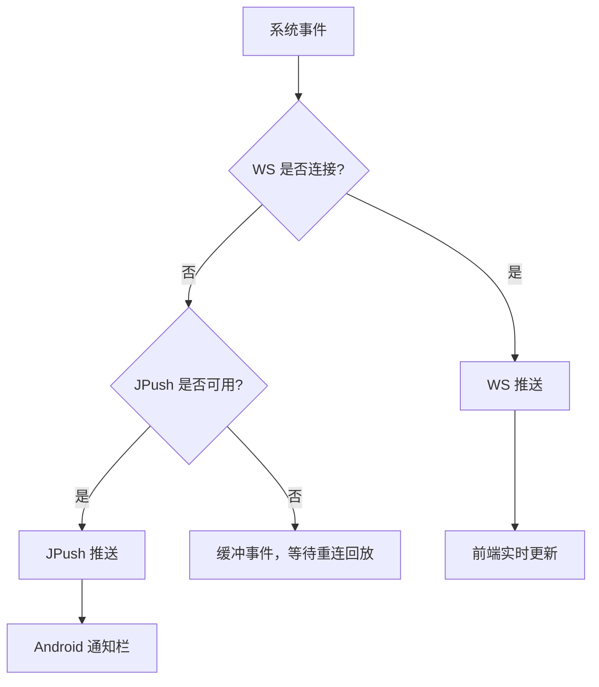
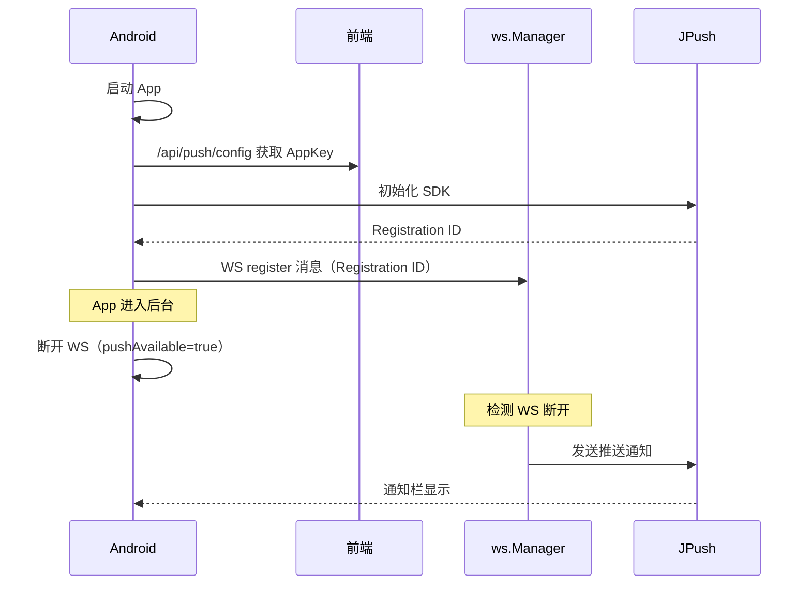

# 推送通知

推送通知让用户在手机息屏时也能收到 AI 执行完成、任务更新等提醒。系统使用 JPush 作为推送通道，WebSocket 作为实时通道，两者配合实现"在线走 WebSocket、离线走 JPush"的推送感知策略。Android 后台服务管理 SSH 端口转发的生命周期，确保推送通道始终可用。

## 流程图

### 推送感知策略

### 推送注册与生命周期

## 功能与设计要点

### 功能清单

- **JPush 推送**：集成 JPush Android SDK，支持通知栏推送。AppKey 从服务端运行时获取（不打包在 APK 中），支持动态切换推送配置
- **WebSocket 实时事件**：在线时通过 WebSocket 接收实时事件（session_update、task_update 等），比推送延迟更低、信息更丰富
- **推送感知后台策略**：App 进入后台时，如果 JPush 可用则断开 WebSocket（省电），JPush 不可用则保持 WebSocket 连接。在省电和实时性之间自动权衡
- **事件缓冲与回放**：WebSocket 断线期间的事件缓冲在服务端，重连后自动回放。配合 JPush 确保不丢失关键通知
- **任务完成推送预览**：推送通知包含任务完成的响应摘要预览文本和 `Done:` 前缀，用户不用打开 App 就能判断任务是否成功
- **Registration ID 持久化**：推送 Registration ID 通过 WS `register` 消息上报，绑定到登录级别而非 WS 连接级别——WS 重连后不需要重新注册

### 设计要点

- **AppKey 运行时获取而非编译时打包**：不同部署环境可能使用不同的 JPush 配置，运行时获取允许同一 APK 连接不同推送服务
- **推送是 WS 的后备而非替代**：推送通知有延迟、有字数限制、无法交互——在线时始终优先使用 WebSocket。推送只在离线时兜底
- **Registration ID 绑定登录级别**：用户登出后 Registration ID 清除，新用户登录后重新注册。避免推送给错误的用户
- **断线缓冲窗口有限（10s）**：WebSocket 断线后只缓冲 10s 内的事件，超过的事件丢失。这是存储和时效性的权衡——太久之前的事件对用户已无意义
