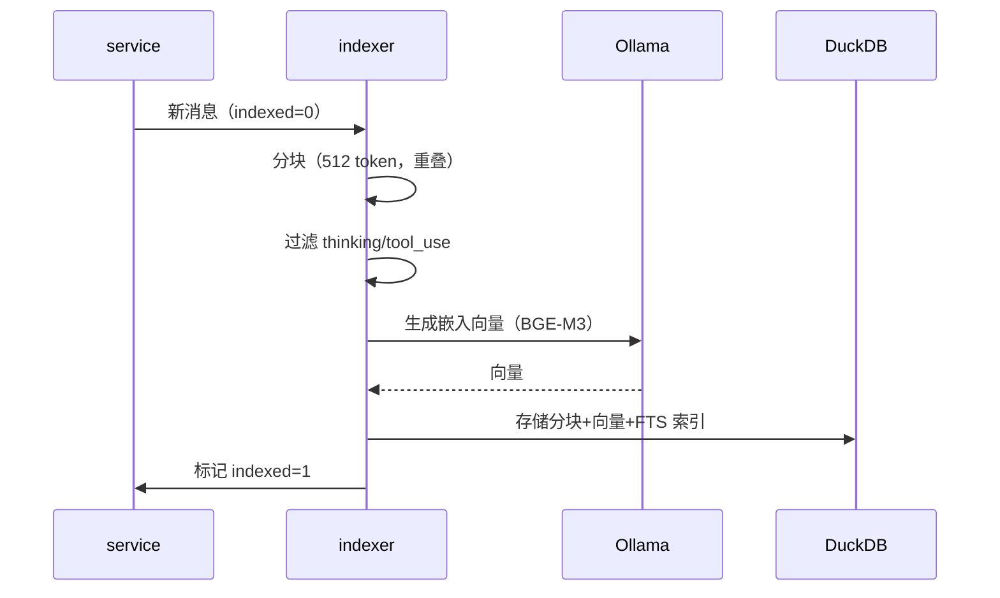
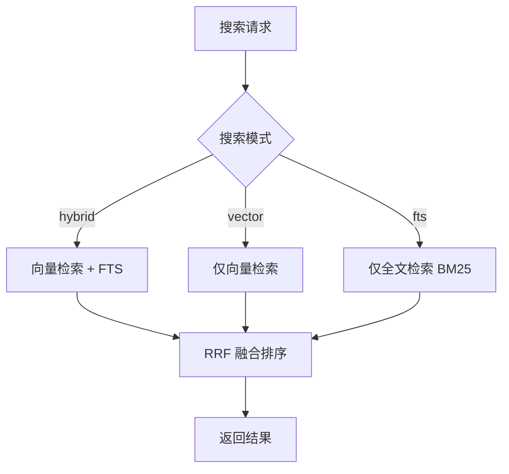

# RAG 检索

RAG（Retrieval-Augmented Generation）让用户搜索历史对话内容——"上次我让 Claude 修那个 bug 时它怎么说的？"不需要翻遍历史记录，语义搜索直接找到相关对话。系统将聊天消息分块、向量化、存入 DuckDB，支持向量检索、全文检索和混合检索三种模式。

## 流程图

### RAG 索引流程

### RAG 搜索流程

## 功能与设计要点

### 功能清单

- **语义搜索**：用自然语言搜索历史对话，不依赖精确关键词匹配。用户描述问题即可找到相关历史，降低检索门槛
- **混合检索**：向量检索捕获语义相似性，BM25 全文检索捕获关键词匹配，两者通过 RRF（Reciprocal Rank Fusion）融合排序。比单一检索模式更全面
- **过滤条件**：支持按项目、后端、角色、会话、时间范围过滤。缩小搜索范围，提高结果精度
- **增量索引**：新消息自动标记为待索引，Indexer 轮询处理。不影响聊天主流程的响应速度
- **自动清理**：超过 `RetentionDays`（默认 90 天）的软删除数据定期清理，防止索引无限增长

### 设计要点

- **双数据库架构**：SQLite 存聊天消息（OLTP），DuckDB 存向量索引（OLAP+向量）。各取所长——SQLite 的 WAL 模式适合高频写入，DuckDB 的向量索引适合相似度查询
- **优雅降级**：如果 Ollama/嵌入 API 不可用，退化为 FTS-only 索引和搜索，后续嵌入 API 恢复后自动回填向量——嵌入服务不是强制依赖
- **自适应嵌入维度**：从 API 响应自动检测向量维度，维度变化时重建表。支持切换嵌入模型而无需手动迁移
- **中文分词用 gse**：BM25 全文检索使用 gse 分词器处理中文文本，gse 不可用时退化为字符级分词——中文搜索不依赖外部分词服务
