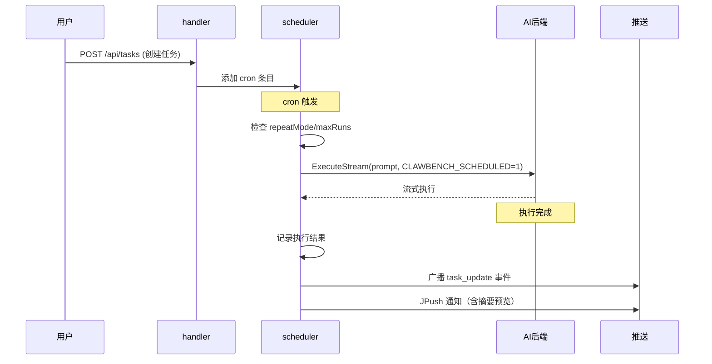
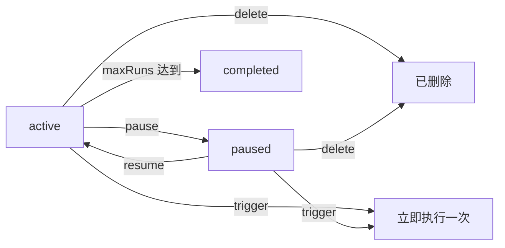

# 定时任务

定时任务让 AI 按计划自动执行——每天凌晨跑代码审查、每周一生成文档、每小时检查 GitHub Issues。任务由 cron 调度器驱动，到点后启动 AI 后端执行，完成后推送摘要通知。执行结果可以续接为交互式对话，让用户从 AI 的自动执行结果直接进入追问模式。这套机制让 AI 从"被动应答"变为"主动执行"，是 ClawBench 区别于普通聊天界面的核心能力。

## 流程图

### 定时任务从创建到执行

### 任务状态流转

## 功能与设计要点

### 功能清单

- **cron 调度**：支持标准 cron 表达式定义执行计划（如 `0 10 * * 1` 每周一 10:00）。这是最灵活的调度方式，覆盖了从"每小时"到"每月"的各种需求
- **手动触发**：`trigger` 命令立即执行一次任务，不影响 cron 计划。适合"我想现在跑一次看看效果"的场景
- **暂停与恢复**：暂停任务不删除 cron 条目，恢复后继续按计划执行。用户临时不需要某个任务时可以暂停而非删除
- **执行限制**：`maxRuns` 限制任务最大执行次数，`repeatMode` 控制重复模式。避免定时任务无限执行消耗资源
- **执行历史**：每次执行的结果、摘要、耗时都有记录，支持分页查询。用户可以回溯任务执行情况
- **摘要推送**：任务完成后生成结果摘要，通过 WebSocket/JPush 推送通知。通知包含 `Done:` 前缀和响应预览文本，用户一眼可知任务是否成功
- **续接对话**：执行完成后用户可从任务执行详情中点击"继续对话"，将执行结果续接为新的交互式聊天会话。新会话继承源会话的消息、摘要和 `external_session_id`（支持 `--resume`），标题前缀为执行时间戳 `[MM-DD HH:MM]`。定时任务不再是"执行完就结束"，用户可以基于 AI 的自动执行结果继续深入探讨

### 设计要点

- **CLAWBENCH_SCHEDULED=1 防递归**：定时执行的 AI 会话设置此环境变量，AI 识别后直接执行任务而非尝试创建新的定时任务——这是提示词层面而非代码层面的防递归机制
- **执行摘要由 AI 生成**：任务执行完成后，系统调用 summarizer 将 AI 回复压缩为摘要，用于推送通知和历史记录。摘要保留 Markdown 格式（与 TTS 摘要不同），约 30% 原文长度
- **续接对话继承会话身份**：续接的新会话继承源会话的 Agent、模型、思考深度和 `external_session_id`，保证对话上下文和 CLI 会话连续性。已存在的续接会话会被复用（已软删除的自动恢复），避免重复创建
- **硬删除而非软删除**：与聊天会话不同，定时任务使用硬删除。任务定义是用户主动管理的配置项，删除意味着"我不再需要这个任务"
- **调度器使用 robfig/cron**：标准库级调度器，可靠且久经考验。运行时执行记录存储在 `sync.Map` 中（内存态），重启后从数据库恢复
