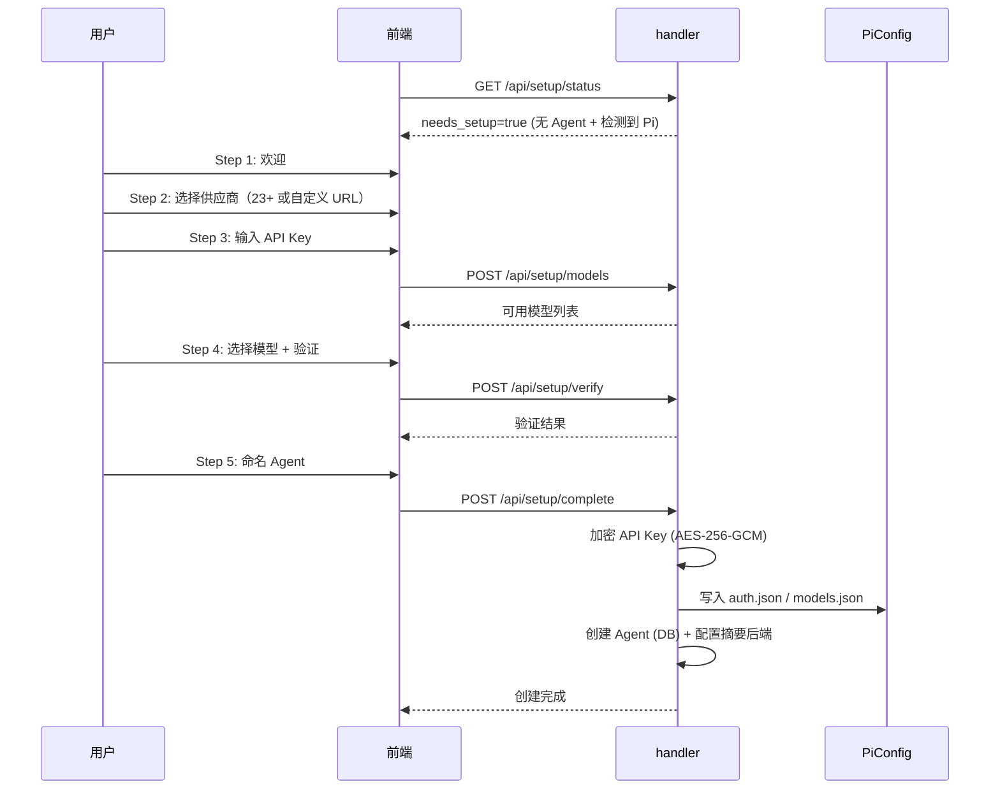
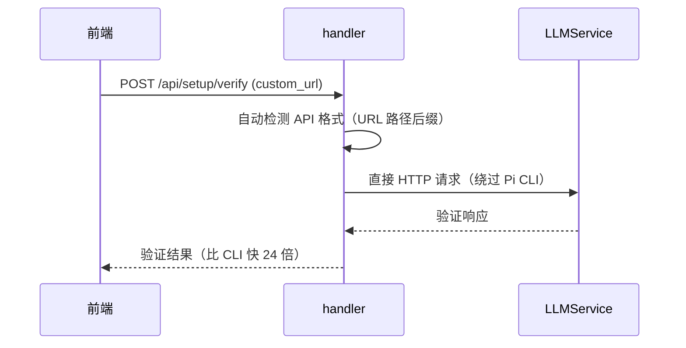

# 设置向导

设置向导让首次使用的用户在 5 步内创建一个可用的 AI Agent——选供应商、输 API Key、选模型、验证、命名。系统自动处理 API 密钥加密、模型配置和后端初始化，用户完成后即可开始聊天。这是零配置启动理念的关键环节：从安装到使用的时间降到最低。

## 流程图

### 设置向导 5 步流程

### 自定义 URL 验证流程

## 功能与设计要点

### 功能清单

- **自动检测首次启动**：当系统中不存在任何 Agent 且检测到内嵌 Pi 二进制时，自动触发设置向导。用户不需要查阅文档就知道下一步该做什么
- **23+ 供应商一键选择**：内置 28 个 LLM 供应商规格（23 个支持向导，5 个企业级需手动配置），覆盖主流 AI 服务商。用户选择供应商后自动配置 API 端点和格式
- **自定义 URL 模式**：用户可输入任意 OpenAI/Anthropic 兼容的 API 端点，系统自动检测 API 格式（从 URL 路径后缀判断），直接 HTTP 验证（绕过 Pi CLI，快 24 倍）。支持私有部署和第三方代理
- **API 密钥安全存储**：密钥使用 AES-256-GCM 加密后存入数据库，加密密钥由登录密码经 HKDF-SHA256 派生。密码变更时自动轮换加密密钥
- **模型验证**：选好模型后实际调用 LLM API 验证连通性，确保配置正确。自定义 URL 模式使用直接 HTTP 验证（更快），内置供应商使用 Pi CLI 验证
- **自动配置摘要后端**：向导完成后自动为 Agent 配置 `summarize` 后端，用于聊天自动摘要和 TTS。自定义 URL 模式下自动同步摘要模型与聊天模型

### 设计要点

- **DB Agent 优先于 YAML**：向导创建的 Agent 存储在数据库（`agents` 表，`source = "wizard"`），与 YAML 定义的 Agent 共存，`LoadAgentsIntoMemory` 合并时 DB 优先——向导创建的配置不会被自动发现覆盖
- **验证路径按模式分流**：内置供应商走 Pi CLI 验证（功能完整），自定义 URL 走直接 HTTP 验证（速度快）。两条路径各有优势，按用户选择的模式自动分流
- **完成步骤使用互斥锁**：`POST /api/setup/complete` 使用 mutex 防止并发请求重复创建 Agent——首次使用时用户可能重复点击
- **供应商模型数据来自嵌入式 JSON**：567 个已知工具调用模型从 models.dev API 自动生成，编译时嵌入二进制——不需要运行时网络请求就能提供模型列表
