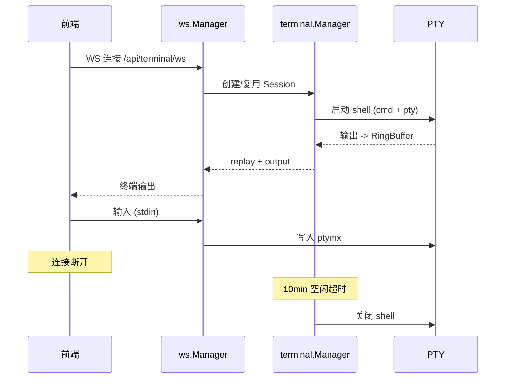

# Web 终端

Web 终端让用户在浏览器中直接访问服务器命令行——不需要 SSH 客户端，在手机上也能执行 `git status`、`docker ps` 等操作。后端通过 PTY 创建真实 shell 会话，前端用 xterm.js 渲染终端界面，WebSocket 双向传输输入输出。支持手势操作和虚拟修饰键，适配移动端的交互限制。

## 流程图

### 终端会话生命周期

## 功能与设计要点

### 功能清单

- **PTY 会话管理**：每个终端标签页对应一个 PTY 会话，最多 10 个并发会话。会话有 10 分钟空闲超时，防止资源泄漏
- **断线重连与回放**：终端输出存储在 RingBuffer（2000 行、4MB 上限），WebSocket 重连后自动回放断线期间的输出，用户不会丢失已执行命令的结果
- **手势交互**：支持双指捏合缩放字体、左右滑动切换终端，适配移动端的触控操作
- **虚拟修饰键**：Ctrl/Alt/Shift 三态状态机（inactive → once → locked），发送对应转义序列。解决移动端缺少物理修饰键的问题
- **快捷指令**：预设常用命令一键发送（如 `git status`、`docker ps`），通过 `useCrudList` 管理 CRUD。与聊天快捷发送共享基础设施
- **键盘避让**：检测 Android 软键盘高度，自动调整终端视口，防止虚拟键盘遮挡终端内容

### 设计要点

- **单 WS 连接竞争**：每个 PTY 会话同一时刻只允许一个 WS 连接，新连接踢掉旧连接——PTY 不支持多路输入，多连接会导致输入混乱
- **RingBuffer 是有界环形缓冲**：固定容量，旧数据自动覆盖。这不是持久化方案，而是重连回放的临时缓冲——终端输出的历史价值随时间快速衰减
- **虚拟修饰键三态设计**：inactive（未激活）→ once（单次生效，发送后回到 inactive）→ locked（持续生效直到再次点击）。once 模式适合偶发的 Ctrl+C，locked 模式适合连续的 Ctrl 组合操作
