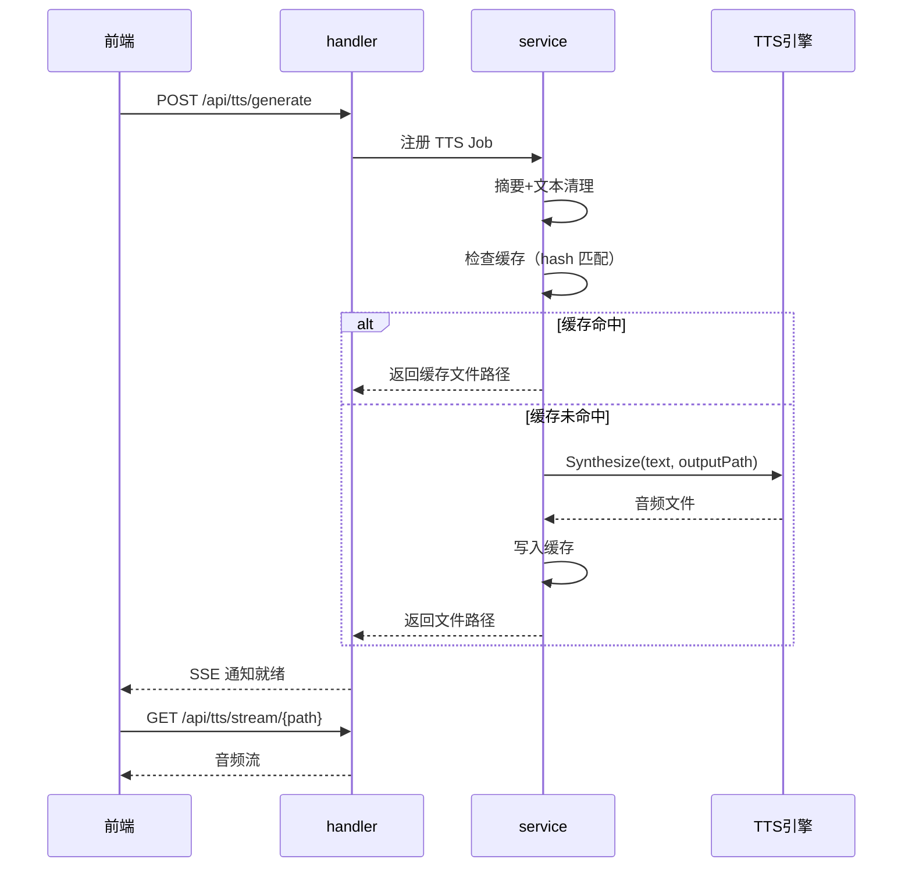

# 语音合成（TTS）

语音合成让用户不用盯着屏幕也能"听"AI 的回复——在移动场景下尤其有用，比如走路时听代码审查结果。系统支持云引擎（Edge TTS）和本地引擎（Piper、Kokoro、MOSS-Nano），通过统一的 `SpeechProvider` 接口切换，TTS 前由 summarizer 将长文本压缩为适合朗读的短文本。

## 流程图

### TTS 请求到播放

## 功能与设计要点

### 功能清单

- **多引擎 TTS**：支持 Edge TTS（云，微软语音）、Piper（本地 ONNX）、Kokoro（本地 ONNX）、MOSS-Nano（本地），用户按需选择引擎。云引擎声音自然但需要网络，本地引擎离线可用但声音质量有限
- **自动摘要**：长文本先经 summarizer 压缩为 30% 长度的摘要再合成语音，避免生成过长的音频文件。短文本（< 300 字符）跳过摘要直接合成
- **文本清理**：合成前自动剥离 Markdown 格式、工具调用输出、thinking block 等不适合朗读的内容，保留可读的纯文本
- **文件缓存**：合成结果按文本 hash 缓存为音频文件，相同内容不重复合成。缓存上限 100 个文件，自动淘汰最旧的——避免存储空间无限增长
- **TTS Job 管理**：每个 TTS 请求注册为 Job，支持取消和完成通知。防止重复合成相同内容

### 设计要点

- **CLISpeechProvider 是通用包装器**：所有 CLI 类 TTS 引擎共享统一的 CLI 调用模式（构建参数 → 管道文本 → 读取输出文件），差异仅在 CLI 名称和参数格式——新增引擎只需配置命令行参数
- **摘要与 TTS 共享 summarizer 接口**：TTS 摘要和任务摘要使用同一个 `Summarizer` 接口，但配置不同——TTS 摘要剥离 Markdown（朗读不需要格式），任务摘要保留 Markdown（记录需要格式）
- **缓存键是文本内容的 hash**：相同文本无论请求多少次只合成一次。但模型/语速/语言的变化会产生不同的 hash，保证不同配置的合成结果不会混淆
