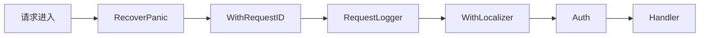
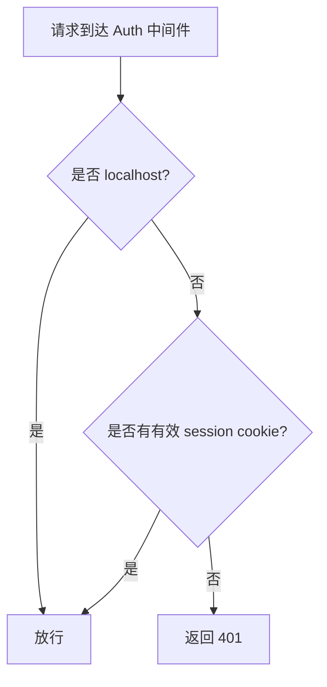

# 认证与中间件

ClawBench 的认证设计围绕一个核心矛盾：CLI 工具需要免认证访问（localhost 直连），而远程访问（浏览器/手机）需要密码保护。中间件链以洋葱模型组织，从外到内依次处理 panic 恢复、请求 ID、日志、i18n、认证，确保每一层只关注自己的职责。

## 流程图

### 请求中间件链

### 认证决策流程

## 功能与设计要点

### 功能清单

- **密码认证**：远程访问需要密码，密码存储为 session cookie（`clawbench_session`），使用常量时间比较防止时序攻击。密码可配置，未配置时自动生成 UUID 并持久化到 `.clawbench/auto-password`
- **localhost 旁路**：来自 127.0.0.1/::1 的请求自动放行，不需要密码。CLI 工具（`clawbench task`、`clawbench rag`）通过 localhost HTTP 调用服务端 API，无需处理认证——这是 CLI 集成的关键设计
- **Panic 恢复**：中间件链最外层捕获 panic，返回 500 而不是让进程崩溃。任何 handler 的未处理异常都被优雅地降级为错误响应
- **请求 ID**：每个请求分配唯一 ID（`X-Request-ID` header），贯穿日志和错误响应。追踪问题时的关键线索
- **请求日志**：记录方法、路径、状态码、耗时、请求 ID。这是生产环境排查问题的第一入口
- **i18n 本地化**：从 `Accept-Language` header 提取语言偏好，错误响应使用用户语言显示。AGENTS.md 中所有 handler 的 `writeLocalizedError` 都基于此

### 设计要点

- **localhost 旁路是 CLI 集成的基石**：CLI 命令（`clawbench task`、`clawbench rag`）本质是 HTTP 客户端，连接 localhost 时自动绕过认证——用户不需要为 CLI 工具单独管理认证
- **常量时间比较防时序攻击**：密码比较使用常量时间算法，不泄露密码长度和内容信息。即使攻击者能测量响应时间也无法推断密码
- **自动密码降低部署门槛**：首次启动自动生成密码，用户不改也能安全使用。这是"零配置启动"理念的体现
- **中间件链是左到右组合**：`Chain(A, B, C)` 的执行顺序是 A→B→C→handler→C→B→A。RecoverPanic 在最外层确保内部任何 panic 都能被捕获
