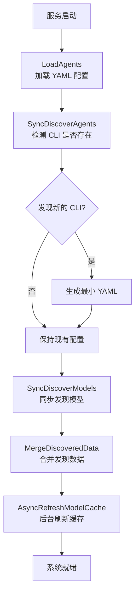
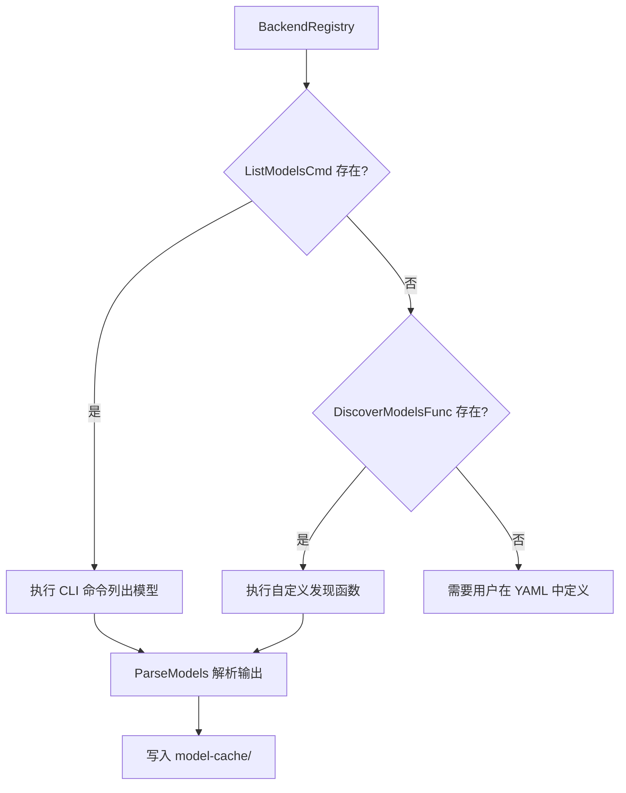

# 配置与自动发现

ClawBench 的核心理念之一是"零配置启动"——安装 CLI 工具后直接运行 `./clawbench`，系统自动发现可用的 AI 后端和模型，生成最小配置，用户即可开始使用。手动配置是可选的增强，不是必须的前置步骤。这套自动发现机制让系统的使用门槛降到了最低。

## 流程图

### 启动时自动发现流程

### Agent/Model 发现策略

## 功能与设计要点

### 功能清单

- **零配置启动**：没有 `config.yaml` 也能运行，系统自动填充所有默认值（端口、密码、TTS 引擎等）。`config.yaml` 是可选的增强，不是必须的前置步骤
- **Agent 自动发现**：启动时检测 PATH 中是否存在 AI CLI 工具，为新发现的工具自动生成最小 YAML 配置。用户安装新 CLI 后重启即自动识别
- **Model 自动发现**：通过 CLI 命令（如 `deepseek models`）或自定义发现函数自动发现可用模型。结果缓存到本地
- **后台模型刷新**：启动后后台定期刷新模型缓存，更新自动发现的 Agent 的模型列表。新增模型无需重启
- **用户配置优先**：YAML 中手动定义的模型列表不会被自动发现覆盖，`ModelsAutoDetected` 标志区分用户定义和自动发现。用户对配置有最终控制权
- **绿色便携部署**：所有运行时数据在 `.clawbench/` 目录下，删除即干净卸载，拷贝二进制目录即可多实例部署。不需要系统级安装

### 设计要点

- **用户定义 vs 自动发现是正交的**：自动发现标志决定模型列表的来源。自动发现的列表可以被刷新覆盖，用户定义的列表永远保留——两种来源不冲突
- **Agent 软删除**：CLI 不存在的 Agent 不会被删除，而是从可用列表中移除。CLI 重新安装后 Agent 自动恢复——避免用户配置因环境变化而丢失
- **模型缓存避免重复发现**：首次发现结果写入本地缓存，后续启动直接读取缓存。同步发现只在首次运行，之后由后台异步刷新
- **Gemini/Codex/VeCLI/Qoder 无 CLI 模型列表**：这些后端不支持 `--list-models` 类命令，模型必须由用户在 YAML 中手动定义。这是后端能力的限制，不是设计的遗漏
