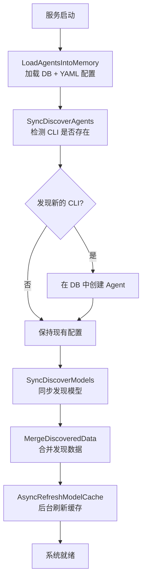
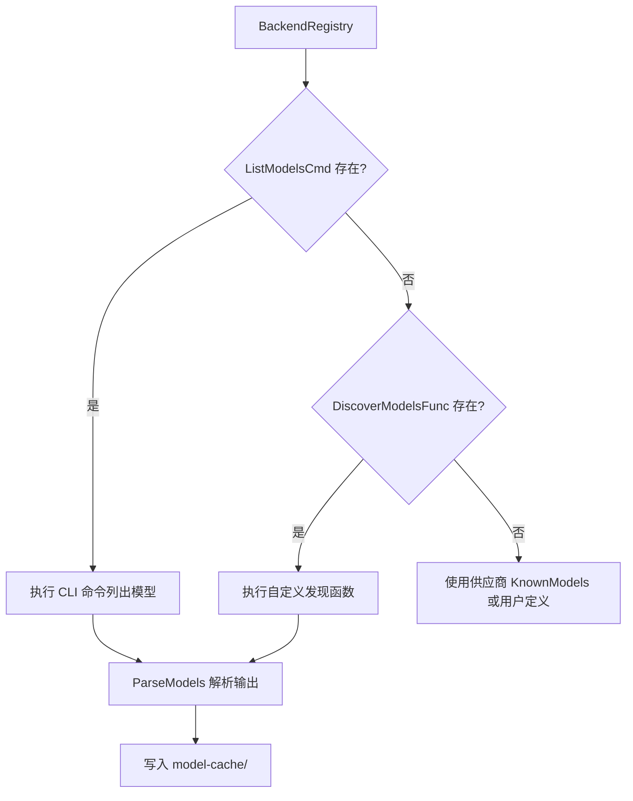

# 配置与自动发现

ClawBench 的核心理念之一是"零配置启动"——安装 CLI 工具后直接运行 `./clawbench`，系统自动发现可用的 AI 后端和模型，生成最小配置，用户即可开始使用。首次启动时[设置向导](../features/setup-wizard.md)引导用户快速创建 Agent。手动配置是可选的增强，不是必须的前置步骤。这套自动发现机制让系统的使用门槛降到了最低。

## 流程图

### 启动时自动发现流程

### Agent/Model 发现策略

## 功能与设计要点

### 功能清单

- **零配置启动**：没有 `config.yaml` 也能运行，系统自动填充所有默认值（端口、密码、TTS 引擎等）。`config.yaml` 是可选的增强，不是必须的前置步骤
- **设置向导**：首次启动时自动引导用户 5 步创建 Agent——选供应商、输 API Key、选模型、验证、命名。[设置向导](../features/setup-wizard.md)将安装到使用的时间降到最低
- **Agent 自动发现**：启动时检测 PATH 中是否存在 AI CLI 工具，为新发现的工具自动在数据库中创建 Agent。用户安装新 CLI 后重启即自动识别
- **Model 自动发现**：通过 CLI 命令（如 `deepseek models`）或自定义发现函数自动发现可用模型。结果缓存到本地
- **后台模型刷新**：启动后后台定期刷新模型缓存，更新自动发现的 Agent 的模型列表。新增模型无需重启
- **用户配置优先**：YAML 中手动定义的模型列表不会被自动发现覆盖，`ModelsAutoDetected` 标志区分用户定义和自动发现。用户对配置有最终控制权
- **供应商注册表**：内置 28 个 LLM 供应商规格（23 个支持向导 + 5 个企业级），567 个已知模型从 models.dev API 自动生成。向导根据供应商规格提供模型列表、API 格式和验证端点
- **API 密钥加密存储**：LLM 供应商的 API 密钥使用 AES-256-GCM 加密后存入 `agent_api_keys` 表，加密密钥由登录密码经 HKDF-SHA256 派生。密码变更时自动轮换
- **绿色便携部署**：所有运行时数据在 `.clawbench/` 目录下，删除即干净卸载，拷贝二进制目录即可多实例部署。不需要系统级安装

### 设计要点

- **用户定义 vs 自动发现是正交的**：自动发现标志决定模型列表的来源。自动发现的列表可以被刷新覆盖，用户定义的列表永远保留——两种来源不冲突
- **Agent 双源存储**：Agent 配置存储在数据库（`agents` 表，由向导创建或 YAML 迁移）和 YAML 文件两个来源。`LoadAgentsIntoMemory` 合并两者，DB 优先。`source` 字段区分 "auto"（自动发现/迁移）和 "wizard"（向导创建）
- **API 密钥与密码联动**：加密密钥由登录密码派生，密码变更触发全量密钥轮换——修改密码不会导致 API 密钥失效
- **模型缓存避免重复发现**：首次发现结果写入本地缓存，后续启动直接读取缓存。同步发现只在首次运行，之后由后台异步刷新
- **Gemini/Codex/VeCLI/Qoder 无 CLI 模型列表**：这些后端不支持 `--list-models` 类命令，模型由供应商注册表的 `KnownModels` 或用户手动提供。CodeBuddy 使用 `product.cloudhosted.json` 解析，Gemini 使用 API 发现，Codex 使用二进制扫描，Qoder 使用 `dynamic-texts.json` 解析——各有定制发现策略
