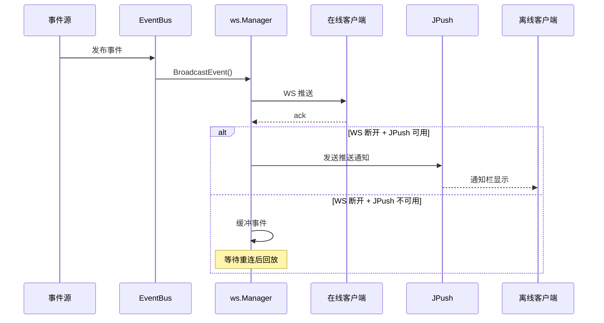
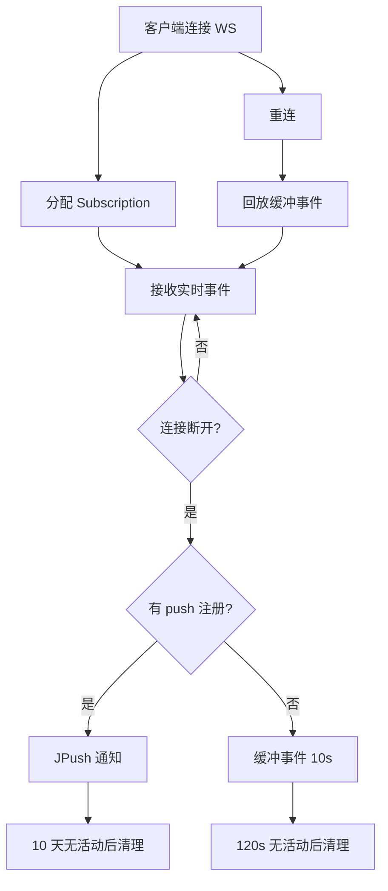

# 事件体系

ClawBench 的事件体系是系统实时性的基础设施——会话开始/完成、任务更新、隧道状态变化等事件从后端产生，经 EventBus 到达 WebSocket Manager，再推送给在线客户端；离线客户端则由 JPush 兜底。这套体系保证所有客户端在任何网络条件下都能收到关键状态变更通知。

## 流程图

### 事件从产生到推送

### 客户端生命周期

## 功能与设计要点

### 功能清单

- **WebSocket 事件通道**：`/api/ai/events/ws` 提供 7 种事件类型（session_start、session_complete、message_new、task_update、task_exec_update、tunnel_status、summary_update），客户端实时感知系统状态变化
- **JPush 推送后备**：WS 断开且 JPush 可用时，事件转为推送通知。保证离线客户端也能收到关键通知（如任务完成）
- **断线缓冲与回放**：WS 断线后缓冲 10s 内的事件（最多 50 条），重连后自动回放。配合推送确保不丢失关键通知
- **Push Registration ID 管理**：客户端通过 WS `register` 消息上报 JPush Registration ID，绑定到登录级别。WS 重连后不需要重新注册
- **摘要推送**：`summary_update` 事件在聊天或任务摘要生成后实时推送，前端 `SummaryToggle` 组件可立即切换显示摘要，无需轮询
- **心跳保活**：WS 30s ping/pong，5min 空闲超时。防止半开连接占用资源
- **客户端容量限制**：最多 20 个 WS 订阅，防止单个服务端过载

### 设计要点

- **WS 替代了 SSE 系统事件**：系统事件最初使用 SSE（`/api/events`），后来迁移到 WebSocket。WS 的双向通信能力更适合 ack 确认和 register 注册场景，也减少了连接数（一个 WS 复用多种事件类型）
- **推送感知策略是自动的**：WS 断开 + push 可用 → JPush 推送；WS 断开 + push 不可用 → 缓冲等待重连。不需要客户端决定走哪个通道，服务端根据 push 注册状态自动选择
- **断线清理有两组超时**：无 push 注册的客户端 120s 后清理（可能只是网络抖动），有 push 注册的客户端 10 天后清理（JPush 可以长期投递）——两种客户端的"活跃"期望不同
- **ack 机制用于确认而非可靠投递**：客户端发送 ack 表示已收到事件，但不触发重发。事件缓冲是时间窗口而非确认驱动——简化了服务端逻辑
