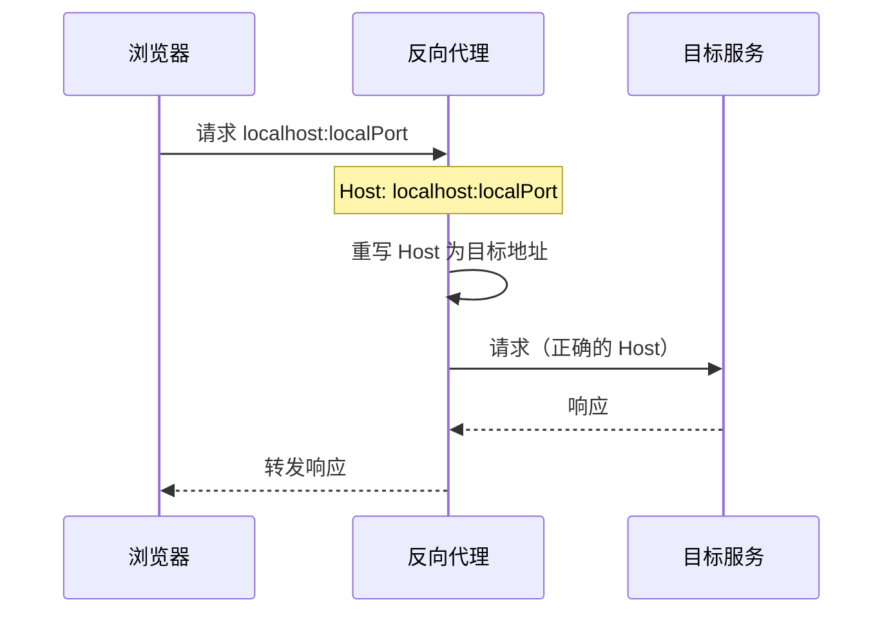
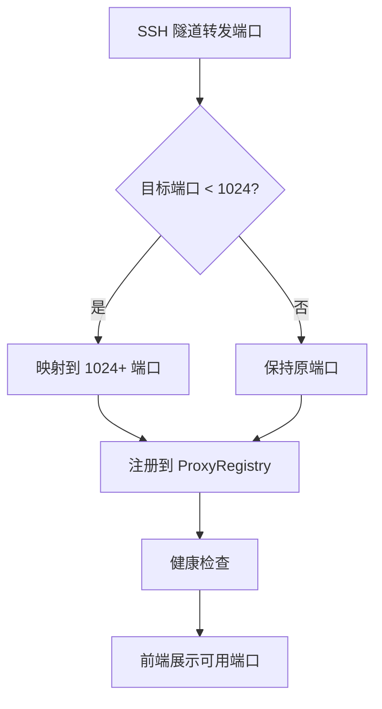

# 代理注册表

代理注册表（ProxyRegistry）管理 SSH 隧道转发端口的注册、健康检查和自动检测。它解决了一个关键问题：SSH 隧道在 TCP 层面转发，但后端 Web 服务（如数据库管理界面、API 文档）依赖 HTTP Host 头做虚拟主机路由，TCP 转发后 Host 仍是 `localhost`，导致虚拟主机后端无法正确响应。反向代理通过重写 Host 头解决了这个问题。

## 流程图

### 反向代理请求流程

### 端口映射流程

## 功能与设计要点

### 功能清单

- **反向代理与 Host 重写**：将浏览器请求的 `Host: localhost:port` 重写为目标服务的原始 Host，解决虚拟主机后端在 SSH 隧道场景下的路由问题
- **端口注册与生命周期管理**：转发的端口注册到 ProxyRegistry，统一管理创建、销毁和查询。前端可以获取所有可用端口的列表
- **特权端口自动映射**：目标端口 < 1024 时自动映射到 1024+ 范围，兼容 Android 和非 root 环境——这些环境无法绑定特权端口
- **健康检查**：定期检查转发端口的可用性，不可用的端口自动标记。前端只展示可用的端口，避免用户点击后才发现服务不可达
- **端口自动检测**：`/api/proxy/detect` 端点扫描常用端口，发现可用的开发服务。用户不需要记住端口号

### 设计要点

- **Host 重写是核心价值**：没有 Host 重写，通过 SSH 隧道访问虚拟主机后端（如 `admin.example.com`）会得到 404——浏览器发送的 Host 是 `localhost:port`，后端不认识这个 Host。反向代理将 Host 改回目标地址，问题迎刃而解
- **特权端口映射对 Android 必要**：Android 没有 root 权限，无法绑定 1024 以下端口。自动映射到高端口号后，SSH 隧道在 Android 上也能转发 80/443 端口的服务
- **默认端口剥离**：重写 Host 时按 HTTP 规范剥离默认端口号（80 for HTTP, 443 for HTTPS），避免 `backend:80` 这样的非规范 Host 导致后端匹配失败
- **支持自签名证书**：HTTPS 目标使用 `InsecureSkipVerify` 跳过证书验证——开发环境常用自签名证书，严格验证会阻断转发
