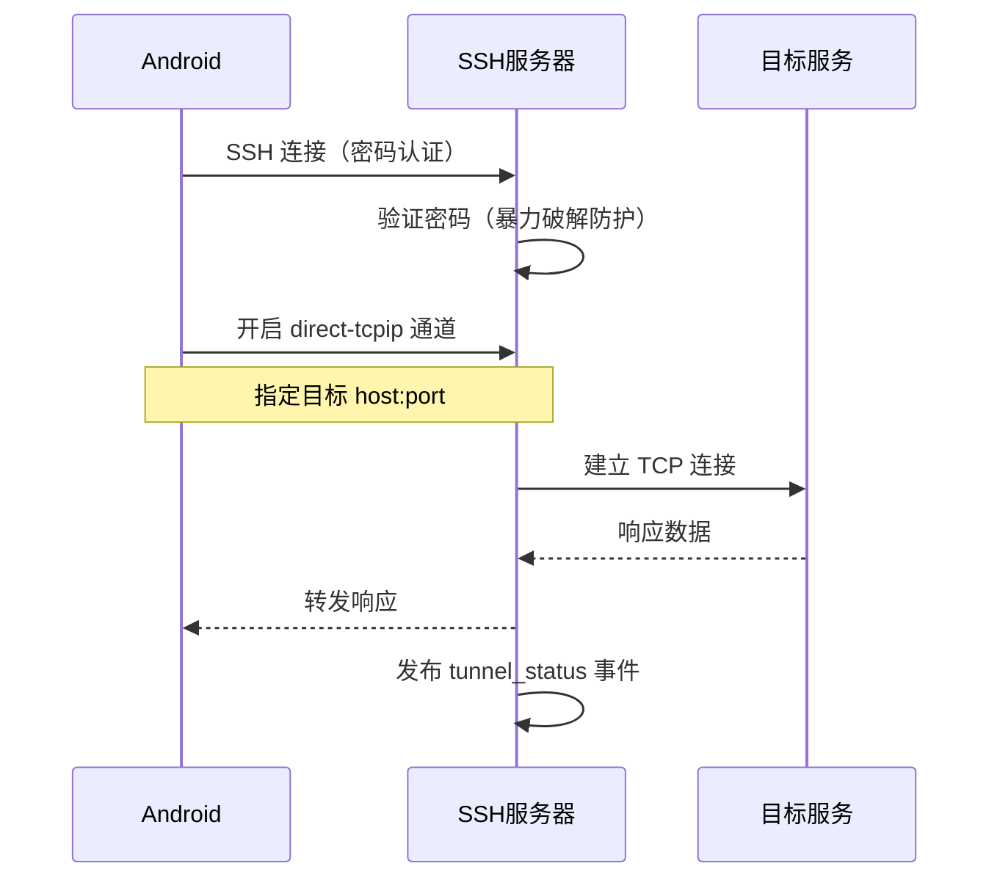

# SSH 隧道

SSH 隧道让移动端的 ClawBench App 通过加密隧道访问局域网内的开发服务（数据库管理界面、API 文档、内部工具等）。隧道使用 SSH direct-tcpip 通道转发端口，配合密码认证和自动 host key，用户只需输入密码即可建立隧道，不需要预配置 SSH 密钥。

## 流程图

### SSH 隧道端口转发流程

## 功能与设计要点

### 功能清单

- **SSH 端口转发**：通过 direct-tcpip 通道将远程端口映射到本地，Android App 通过 `localhost:localPort` 访问局域网内的服务。移动端访问内网服务最通用的方式
- **密码认证**：使用 `clawbench` 用户名 + 服务端配置的密码，与 Web 认证共享密码。用户不需要额外记忆 SSH 密码
- **自动 host key**：启动时自动生成 ECDSA P-256 host key，首次连接无需确认指纹。降低移动端 SSH 连接的配置门槛
- **暴力破解防护**：IP 级别的指数退避封锁（5 次失败 → 5 分钟封锁，翻倍至最长 1 小时）。SSH 面向公网，必须防暴力破解
- **隧道状态事件**：通过 EventBus 发布 `tunnel_status` 事件，前端实时显示隧道连接数和状态。用户一眼可见隧道是否正常工作
- **端口转发配置**：支持配置允许转发的端口范围（`port_forward.allowed_ports`），未配置时允许所有端口。安全策略的灵活控制

### 设计要点

- **密码与 Web 认证共享**：SSH 密码就是 Web 认证密码，不需要单独管理。密码变更同时影响 Web 和 SSH——减少认证配置的复杂度
- **自动 host key 是安全权衡**：生产环境应该使用固定 host key 并验证指纹，但 ClawBench 的场景是个人开发工具，自动生成降低了配置门槛——用户首次连接时无法验证 host key 真实性，但对于个人使用场景可接受
- **指数退避封锁是 IP 级别**：同一 IP 连续失败 5 次后封锁，不是全局封锁——不会因为一个攻击者而影响合法用户
- **隧道状态通过 WebSocket 推送**：[事件体系](event-system.md) 广播 `tunnel_status` 事件，前端实时更新隧道连接数——这是跨组件状态同步的标准模式
