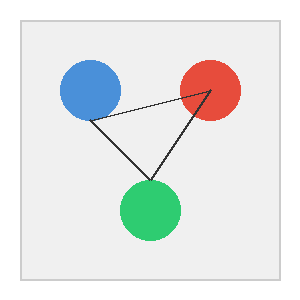

# 本地图片展示示例

本文档用于测试 ClawBench 对本地图片的展示效果。

## 图片目录

测试图片位于 `/path/to/images/` 目录下。请根据你的实际环境修改此路径。

---

## 图片 1：机器人图标

**图片说明**：一张用 PIL 生成的卡通机器人图标，蓝色主题。

---

## 图片 2：风景画

**图片说明**：一张用 PIL 生成的抽象风景画，包含天空、太阳和山脉。

---

## 图片 3：关系图示意

**图片说明**：展示三个节点及其连接关系的示意图。

---

## 图片 4：内联小图测试

这是一段文字，中间嵌入了一张小图 🦐 ：，看看内联图片的显示效果。

---

## 正常网络图片（对比）

---

## 大图测试

图片应该能正常显示，并且点击可以放大查看（Lightbox 功能）。
