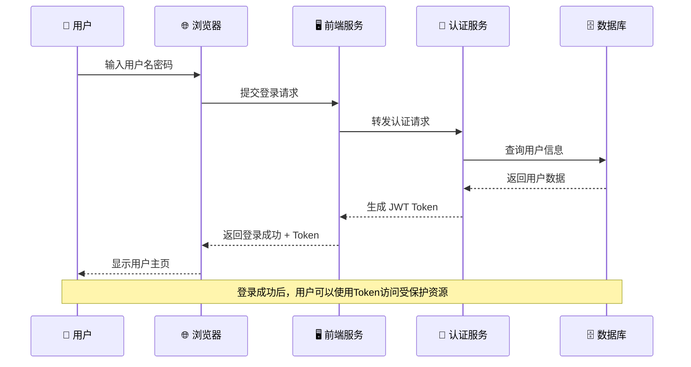
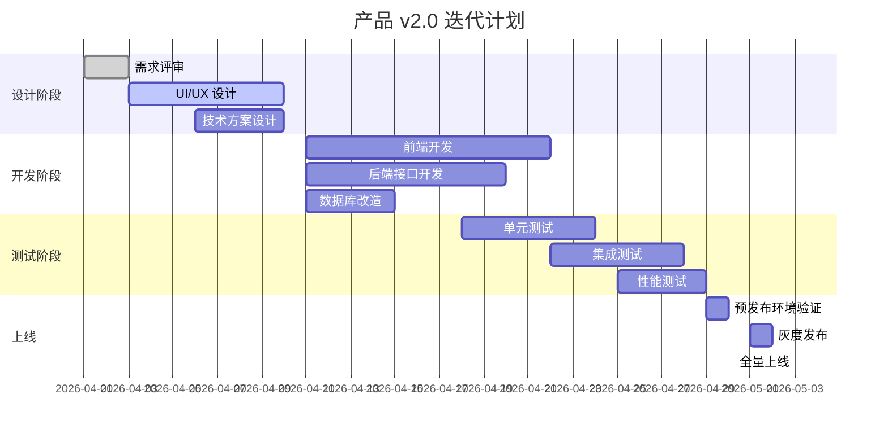
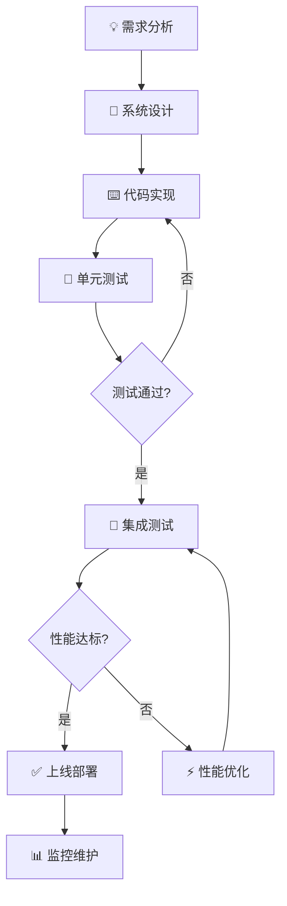
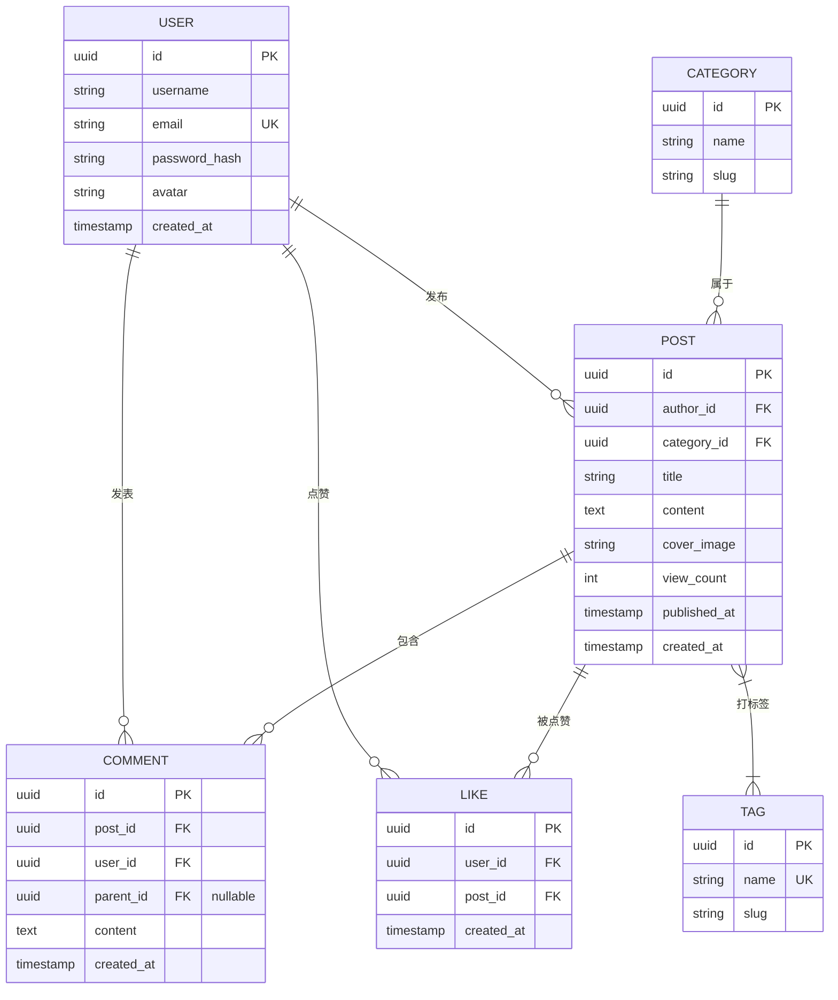

# Mermaid 图表合集

本文档包含多种 Mermaid 图表示例：时序图、甘特图、流程图和 ER 图。

---

## 1. 时序图 - 用户登录系统

**关键步骤：**
1. 用户提交 → 浏览器收集表单数据
2. 前端转发 → 调用认证服务
3. Token 生成 → 使用 JWT 签名
4. 会话建立 → 后续请求携带 Token

---

## 2. 甘特图 - 产品迭代计划

**里程碑：**
- 📋 **设计冻结**: 2026-04-10
- 🏗️ **功能开发完成**: 2026-04-22
- 🧪 **测试通过**: 2026-04-29
- 🚀 **正式上线**: 2026-05-03

---

## 3. 流程图 - 软件开发流程

**子流程说明：**
| 步骤 | 说明 |
|------|------|
| 需求分析 | 收集用户需求，整理成需求文档 |
| 系统设计 | 设计系统架构、数据库、接口规范 |
| 代码实现 | 按设计文档进行编码 |
| 单元测试 | 保证每个模块的功能正确性 |

---

## 4. ER 图 - 博客系统数据模型

**关系说明：**
| 符号 | 含义 |
|------|------|
| `\|\|--o{` | 一对多 |
| `}\|--|{` | 多对多 |
| `\|\|--\|\|` | 一对一 |
